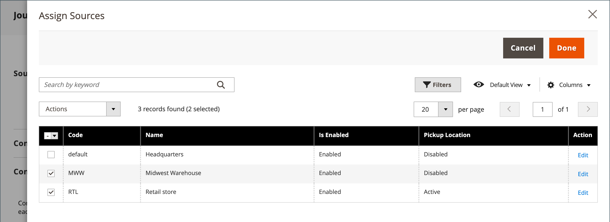

# 库存 — 分配来源和数量

对于使用[[!DNL Inventory Management]](../inventory-management/introduction.md)的多源商家，向下滚动到&#x200B;**源**&#x200B;部分并分配源和数量：

1. 要添加源，请单击&#x200B;**[!UICONTROL Assign Sources]**。

1. 浏览或搜索源，然后选中要为产品添加的源旁边的复选框。

   {width="600" zoomable="yes"}

1. 单击&#x200B;**[!UICONTROL Done]**&#x200B;添加源。

1. 要管理源的数量和状态，请单击&#x200B;**[!UICONTROL Advanced Inventory]**&#x200B;并将&#x200B;**[!UICONTROL Manage Stock]**&#x200B;设置为`Yes`。

1. 将&#x200B;**[!UICONTROL Source Item Status]**&#x200B;设置为`In Stock`。

1. 输入现有库存的金额更新&#x200B;**[!UICONTROL Qty]**。

1. 要设置库存数量通知，请执行以下操作之一：

   - _自定义通知数量_ — 清除&#x200B;**[!UICONTROL Notify Quantity Use Default]**&#x200B;复选框并在&#x200B;**[!UICONTROL Notify Quantity]**&#x200B;中输入数量。

   - _默认通知数量_ — 选中&#x200B;**[!UICONTROL Notify Quantity Use Default]**&#x200B;复选框。 Commerce检查并使用[!UICONTROL Advanced Inventory]或全局存储配置中的设置。

   {width="600" zoomable="yes"}
