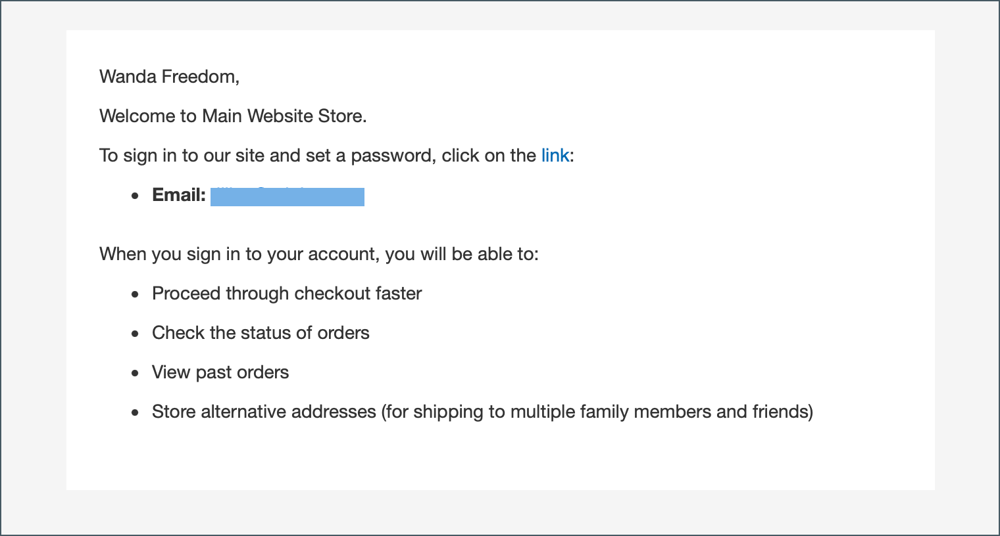
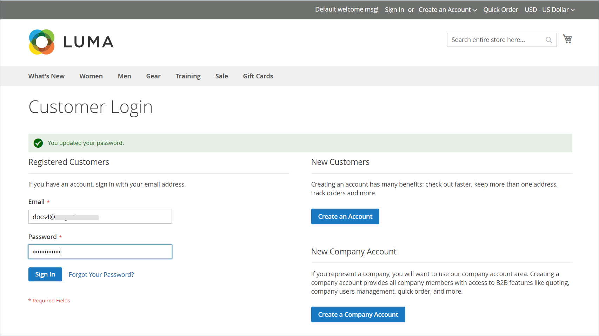

# 公司帐户

当您在商店中合并B2B公司帐户时，您可以让公司根据其组织中的用户角色创建多个具有灵活权限的子帐户，从而简化公司购物体验。 根据公司的具体情况，店铺管理员可以调整促销活动和价格以满足他们的需求，并创建高度定制的优惠，以满足购物者的需求并增加订单。 将公司帐户关联添加到标准 [个人](../customers/account-create.md) 允许客户使用为公司定义的特定购买工作流。

公司帐户的优势：

- 优惠无限制 [公司用户](account-company-users.md) 以及创建附加账户，从而简化企业购买。

- 包括对 _智能_ 具有不同级别的公司帐户层次结构 [角色和权限](account-company-roles-permissions.md) 下订单的事。

- 为商家提供通过提供优惠增加收入的机制 [公司商店点数](credit-company.md) 作为支付方式。

- 支持 [管理](account-company-manage.md) 管理员中所有公司帐户的ID。

## 查看公司帐户

此 _公司_ 网格会列出所有活动的公司帐户和挂起的请求，而不考虑状态设置。 它还提供了以下工具 [创建](account-company-create.md) 和 [管理](account-company-manage.md) 公司帐户。 使用标准网格控件筛选列表并调整列布局。 有关列说明的列表，请参见 _列说明_ 中的部分 [管理公司帐户](account-company-manage.md).

客户可以从店面创建公司帐户，或者商家可以从管理员创建公司帐户。 默认情况下，从店面创建公司帐户的功能处于启用状态。 如果配置允许，则商店的访客可以请求打开公司帐户。 公司帐户获得批准后，公司管理员可以设置公司结构和具有各种级别权限的用户。

在 _管理员_ 侧栏，转到 **[!UICONTROL Customers]** > **[!UICONTROL Companies]**.

{width="700" zoomable="yes"}

此 [!UICONTROL Companies] 网格会列出所有公司，而不管其状态如何。 显示的示例显示了两个公司的帐户：“ACME”公司和“Vandelay”公司。

## 公司管理员

以下示例显示了 _客户_ 使用初始公司管理员帐户进行网格化。

{width="700" zoomable="yes"}

担任公司管理员的人员可能在公司内拥有多个角色。 如果为公司管理员输入了单独的电子邮件地址，则初始公司结构包括公司管理员以及公司管理员名下的个人用户帐户。 在这种情况下，公司管理员可以以公司或个人用户的身份登录帐户。

创建帐户后，公司管理员定义的公司结构 [团队](account-company-structure.md)，设置 [公司用户](account-company-users.md)，并建立 [角色和权限](account-company-roles-permissions.md) 每一个。

### 在首次登录前设置公司管理员密码

1. 公司管理员从应用商店找到一封欢迎电子邮件。

   {width="500"}

   >[!NOTE]
   >
   >电子邮件的电子邮件地址目标和内容由 [公司电子邮件选项](email-company-configuration.md) 配置。

1. 按照说明进行操作，然后单击 [!UICONTROL **链接**] 来设置密码。

1. 输入 [!UICONTROL **新密码**] ，并再次确认。

   密码必须至少包括以下字符类型中的三种：

   - 小写字符(abc...)
   - 大写字符(ABC...)
   - 数字(1234567890)
   - 特殊字符(！@#$...)

1. 点击次数 [!UICONTROL **设置新密码**].

   {width="700" zoomable="yes"}

1. 当 [!UICONTROL Customer Login] 页面时，客户输入他们的 [!UICONTROL **电子邮件**] 和 [!UICONTROL **密码**].

1. 点击次数 [!UICONTROL **登录**] 以访问其帐户信息板。

   {width="700" zoomable="yes"}

## 公司结构

公司账目可设立以反映业务结构。 最初，公司结构仅包括公司管理员，但可以扩展到包括用户团队。 用户可与团队相关联，或在公司内部门和子部门的层次结构中进行组织。 该结构旨在支持使用 [审批规则](account-dashboard-approval-rules.md) 对象 [采购订单](purchase-order-flow.md) 与公司帐户关联的(PO)。

{width="450"}

在公司管理员帐户仪表板中，公司结构表示为树，最初仅由公司管理员组成。

{width="600"}

创建帐户后，公司管理员可以使用公司电子邮件地址或分配不同的电子邮件地址。

在以下示例中，初始公司结构包括公司管理员以及公司管理员名下的个人用户帐户。 但是，公司管理员功能（如公司结构和审批规则）仅在登录到指定为公司管理员的用户帐户时才可用。

{width="600"}
