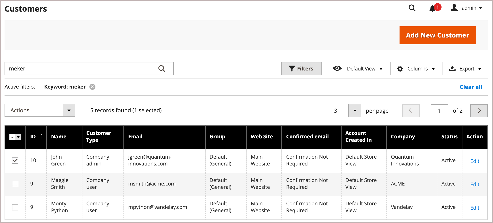
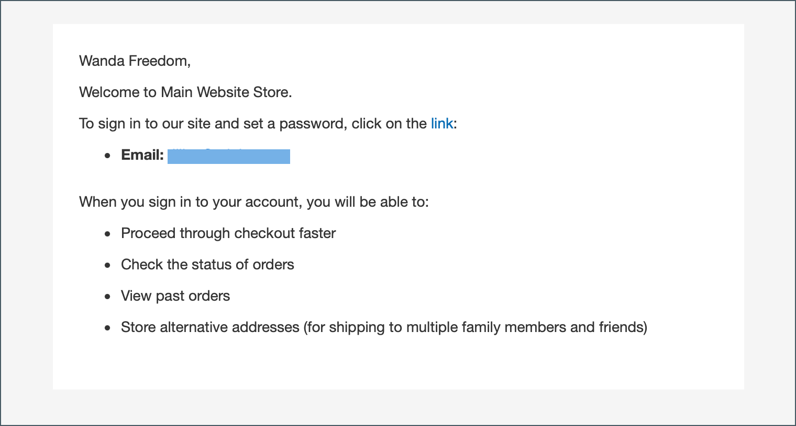

# 公司帐户

当您在商店中合并B2B公司帐户时，您可以让公司根据其组织中的用户角色创建多个具有灵活权限的子帐户，从而简化公司购物体验。

根据公司的具体情况，店铺管理员可以调整促销活动和价格以满足他们的需求，并创建高度定制的优惠，以满足购物者的需求并增加订单。

将公司帐户关联添加到标准[个人](../customers/account-create.md)允许客户使用为公司定义的特定购买工作流。

公司帐户的优势：

- 为无限制的[公司用户](account-company-users.md)提供和创建附加帐户，从而简化公司购买。

- 包含对具有不同下订单的[角色和权限](account-company-roles-permissions.md)的&#x200B;_smart_&#x200B;公司帐户层次结构的支持。

- 通过提供[公司商店积分](credit-company.md)作为付款方式，为商家提供增加收入的机制。

- 支持管理员对所有公司帐户的[管理](account-company-manage.md)。

## 查看公司帐户

_公司_&#x200B;网格列出了所有活动的公司帐户和挂起的请求，无论状态设置如何。 它还为[创建](account-company-create.md)和[管理](account-company-manage.md)公司帐户提供了工具。 使用标准网格控件筛选列表并调整列布局。 有关列说明的列表，请参阅[管理公司帐户](account-company-manage.md)中的&#x200B;_列说明_&#x200B;部分。

客户可以从店面创建公司帐户，或者商家可以从管理员创建公司帐户。 默认情况下，从店面创建公司帐户的功能处于启用状态。 如果配置允许，则商店的访客可以请求打开公司帐户。 公司帐户获得批准后，公司管理员可以设置公司结构和具有各种级别权限的用户。

在&#x200B;_管理员_&#x200B;侧边栏中，转到&#x200B;**[!UICONTROL Customers]** > **[!UICONTROL Companies]**。

{width="700" zoomable="yes"}

[!UICONTROL Companies]网格列出了所有公司，无论其状态如何。 公司列表指示公司是否与[公司层次结构](manage-company-hierarchy.md)关联，并提供有关公司的[详细信息](/help/b2b/account-company-manage.md#company-options-and-columns)、公司管理员及其他信息。 使用[管理网格控件](../getting-started/admin-grid-controls.md)自定义视图，以设置筛选器、列视图选项等。

## 公司管理员

以下示例显示具有初始公司管理员帐户的&#x200B;_客户_&#x200B;网格。

使用公司管理员帐户的{width="700" zoomable="yes"}

每个公司都有一个由帐户电子邮件地址以及管理员的名字和姓氏标识的公司管理员。 管理员可以作为用户分配给其他公司，但他们只能作为一家公司的管理员。

创建帐户后，公司管理员定义[团队](account-company-structure.md)的公司结构，设置[公司用户](account-company-users.md)，并为每个用户建立[角色和权限](account-company-roles-permissions.md)。

### 在首次登录前设置公司管理员密码

1. 公司管理员从应用商店找到一封欢迎电子邮件。

   {width="500"}

   >[!NOTE]
   >
   >电子邮件的电子邮件地址目标和内容由[公司电子邮件选项](email-company-configuration.md)配置中指定的选项决定。

1. 按照说明进行操作，然后单击&#x200B;[!UICONTROL **链接**]&#x200B;设置其密码。

1. 为其帐户输入&#x200B;[!UICONTROL **新密码**]&#x200B;和密码确认。

   密码必须至少包括以下字符类型中的三种：

   - 小写字符(abc...)
   - 大写字符(ABC...)
   - 数字(1234567890)
   - 特殊字符(！@#$...)

1. 单击&#x200B;[!UICONTROL **设置新密码**]。

   {width="700" zoomable="yes"}

1. 显示[!UICONTROL Customer Login]页面时，客户输入其&#x200B;[!UICONTROL **电子邮件**]&#x200B;和&#x200B;[!UICONTROL **密码**]。

1. 单击&#x200B;[!UICONTROL **登录**]&#x200B;以访问其帐户信息板。

   {width="700" zoomable="yes"}

## 公司结构

公司账目可设立以反映业务结构。 最初，公司结构仅包括公司管理员，但可以扩展到包括用户团队。 用户可与团队相关联，或在公司内部门和子部门的层次结构中进行组织。 该结构旨在支持对与公司帐户关联的[采购订单](purchase-order-flow.md) (PO)使用[审批规则](account-dashboard-approval-rules.md)。

{width="450"}

在公司管理员帐户仪表板中，公司结构表示为树，最初仅由公司管理员组成。

{width="600"}

创建帐户后，公司管理员可以使用公司电子邮件地址或分配不同的电子邮件地址。

在以下示例中，初始公司结构包括公司管理员以及公司管理员名下的个人用户帐户。 但是，公司管理员功能（如公司结构和审批规则）仅在登录到指定为公司管理员的用户帐户时才可用。

具有管理员和用户帐户的{width="600"}
