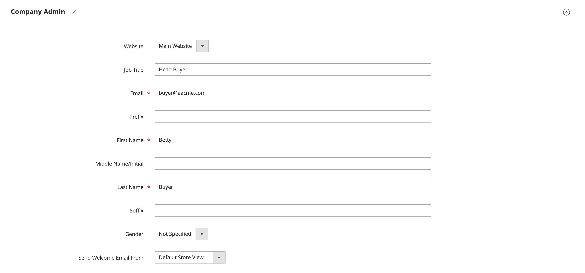

# 分配公司管理员

公司管理员最初是在首次创建公司帐户时分配的，只有商店管理员才能从管理员处对其进行修改。

- 每个公司只能有一个指定的管理员。
- 公司用户只能成为一家公司的管理员。
- 对已分配公司管理员的更改必须由管理员的存储管理员完成。

## 更改已分配的公司管理员

1. 在&#x200B;_管理员_&#x200B;侧边栏上，转到&#x200B;**[!UICONTROL Customers]** > **[!UICONTROL Companies]**。

   {width="700" zoomable="yes"}

1. 在列表中查找公司，然后单击&#x200B;**[!UICONTROL Edit]**。

1. 展开&#x200B;**[!UICONTROL Company Admin]**&#x200B;部分的。

   {width="700" zoomable="yes"}

1. 输入新公司管理员的&#x200B;**[!UICONTROL Job Title]**。

   此操作清除表单，必需的&#x200B;_[!UICONTROL First Name]_&#x200B;和_[!UICONTROL Last Name]_&#x200B;字段突出显示。

1. 输入新公司管理员的&#x200B;**[!UICONTROL Email]**&#x200B;地址。

   如果系统在数据库中找不到电子邮件地址，系统将提示您确认是否要替换公司管理员。

   - 如果新公司管理员没有用户帐户，则系统会创建`Company Admin`类型的帐户。

   - 如果用户帐户存在于系统中，则会将其移至公司结构中的公司管理员位置。

1. 输入&#x200B;**[!UICONTROL First Name]**&#x200B;和&#x200B;**[!UICONTROL Last Name]**，以及适用于新公司管理员的任何其他信息。

1. 完成后，单击&#x200B;**[!UICONTROL Save]**。

   前公司管理员的个人帐户作为活动用户帐户保留在系统中，分配给默认用户角色。 如果这是唯一与用户帐户关联的公司，则帐户类型将从&#x200B;*[!UICONTROL Company user]*&#x200B;更改为&#x200B;*[!UICONTROL Individual user]*。

   系统向新的和以前的公司管理员发送更改电子邮件通知。

