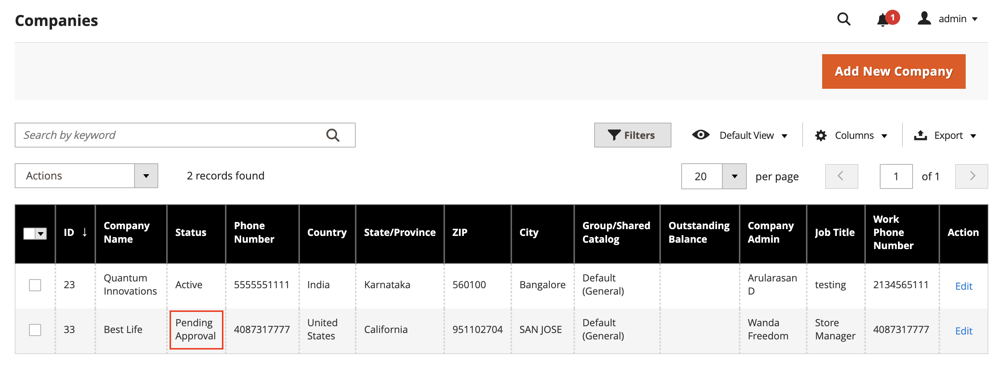

# 批准公司帐户

从店面收到的创建公司的请求的状态为 `Pending Approval` 直到应用商店管理员审查该请求，并批准或拒绝该请求。 公司帐户的状态可以设置为以下任意状态：

- [!UICONTROL Active]
- [!UICONTROL Pending Approval]
- [!UICONTROL Rejected]
- [!UICONTROL Blocked]

您也可以使用 [操作控制](account-company-manage.md) 批准多个公司请求。

{width="700" zoomable="yes"}

## 批准待处理公司帐户

1. 在 _管理员_ 侧栏，转到 **[!UICONTROL Customers]** > **[!UICONTROL Companies]**.

   您可以使用 _[!UICONTROL Columns]_选择器显示在网格上&#x200B;**[!UICONTROL Status]**列。

1. 在 _[!UICONTROL Action]_列，单击&#x200B;**[!UICONTROL Edit]**.

1. 设置 **[!UICONTROL Company Status]** 到 `Active`.

   {width="700" zoomable="yes"}

1. 提示确认时，单击 **[!UICONTROL Change status]**.

   公司管理员会收到公司当前处于活动状态的电子邮件通知。

1. 如果适用，请设置 **[!UICONTROL Sales Representative]** 到特定的管理员用户帐户。

1. 展开   该 **[!UICONTROL Account Information]** 部分并使用 **[!UICONTROL Comment]** 用于输入有关帐户的注释的字段。

   评论在店面不可见。

1. 完成后，单击 **[!UICONTROL Save]**.

   向公司和公司管理员发送确认电子邮件，确认公司帐户已获得批准。

## 公司状态

| 状态 | 描述 |
|------------------|--------------------------------------------------------------------------------------------------------------------------------------------|
| [!UICONTROL Active] | 公司已获批准，公司管理员可从店面对其进行管理。 |
| [!UICONTROL Pending Approval] | 创建公司帐户的请求已从店面提交，但尚未审核。 |
| [!UICONTROL Rejected] | 创建公司帐户的请求被商店管理员拒绝。 |
| [!UICONTROL Blocked] | 公司账户不再健全。 客户可以从店面访问帐户，但不能进行购买。 |

{style="table-layout:auto"}
