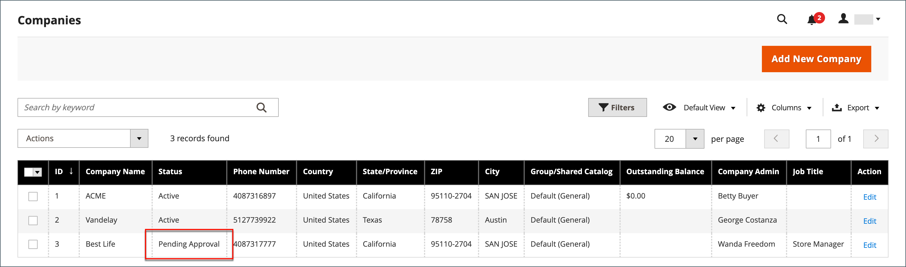

# 批准公司帐户

从店面收到的创建公司的请求的状态为`Pending Approval`，直到该请求被店面管理员审核并批准或拒绝。 公司帐户的状态可以设置为以下任意状态：

- [!UICONTROL Active]
- [!UICONTROL Pending Approval]
- [!UICONTROL Rejected]
- [!UICONTROL Blocked]

您还可以使用[Actions控件](account-company-manage.md)来批准多个公司请求。

{width="700" zoomable="yes"}

## 批准待处理公司帐户

1. 在&#x200B;_管理员_&#x200B;侧边栏上，转到&#x200B;**[!UICONTROL Customers]** > **[!UICONTROL Companies]**。

   您可以使用网格上方的&#x200B;_[!UICONTROL Columns]_选择器来显示&#x200B;**[!UICONTROL Status]**列。

1. 在&#x200B;_[!UICONTROL Action]_列中，单击&#x200B;**[!UICONTROL Edit]**。

1. 将&#x200B;**[!UICONTROL Company Status]**&#x200B;设置为`Active`。

   {width="700" zoomable="yes"}

1. 提示确认时，单击&#x200B;**[!UICONTROL Change status]**。

   公司管理员会收到公司当前处于活动状态的电子邮件通知。

1. 如果适用，请将&#x200B;**[!UICONTROL Sales Representative]**&#x200B;设置为特定的管理员用户帐户。

1. 展开&#x200B;**[!UICONTROL Account Information]**&#x200B;部分的，并使用&#x200B;**[!UICONTROL Comment]**&#x200B;字段输入有关帐户的注释。

   评论在店面不可见。

1. 完成后，单击&#x200B;**[!UICONTROL Save]**。

   向公司和公司管理员发送确认电子邮件，确认公司帐户已获得批准。

## 公司状态

| 状态 | 描述 |
|------------------|--------------------------------------------------------------------------------------------------------------------------------------------|
| [!UICONTROL Active] | 公司已获批准，公司管理员可从店面对其进行管理。 |
| [!UICONTROL Pending Approval] | 创建公司帐户的请求已从店面提交，但尚未审核。 |
| [!UICONTROL Rejected] | 创建公司帐户的请求被商店管理员拒绝。 |
| [!UICONTROL Blocked] | 公司账户不再健全。 客户可以从店面访问帐户，但不能进行购买。 |

{style="table-layout:auto"}
