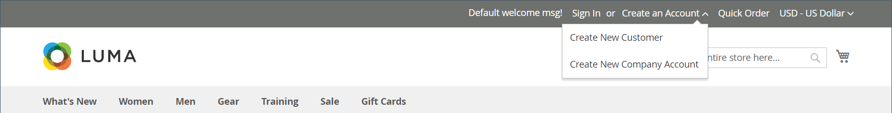

# 创建公司帐户

公司帐户可由客户在店面或管理员设置。 创建公司帐户的所有请求都必须获得商店管理员的批准，该帐户才能激活。

从店面设置公司帐户的人员被分配了一个角色，即 [公司管理员](account-company-admin.md). 创建公司帐户的请求获得批准后，公司管理员可以设置帐户密码并登录到帐户。

## 方法1：客户从店面创建帐户

>[!IMPORTANT]
>
>要支持此方法（允许客户从店面注册其公司），请确保 [B2B功能](enable-basic-features.md) 进行了相应配置，以便 **[!UICONTROL Allow Company Registration from the Storefront]** 设置为 `Yes`.

1. 在店面标题的右上角，客户单击 **[!UICONTROL Create an Account]** 并选择 **[!UICONTROL Create New Company Account]**.

   {width="700" zoomable="yes"}

   >[!NOTE]
   >
   >如果访客登录到注册的用户帐户，则他们可以通过导航到 _[!UICONTROL Customer Profile]_>**[!UICONTROL Company Structure]**>**[!UICONTROL Create a Company Account]**. 创建公司帐户后，客户帐户将被分配为主要联系人。 否则，系统会创建一个客户，该客户会收到一封用于设置密码的电子邮件。

1. 在 _[!UICONTROL Company Information]_部分，客户执行以下操作：

   - 填写必填字段：

      - **[!UICONTROL Company Name]**
      - **[!UICONTROL Company Email]**

   - 填写剩余的字段（如果适用）：

      - **[!UICONTROL Company Legal Name]**
      - **[!UICONTROL VAT/TAX ID]**
      - **[!UICONTROL Re-seller ID]**

   {width="700" zoomable="yes"}

1. 填写 _[!UICONTROL Legal Address]_部分。

   - **[!UICONTROL Street Address]**
   - **[!UICONTROL City]**
   - **[!UICONTROL Country]**
   - **[!UICONTROL State/Province]**
   - **[!UICONTROL ZIP/Postal Code]**
   - **[!UICONTROL Phone Number]**

   {width="700" zoomable="yes"}

1. 在 _[!UICONTROL Company Administrator]_部分，执行以下操作：

   - 进入 **[!UICONTROL Email address]** 作为公司管理员。

     公司管理员的电子邮件地址可以与公司电子邮件地址相同，也可以与不同的电子邮件地址相同。 如果输入了不同的电子邮件地址，则除了公司管理员帐户外，还会创建公司用户帐户。

   - 进入 **[!UICONTROL First Name]** 和 **[!UICONTROL Last Name]** 公司管理员的。

   - （可选）完成以下字段：

      - **[!UICONTROL Job Title]**
      - **[!UICONTROL Gender]**

   

1. 如果为此店面功能启用了reCAPTCHA，则完成验证。

1. 信息完成后，单击 **[!UICONTROL Submit]**.

   创建公司帐户的请求获得商家批准后，将向公司管理员发送电子邮件通知。

   {width="500"}

   设置密码后，公司管理员可以 [登录](../customers/customer-sign-in.md) 到帐户。

## 方法2：商家从管理员创建帐户

从管理员创建公司的过程与从店面创建公司的过程基本相同，只是增加了额外的字段。

{width="700" zoomable="yes"}

1. 在 _管理员_ 侧栏，转到 **[!UICONTROL Customers]** > **[!UICONTROL Companies]**.

1. 单击 **[!UICONTROL Add New Company]** 并执行以下操作：

   - 填写以下必填字段：

      - **[!UICONTROL Company Name]**
      - **[!UICONTROL Company Email]**

   - 如果您还没有准备好让帐户启用，请设置 **[!UICONTROL Status]** 到 `Pending Approval`. (设置为 `Active` 默认情况下。)

   - 如果适用，请选择的管理员帐户 **[!UICONTROL Sales Representative]** 谁将管理该帐户。

1. 在 _[!UICONTROL Account Information]_部分，执行以下操作：

   - 根据情况填写以下字段：

      - **[!UICONTROL Company Legal Name]**
      - **[!UICONTROL VAT/TAX ID]**
      - **[!UICONTROL Reseller ID]**

   - 对象 **[!UICONTROL Comment]**，输入有关客户的任何其他可能必需的信息。

     这些注释仅从管理员中可见。

   {width="700" zoomable="yes"}

1. 在最初创建公司时， _[!UICONTROL Company Hierarchy]_展开网格时，网格为空。 保存公司后，您可以将其包含在公司层次结构中。 请参阅 [公司管理](manage-companies.md).

1. 在 _[!UICONTROL Legal Address]_部分填写以下必填字段：

   - **[!UICONTROL Street Address]**
   - **[!UICONTROL City Country]**
   - **[!UICONTROL ZIP/Postal Code]**
   - **[!UICONTROL Phone Number]**

1. 在 _[!UICONTROL Company Admin]_部分，执行以下操作：

   - 填写以下必填字段：

      - **[!UICONTROL Email]**
      - **[!UICONTROL First Name]**
      - **[!UICONTROL Last Name]**

   - 完成名称的以下可选部分，这些部分可能比其他部分更适用于某些客户名称，您可以自行使用：

      - **[!UICONTROL Prefix]**
      - **[!UICONTROL Middle Name/Initial]**
      - **[!UICONTROL Suffix]**

   - 如果信息可用，请填写描述公司管理员的其余字段：

      - **[!UICONTROL Website]**
      - **[!UICONTROL Job Title]**
      - **[!UICONTROL Gender]**
      - **[!UICONTROL Send Welcome Email From]**

   {width="700" zoomable="yes"}

1. 在 _[!UICONTROL Company Credit]_部分，显示客户信用活动的摘要，请填写部分下半部分中的任意多个字段：

   - **[!UICONTROL Credit Currency]**
   - **[!UICONTROL Credit Limit]**
   - **[!UICONTROL Allow to Exceed Credit Limit]**
   - **[!UICONTROL Reason for Change]**

   {width="700" zoomable="yes"}

1. 在 _[!UICONTROL Advanced Settings]_部分，执行以下操作：

   >[!NOTE]
   >
   >客户组分配确定公司及其员工可用的共享目录。 默认情况下，会将公司分配给在配置中设置为默认的客户组。

   - 您可以更改 **[!UICONTROL Customer Group]** 将公司及其员工分配给有权访问其他共享目录的组或标准客户组。 在更改组之前，系统会提示您进行确认。

     {width="600"}

   - 如果要允许公司员工从其帐户生成报价，请设置 **[!UICONTROL Allow Quotes]** 到 `Yes`.

   - 如果要允许公司员工从其帐户创建和使用采购订单，请设置 **[!UICONTROL Enable Purchase Orders]** 到 `Yes`.

   - 要更改 **[!UICONTROL Applicable Payment Methods]** 公司可用的URL，清除 **[!UICONTROL Use config settings]** 复选框，然后选择以下任一选项：

     | 选项 | 描述 |
     | ------ | ----------- |
     | `B2B Payment Methods` | （默认）启用全部 [付款方式设置为默认值](../configuration-reference/general/b2b-features.md#default-b2b-payment-methods) B2B订单。 |
     | `All Enabled Payment Methods` | 制作全部 [启用的支付方式](../configuration-reference/sales/payment-methods.md) 适用于与公司帐户关联的客户帐户。 |
     | `Selected Payment Methods` | 允许您选择与公司帐户关联的客户帐户可用的付款方法。 要选择多种支付方式，请按住Ctrl键(PC)或Command键(Mac)并单击每个选项。 |

     {style="table-layout:auto"}

   - 要更改 **[!UICONTROL Applicable Shipping Methods]** 公司可用的URL，清除 **[!UICONTROL Use config settings]** 复选框，然后选择以下任一选项：

     | 选项 | 描述 |
     | ------ | ----------- |
     | `B2B Shipping Methods` | （默认）启用全部 [配送方式设置为默认值](../configuration-reference/general/b2b-features.md#default-b2b-shipping-methods) B2B订单。 |
     | `All Enabled Shipping Methods` | 制作全部 [启用的配送方式](../configuration-reference/sales/delivery-methods.md) 适用于与公司帐户关联的客户帐户。 |
     | `Selected Shipping Methods` | 允许您选择与公司帐户关联的客户帐户可用的配送方式。 要选择多种配送方式，请按住Ctrl键(PC)或Command键(Mac)并单击每个选项。 |

     {style="table-layout:auto"}

1. 完成后，单击 **[!UICONTROL Save]**.

   创建公司帐户的请求获得商家批准后，将向公司管理员的电子邮件地址发送一封电子邮件通知。

   设置密码后，公司管理员可以 [登录](../customers/customer-sign-in.md) 到帐户。

## 按钮栏

| 按钮 | 描述 |
|------- | ----------- |
| [!UICONTROL Back] | 返回到“公司”页而不保存更改。 |
| [!UICONTROL Reset] | 将原始值还原到具有未保存更改的任何字段。 |
| [!UICONTROL Save] | 将更改保存到公司，并保持配置文件处于打开状态。 |
| [!UICONTROL Save & Close] | 保存对公司所做的更改并关闭用户档案。 |

{style="table-layout:auto"}

## 字段描述

| 字段 | 描述 |
|--- |--- |
| [!UICONTROL Company Name] | 公司名称在首次创建公司帐户时输入，可以是完整法律名称的缩写版本。 |
| [!UICONTROL Status] | （仅限管理员）指示公司帐户的当前状态。 选项：  **[!UICONTROL Active]**— 公司帐户由商店管理员批准。 公司管理员和关联成员可以从店面登录帐户并进行购买。 **[!UICONTROL Pending Approval]**  — 已提交打开公司帐户的请求，但尚未获得商店管理员的批准。  **[!UICONTROL Rejected]**— 已提交打开公司帐户的请求，但未获得商店管理员的批准。 用于提交请求的初始登录凭据被阻止。 **&#x200B;已阻止&#x200B;**— 公司成员可以登录并访问目录，但不能进行购买。 商店管理员可能会阻止信誉不佳的公司帐户。 商店管理员可随时删除帐户上的块。 |
| [!UICONTROL Company Email] | 与公司帐户关联的电子邮件地址。 |
| [!UICONTROL Sales Representative] | （仅限管理员）作为公司帐户主要联系人的管理员用户。 |

{style="table-layout:auto"}

### [!UICONTROL Account Information]

| 字段 | 描述 |
|--- |--- |
| [!UICONTROL Company Legal Name] | 公司的完整法定名称。 |
| [!UICONTROL VAT / TAX ID] | 此 [增值税](../stores-purchase/vat.md) 某些管辖区为报税目的而分配给公司的编号。 要配置要显示在店面中的客户VAT/TAX ID，请参阅 [创建新帐户选项](../configuration-reference/customers/customer-configuration.md).   **_注意：_** 公司管理员和其他公司用户在其客户帐户中没有各自的增值税/税号。 |
| [!UICONTROL Reseller ID] | 为纳税申报目的而分配给公司的转售编号。 |
| [!UICONTROL Comment] | （仅限管理员）有关公司帐户的这些注释仅供管理员参考和查看。 |

{style="table-layout:auto"}

### [!UICONTROL Company Hierarchy]

| 字段 | 描述 |
|--- |--- |
| [!UICONTROL Company ID] | 公司的ID号。 |
| [!UICONTROL Company Name] | 公司的全名。  A `current company indicator` 显示在正在编辑的公司行中。 |
| [!UICONTROL Company Email] | 与公司帐户关联的电子邮件地址。 |
| [!UICONTROL Phone Number] | 公司的主要电话号码。 |
| [!UICONTROL State/Province] | 公司注册地所在国家或省。 |
| [!UICONTROL City] | 公司注册地城市，开展业务。 |
| [!UICONTROL Customer Group] | （仅限管理员）指示 [客户组](../customers/customer-groups.md) 或 [共享目录](catalog-shared.md) 分配给公司的属性。 |
| [!UICONTROL Company Admin] | 公司管理员的全名。 |
| [!UICONTROL Action] | 公司行可能执行的操作列表。 |

{style="table-layout:auto"}

### [!UICONTROL Legal Address]

| 字段 | 描述 |
|--- |--- |
| [!UICONTROL Street Address] | 公司开展业务的注册街道地址。 |
| [!UICONTROL City] | 公司注册地城市，开展业务。 |
| [!UICONTROL Country] | 公司注册经营的国家/地区。 |
| [!UICONTROL State/Province] | 公司注册地所在国家或省。 |
| [!UICONTROL ZIP/Postal Code] | 公司注册开展业务的邮政编码。 |
| [!UICONTROL Phone Number] | 公司的主要电话号码。 |

{style="table-layout:auto"}

### [!UICONTROL Company Admin]

| 字段 | 描述 |
|--- |--- |
| [!UICONTROL Website] | 确定公司管理员所属的网站。 |
| [!UICONTROL Job Title] | 管理公司帐户的公司管理员的职务。 |
| [!UICONTROL Email] | 公司管理员的电子邮件地址可以与公司电子邮件地址相同。 如果输入了不同的电子邮件地址，则除了公司帐户外，还会为公司管理员创建单独的个人帐户。 |
| [!UICONTROL Prefix] | 如果适用，则为与公司管理员的姓名关联的前缀(例如 `Mr.`， `Ms.`， `Mrs.`，或 `Dr.`)。 根据配置，输入字段可能是文本字段或列表。 |
| [!UICONTROL First Name] | 公司管理员的名字。 |
| [!UICONTROL Middle Name/Initial] | 公司管理员的中间名或首字母。 |
| [!UICONTROL Last Name] | 公司管理员的姓氏。 |
| [!UICONTROL Suffix] | 如果适用，则为与公司管理员的姓名关联的后缀(例如 `Jr.`， `Sr.`，或 `III.`)。 根据配置，输入字段可能是文本字段或列表。 |
| [!UICONTROL Gender] | 公司管理员的性别。 选项： `Male` / `Female` / `Not Specified` |
| [!UICONTROL Send Welcome Email From] | 从中发送欢迎电子邮件的商店视图。 |

{style="table-layout:auto"}

### [!UICONTROL Company Credit]

| 字段 | 描述 |
|--- |--- |
| [!UICONTROL Credit Currency] | （仅限管理员）商店接受以公司信贷购买的货币。 |
| [!UICONTROL Credit Limit] | （仅限管理员）扩展到公司帐户的信用额度。 |
| [!UICONTROL Allow to Exceed Credit Limit] | （仅限管理员）指示公司是否有权超出信用额度。 选项： `Yes` / `No` |
| [!UICONTROL Reason for Change] | （仅限管理员）说明公司被允许或不允许超出信用额度原因的注释。 仅当超出信用限制的权限发生变化时，此字段才处于活动状态。 |

{style="table-layout:auto"}

### [!UICONTROL Advanced Settings]

| 字段 | 描述 |
|--- |--- |
| [!UICONTROL Customer Group] | （仅限管理员）指示 [客户组](../customers/customer-groups.md) 或 [共享目录](catalog-shared.md) 分配给公司的属性。 |
| [!UICONTROL Allow Quotes] | （仅限管理员）确定公司成员是否可以代表公司准备并提交可协商报价。 |
| [!UICONTROL Enable Purchase Orders] | （仅限管理员）确定公司成员是否可以提交订单 [采购订单](account-dashboard-my-purchase-orders.md) 代表公司。 |
| 适用的支付方式 | （仅限管理员）指示可用于公司购买的付款方法。 选项： `B2B Payment Methods` / `All Enabled Payment Methods` / `Selected Payment Methods` |
| [!UICONTROL Payment Methods] | （仅限管理员）如果激活了特定支付方式，则变为活动状态。 要使公司帐户可以使用多种支付方式，请按住Ctrl键(PC)或命令键(Mac)并单击每个选项。 |
| [!UICONTROL Applicable Shipping Methods] | （仅限管理员）指示可用于公司购买的配送方式。 选项： `B2B Shipping Methods` / `All Enabled Shipping Methods` / `Selected Shipping Methods` |
| [!UICONTROL Shipping Methods] | （仅限管理员）如果激活了特定配送方式，则变为活动状态。 要使公司帐户可以使用多种支付方式，请按住Ctrl键(PC)或命令键(Mac)并单击每个选项。 |

{style="table-layout:auto"}
