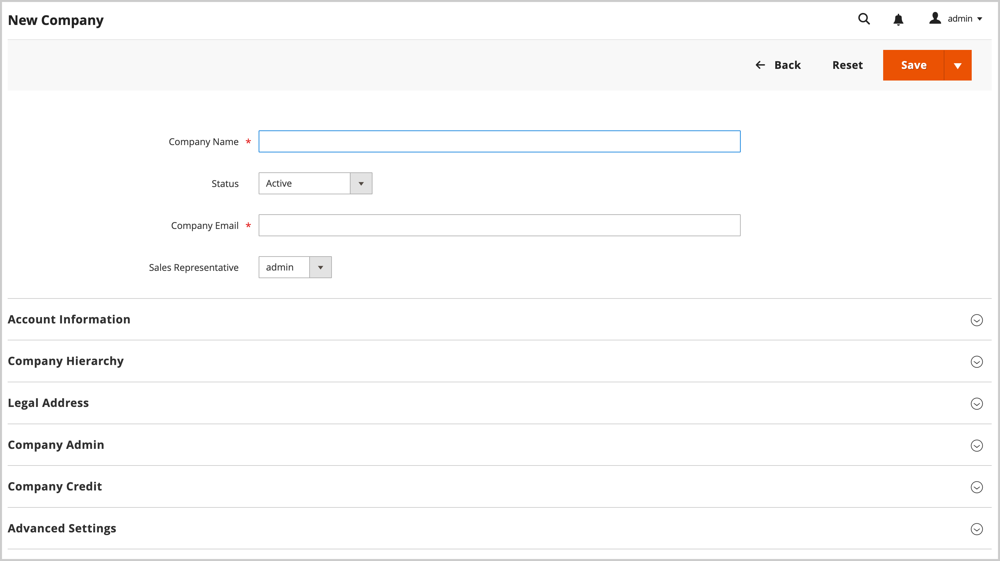

# 创建公司帐户

公司帐户使B2B企业能够在Adobe Commerce中管理其购买、用户和信用。 本主题介绍创建、配置和激活公司帐户的完整过程。

## 公司帐户创建概述

公司帐户可通过两种方法创建，每种方法都适用于不同的业务方案：

* **店面注册** — 企业自助帐户请求
* **管理员创建** — 具有预配置详细信息的销售辅助帐户设置

所有公司帐户在成为活动帐户之前都需要管理员批准，以确保进行适当的审查和配置。

## 先决条件

在创建公司帐户之前，请确保满足以下要求：

* **系统要求：**
   * 已在Adobe Commerce安装中启用[B2B功能](enable-basic-features.md)
   * 已启用公司注册以创建店面
   * 为审批工作流配置电子邮件通知

* **业务要求：**
   * 建立批准流程和策略
   * 已分配销售代表（针对管理员创建的帐户）
   * 信贷政策已界定（倘使用公司信贷）
   * 配置客户组和共享目录

* **管理访问权限：**
   * 公司管理的适当权限
   * 访问客户和公司管理部分

系统将[公司管理员](account-company-admin.md)角色分配给从店面设置公司帐户的人员。 商店管理员在管理员中批准公司帐户创建请求后，公司管理员可以设置帐户密码并登录到该帐户。

## 方法1：客户从店面创建帐户

**何时使用此方法：**

* 首选自助式业务注册
* 客户随时可以获得所有必需的业务信息
* 标准审批工作流就足够了
* 无需特殊配置或预填充

>[!IMPORTANT]
>
>要支持此方法（允许客户从店面注册其公司），请确保已启用[B2B功能](enable-basic-features.md)。

1. 在店面标题的右上角，客户单击&#x200B;**[!UICONTROL Create an Account]**&#x200B;并选择&#x200B;**[!UICONTROL Create New Company Account]**。

   {width="700" zoomable="yes"}

   >[!NOTE]
   >
   >如果访客登录到注册的用户帐户，则他们可以通过导航到&#x200B;_[!UICONTROL Customer Profile]_>**[!UICONTROL Company Structure]**>**[!UICONTROL Create a Company Account]**来创建公司帐户。

1. 在&#x200B;_[!UICONTROL Company Information]_部分中，客户执行以下操作：

   * 填写必填字段：

      * **[!UICONTROL Company Name]**
      * **[!UICONTROL Company Email]**

   * 填写剩余的字段（如果适用）：

      * **[!UICONTROL Company Legal Name]**
      * **[!UICONTROL VAT/TAX ID]**
      * **[!UICONTROL Reseller ID]**

   {width="700" zoomable="yes"}

1. 完成&#x200B;_[!UICONTROL Legal Address]_部分中的必填字段。

   * **[!UICONTROL Street Address]**
   * **[!UICONTROL City]**
   * **[!UICONTROL Country]**
   * **[!UICONTROL State/Province]**
   * **[!UICONTROL ZIP/Postal Code]**
   * **[!UICONTROL Phone Number]**

   {width="700" zoomable="yes"}

1. 在&#x200B;_[!UICONTROL Company Administrator]_部分中，执行以下操作：

   * 为公司管理员输入&#x200B;**[!UICONTROL Email address]**。

     公司管理员的电子邮件地址可以与公司电子邮件地址相同，也可以与不同的电子邮件地址相同。 如果输入不同的电子邮件地址，则除了公司管理员帐户外，系统还会创建公司用户帐户。

   * 输入公司管理员的&#x200B;**[!UICONTROL First Name]**&#x200B;和&#x200B;**[!UICONTROL Last Name]**。

   * （可选）完成以下字段：

      * **[!UICONTROL Job Title]**
      * **[!UICONTROL Work Phone Number]**
      * **[!UICONTROL Gender]**

   

1. 如果为此店面功能启用了reCAPTCHA，则完成验证。

1. 信息完成后，选择&#x200B;**[!UICONTROL Submit]**。

   当商家批准创建公司帐户的请求时，系统会向公司管理员发送电子邮件通知。

   {width="500"}

   设置密码后，公司管理员可以[登录](../customers/customer-sign-in.md)帐户。

## 方法2：商家从管理员创建帐户

**何时使用此方法：**

* 首选创建销售辅助帐户
* 根据现有业务关系预填充帐户详细信息
* 需要自定义配置（信用额度、特殊定价）
* 需要立即激活而无需审批工作流

从管理员创建公司的过程与从店面创建公司的过程基本相同，只是增加了额外的字段。

从管理员{width="700" zoomable="yes"}

1. 在&#x200B;_管理员_&#x200B;侧边栏上，转到&#x200B;**[!UICONTROL Customers]** > **[!UICONTROL Companies]**。

1. 单击&#x200B;**[!UICONTROL Add New Company]**&#x200B;并执行以下操作：

   * 填写以下必填字段：

      * **[!UICONTROL Company Name]**
      * **[!UICONTROL Company Email]**

   * 如果您还没有准备好让帐户上线，请将&#x200B;**[!UICONTROL Status]**&#x200B;设置为`Pending Approval`。 （默认设置为`Active`。）

   * 如果适用，请选择将管理该帐户的&#x200B;**[!UICONTROL Sales Representative]**&#x200B;的管理员帐户。

1. 在&#x200B;_[!UICONTROL Account Information]_部分中，执行以下操作：

   * 根据情况填写以下字段：

      * **[!UICONTROL Company Legal Name]**
      * **[!UICONTROL VAT/TAX ID]**
      * **[!UICONTROL Reseller ID]**

   * 对于&#x200B;**[!UICONTROL Comment]**，请输入可能需要的有关客户的任何其他信息。

     这些注释仅从管理员中可见。

   {width="700" zoomable="yes"}

1. 最初创建公司时，展开公司时&#x200B;_[!UICONTROL Company Hierarchy]_网格显示为空。 保存公司后，您可以将其包含在公司层次结构中。 查看[公司管理](manage-companies.md)。

1. 在&#x200B;_[!UICONTROL Legal Address]_部分中，完成以下必填字段：

   * **[!UICONTROL Street Address]**
   * **[!UICONTROL City]**
   * **[!UICONTROL Country]**
   * **[!UICONTROL ZIP/Postal Code]**
   * **[!UICONTROL Phone Number]**

1. 在&#x200B;_[!UICONTROL Company Admin]_部分中，执行以下操作：

   * 填写以下必填字段：

      * **[!UICONTROL Email]**
      * **[!UICONTROL First Name]**
      * **[!UICONTROL Last Name]**

   * 完成名称的以下可选部分，这些部分可能比其他部分更适用于某些客户名称，您可以自行使用：

      * **[!UICONTROL Prefix]**
      * **[!UICONTROL Middle Name/Initial]**
      * **[!UICONTROL Suffix]**

   * 如果信息可用，请填写描述公司管理员的其余字段：

      * **[!UICONTROL Website]**
      * **[!UICONTROL Job Title]**
      * **[!UICONTROL Work Phone Number]**
      * **[!UICONTROL Gender]**
      * **[!UICONTROL Send Welcome Email From]**

   {width="700" zoomable="yes"}

1. 在显示客户信用活动摘要的&#x200B;_[!UICONTROL Company Credit]_部分中，完成部分下半部分中的任意多个字段：

   * **[!UICONTROL Credit Currency]**
   * **[!UICONTROL Credit Limit]**
   * **[!UICONTROL Allow to Exceed Credit Limit]**
   * **[!UICONTROL Reason for Change]**

   {width="700" zoomable="yes"}

1. 在&#x200B;_[!UICONTROL Advanced Settings]_部分中，执行以下操作：

   >[!NOTE]
   >
   >客户组分配确定公司及其员工可用的共享目录。 默认情况下，系统将公司分配给配置为默认的客户组。

   * 您可以将公司及其员工的&#x200B;**[!UICONTROL Customer Group]**&#x200B;分配更改为有权访问其他共享目录的组或标准客户组。 系统会在更改组之前提示您进行确认。

     {width="600"}

   * 如果要允许公司员工从其帐户生成报价，请将&#x200B;**[!UICONTROL Allow Quotes]**&#x200B;设置为`Yes`。

   * 如果要允许公司员工从其帐户创建和使用采购订单，请将&#x200B;**[!UICONTROL Enable Purchase Orders]**&#x200B;设置为`Yes`。

   * 要更改公司可用的&#x200B;**[!UICONTROL Applicable Payment Methods]**，请清除&#x200B;**[!UICONTROL Use config settings]**&#x200B;复选框并选择以下选项之一：

     | 选项 | 描述 |
     |-------------------------------|-----------------------------------------------------------------------------------------------------------------------------------------------------------------------------------------------------------------------------------------|
     | `B2B Payment Methods` | （默认）为B2B订单启用设置为默认[的所有](../configuration-reference/general/b2b-features.md#default-b2b-payment-methods)付款方法。 |
     | `All Enabled Payment Methods` | 使所有[启用的付款方法](../configuration-reference/sales/payment-methods.md)可用于与公司帐户关联的客户帐户。 |
     | `Selected Payment Methods` | 允许您选择与公司帐户关联的客户帐户可用的付款方法。 要选择多种支付方式，请按住Ctrl键(PC)或Command键(Mac)并选择每个选项。 |

     {style="table-layout:auto"}

   * 要更改公司可用的&#x200B;**[!UICONTROL Applicable Shipping Methods]**，请清除&#x200B;**[!UICONTROL Use config settings]**&#x200B;复选框并选择以下选项之一：

     | 选项 | 描述 |
     |--------------------------------|----------------------------------------------------------------------------------------------------------------------------------------------------------------------------------------------------------------------------------------------------|
     | `B2B Shipping Methods` | （默认）为B2B订单启用设置为默认[的所有](../configuration-reference/general/b2b-features.md#default-b2b-shipping-methods)配送方式。 |
     | `All Enabled Shipping Methods` | 使所有[启用的配送方式](../configuration-reference/sales/delivery-methods.md)都可供与公司帐户关联的客户帐户使用。 |
     | `Selected Shipping Methods` | 允许您选择与公司帐户关联的客户帐户可用的配送方式。 要选择多种配送方式，请按住Ctrl键(PC)或Command键(Mac)并选择每个选项。 |

     {style="table-layout:auto"}

1. 完成后，选择&#x200B;**[!UICONTROL Save]**。

   创建公司帐户的请求获得商家批准后，将向公司管理员的电子邮件地址发送一封电子邮件通知。

   设置密码后，公司管理员可以[登录](../customers/customer-sign-in.md)帐户。

## 帐户创建后

创建公司帐户后，将发生以下过程：

### 1.审批工作流程

* **待处理状态** — 新帐户等待管理员审核
* **审核流程** — 存储管理员验证业务信息并批准/拒绝请求
* **状态更新** — 公司会收到有关审批状态更改的电子邮件通知

### 2.帐户激活

* **欢迎电子邮件** — 已批准的公司管理员收到安装说明
* **密码设置** — 管理员为帐户访问创建安全密码
* **初始登录** — 首次访问公司信息板和功能

### 3.公司管理员的后续步骤

激活后，公司管理员应：

* **[配置公司结构](account-company-structure.md)** — 设置部门和用户层次结构
* **[管理公司用户](account-company-users.md)** — 添加员工并分配角色
* **[设置采购订单](purchase-order-flow.md)** — 根据需要配置审批工作流
* **[查看信用设置](credit-company.md)** — 了解和管理公司信用（如果已启用）

## 常见问题和疑难解答

### 帐户创建问题

**注册表单提交失败**

* 验证所有必填字段均已正确填写
* 检查电子邮件地址是否有效且唯一
* 确保已启用B2B功能并允许公司注册
* 清除浏览器缓存并重试

**公司名称已存在**

* 选择唯一的公司名称
* 如果您认为出现错误，请联系管理员
* 考虑添加位置或业务单位标识符

**电子邮件地址问题**

* 使用企业电子邮件地址而不是个人电子邮件地址
* 确保公司管理员电子邮件可访问
* 检查域是否未被电子邮件筛选器阻止

### 审批和激活问题

**未收到批准电子邮件**

* 检查垃圾邮件/垃圾邮件文件夹
* 验证在注册过程中输入的电子邮件地址是否正确
* 联系商店管理员以进行手动审批状态检查
* 工作日内留出24 - 48小时进行处理

**批准后无法设置密码**

* 使用批准电子邮件中提供的确切链接
* 检查激活链接是否已过期
* 向管理员请求新的激活电子邮件

**激活后的访问问题**

* 验证你是否通过正确的公司帐户门户登录
* 检查您的帐户状态是否为“活动”
* 确保您使用的是公司管理员凭据
* 如果权限不正确，请联系支持人员

## 安全最佳实践

创建和管理公司帐户时：

* **使用强密码** — 需要公司管理员的复杂密码
* **验证业务信息** — 在审批过程中验证公司详细信息
* **监视帐户活动** — 定期审查公司用户访问和权限
* **保护敏感数据** — 确保信用和财务信息得到适当保护

## 公司帐户用户界面参考

### 按钮栏

| 按钮 | 描述 |
|---------------------------|------------------------------------------------------------------|
| [!UICONTROL Back] | 返回到“公司”页而不保存更改。 |
| [!UICONTROL Reset] | 将原始值还原到具有未保存更改的任何字段。 |
| [!UICONTROL Save] | 将更改保存到公司，并保持配置文件处于打开状态。 |
| [!UICONTROL Save & Close] | 保存对公司所做的更改并关闭用户档案。 |

{style="table-layout:auto"}

### 字段描述

| 字段 | 描述 |
|-----------------------------------|---------------------------------------------------------------------------------------------------------------------------------------------------------------------------------------------------------------------------------------------------------------------------------------------------------------------------------------------------------------------------------------------------------------------------------------------------------------------------------------------------------------------------------------------------------------------------------------------------------------------------------------------------------------------------------------------------------------------------------------------------------------------------------------------------------------------------------------------------------------------------------------------------------------------------------|
| [!UICONTROL Company Name] | 公司名称在首次创建公司帐户时输入，可以是完整法律名称的缩写版本。 |
| [!UICONTROL Status] | （仅限管理员）指示公司帐户的当前状态。 选项：  **[!UICONTROL Active]**— 公司帐户由存储管理员批准。 公司管理员和关联成员可以从店面登录帐户并进行购买。 **[!UICONTROL Pending Approval]** — 已提交打开公司帐户的请求，但尚未获得商店管理员的批准。  **[!UICONTROL Rejected]**— 已提交打开公司帐户的请求，但未获得商店管理员的批准。 用于提交请求的初始登录凭据被阻止。 **&#x200B;已阻止&#x200B;**— 公司成员可以登录并访问目录，但不能进行购买。 商店管理员可能会阻止信誉不佳的公司帐户。 商店管理员可随时删除帐户上的块。 |
| [!UICONTROL Company Email] | 与公司帐户关联的电子邮件地址。 |
| [!UICONTROL Sales Representative] | （仅限管理员）作为公司帐户主要联系人的管理员用户。 |

{style="table-layout:auto"}

#### [!UICONTROL Account Information]

| 字段 | 描述 |
|---------------------------------|-----------------------------------------------------------------------------------------------------------------------------------------------------------------------------------------------------------------------------------------------------------------------------------------------------------------------------------------------------------------------------------------------------------------------------------------------------------------|
| [!UICONTROL Company Legal Name] | 公司的完整法定名称。 |
| [!UICONTROL VAT / TAX ID] | 某些管辖区为报税目的而分配给公司的[增值税](../stores-purchase/vat.md)编号。 要将客户VAT/TAX ID配置为显示在店面中，请参阅[新建帐户选项](../configuration-reference/customers/customer-configuration.md)。  **_注意:_**&#x200B;公司管理员和其他公司用户在其客户帐户中没有自己的增值税/税号。 |
| [!UICONTROL Reseller ID] | 为纳税申报目的而分配给公司的转售编号。 |
| [!UICONTROL Comment] | （仅限管理员）有关公司帐户的这些注释仅供管理员参考和查看。 |

{style="table-layout:auto"}

#### [!UICONTROL Company Hierarchy]

| 字段 | 描述 |
|-----------------------------------|------------------------------------------------------------------------------------------------------------------------------------------------------|
| [!UICONTROL Company ID] | 公司的ID号。 |
| [!UICONTROL Company Name] | 公司的全名。  正在编辑的公司行中出现一个`current company indicator`。 |
| [!UICONTROL Company Email] | 与公司帐户关联的电子邮件地址。 |
| [!UICONTROL Phone Number] | 公司的主要电话号码。 |
| [!UICONTROL Country] | 公司注册经营的国家/地区。 |
| [!UICONTROL State/Province] | 公司注册地所在国家或省。 |
| [!UICONTROL City] | 公司注册地城市，开展业务。 |
| [!UICONTROL Group/Shared Catalog] | （仅限管理员）显示分配给公司的[客户组](../customers/customer-groups.md)或[共享目录](catalog-shared.md)。 |
| [!UICONTROL Company Admin] | 公司管理员的全名。 |
| [!UICONTROL Action] | 公司行可能执行的操作列表。 |

{style="table-layout:auto"}

#### [!UICONTROL Legal Address]

| 字段 | 描述 |
|------------------------------|-----------------------------------------------------------------------------|
| [!UICONTROL Street Address] | 公司开展业务的注册街道地址。 |
| [!UICONTROL City] | 公司注册地城市，开展业务。 |
| [!UICONTROL Country] | 公司注册经营的国家/地区。 |
| [!UICONTROL State/Province] | 公司注册地所在国家或省。 |
| [!UICONTROL ZIP/Postal Code] | 公司注册开展业务的邮政编码。 |
| [!UICONTROL Phone Number] | 公司的主要电话号码。 |

{style="table-layout:auto"}

#### [!UICONTROL Company Admin]

| 字段 | 描述 |
|--------------------------------------|---------------------------------------------------------------------------------------------------------------------------------------------------------------------------------------------------------------------------------------------------|
| [!UICONTROL Website] | 确定公司管理员所属的网站。 |
| [!UICONTROL Job Title] | 管理公司帐户的公司管理员的职务。 |
| [!UICONTROL Work Phone Number] | 管理公司帐户的公司管理员的电话号码。 |
| [!UICONTROL Email] | 公司管理员的电子邮件地址可以与公司电子邮件地址相同。 如果输入不同的电子邮件地址，则系统将为公司管理员创建除公司帐户之外的单独个人帐户。 |
| [!UICONTROL Prefix] | 如果适用，与公司管理员的姓名（如`Mr.`、`Ms.`、`Mrs.`或`Dr.`）关联的前缀。 根据配置，输入字段可能是文本字段或列表。 |
| [!UICONTROL First Name] | 公司管理员的名字。 |
| [!UICONTROL Middle Name/Initial] | 公司管理员的中间名或首字母。 |
| [!UICONTROL Last Name] | 公司管理员的姓氏。 |
| [!UICONTROL Suffix] | 如果适用，则为与公司管理员的姓名关联的后缀（如`Jr.`、`Sr.`或`III.`）。 根据配置，输入字段可能是文本字段或列表。 |
| [!UICONTROL Gender] | 公司管理员的性别。 选项： `Male` / `Female` / `Not Specified` |
| [!UICONTROL Send Welcome Email From] | 系统从中发送欢迎电子邮件的商店视图。 |

{style="table-layout:auto"}

#### [!UICONTROL Company Credit]

| 字段 | 描述 |
|-------------------------------------------|-----------------------------------------------------------------------------------------------------------------------------------------------------------------------------------------|
| [!UICONTROL Credit Currency] | （仅限管理员）商店接受以公司信贷购买的货币。 |
| [!UICONTROL Credit Limit] | （仅限管理员）扩展到公司帐户的信用额度。 |
| [!UICONTROL Allow to Exceed Credit Limit] | （仅限管理员）指示公司是否有权超出信用额度。 选项： `Yes` / `No` |
| [!UICONTROL Reason for Change] | （仅限管理员）说明公司被允许或不允许超出信用额度原因的注释。 仅当超出信用限制的权限发生变化时，此字段才处于活动状态。 |

{style="table-layout:auto"}

#### [!UICONTROL Advanced Settings]

您可以为各个公司配置高级设置。 如果创建公司层次结构，则可以通过配置父公司的设置并将这些设置应用于所有或选定的子公司来简化设置配置，而不是单独配置每个子公司。 有关详细信息，请参阅[管理公司层次结构](manage-company-hierarchy.md)。

| 字段 | 描述 |
|------------------------------------------|--------------------------------------------------------------------------------------------------------------------------------------------------------------------------------------------------------------------------|
| [!UICONTROL Customer Group] | （仅限管理员）显示分配给公司的[客户组](../customers/customer-groups.md)或[共享目录](catalog-shared.md)。 |
| [!UICONTROL Allow Quotes] | （仅限管理员）确定公司成员是否可以代表公司准备并提交可协商报价。 |
| [!UICONTROL Enable Purchase Orders] | （仅限管理员）确定公司成员是否可以代表公司提交订单作为[采购订单](account-dashboard-my-purchase-orders.md)。 |
| 适用的支付方式 | （仅限管理员）指示可用于公司购买的付款方法。 选项： `B2B Payment Methods` / `All Enabled Payment Methods` / `Selected Payment Methods` |
| [!UICONTROL Payment Methods] | （仅限管理员）如果您激活特定支付方式，则变为活动状态。 要使公司帐户可以使用多种支付方式，请按住Ctrl键(PC)或命令键(Mac)并选择每个选项。 |
| [!UICONTROL Applicable Shipping Methods] | （仅限管理员）指示可用于公司购买的配送方式。 选项： `B2B Shipping Methods` / `All Enabled Shipping Methods` / `Selected Shipping Methods` |
| [!UICONTROL Shipping Methods] | （仅限管理员）如果您激活特定的配送方式，将会激活。 要使公司帐户可以使用多种配送方式，请按住Ctrl键(PC)或Command键(Mac)并选择每个选项。 |

{style="table-layout:auto"}

>[!MORELIKETHIS]
>
>* [启用B2B功能](enable-basic-features.md) — 配置基础B2B功能
>* [公司帐户结构](account-company-structure.md) — 从店面组织用户和部门
>* [管理公司用户](account-company-users.md) — 从店面添加和配置员工帐户
>* [公司管理员角色](account-company-admin.md) — 了解管理员职责
>* [管理公司](manage-companies.md) — 公司管理的管理概述
>* [公司信用管理](credit-company.md) — 从管理员设置和管理公司信用
>* [采购订单工作流](purchase-order-flow.md) — 配置管理员的审批流程
>* [公司角色和权限](account-company-roles-permissions.md) — 从管理员控制用户访问级别
>* [B2B配置引用](../configuration-reference/general/b2b-features.md) — 详细的系统设置
