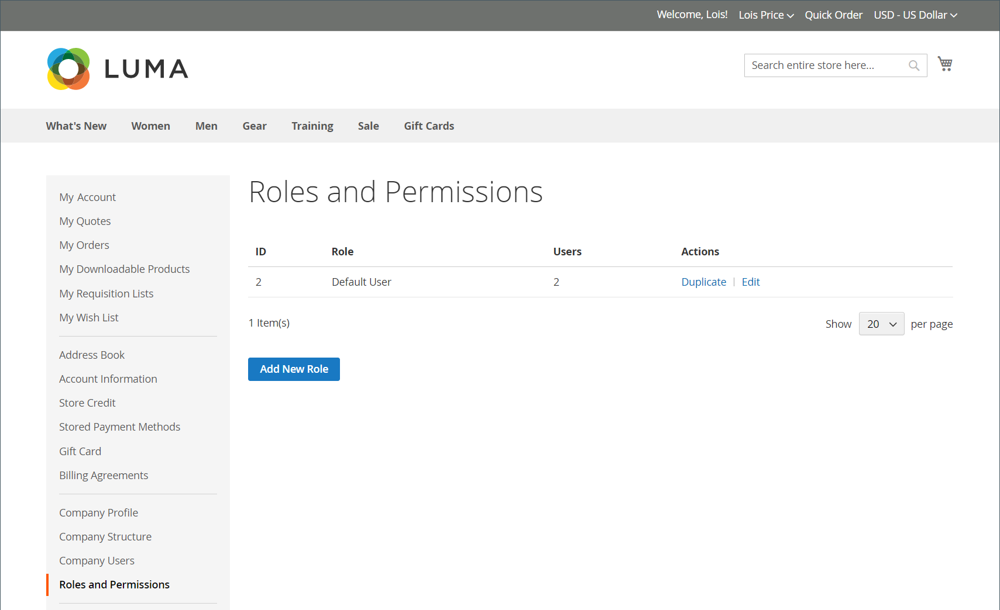
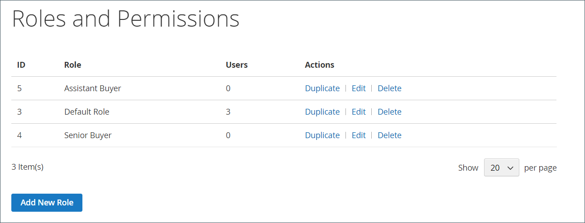

# 公司角色和权限

公司用户的角色被设置为具有访问销售信息和资源的各种级别权限。 默认情况下，公司管理员是具有完整权限的&#x200B;_超级用户_。 如果用户没有访问页面的权限，则会显示[访问被拒绝](../content-design/pages.md#access-denied)页面。

具有默认角色的{width="700" zoomable="yes"}

系统具有一个预定义的默认用户角色，您可以按原样&#x200B;_使用_&#x200B;或修改该角色以满足您的需要。 您可以根据需要创建任意数量的角色，以匹配您的公司结构和组织职责，如下所示：

- **默认用户** — 默认用户拥有与销售和报价相关的活动的完全访问权限，以及对公司配置文件和信用信息的仅查看访问权限。

- **高级购买者** — 高级购买者可能有权访问所有销售和报价资源，并有权查看公司配置文件、用户和团队、付款信息和公司业绩。

- **助理购买者** — 助理购买者可能有权使用&#x200B;_带报价的结帐_&#x200B;下达订单，并在公司配置文件中查看订单、报价和信息。

## 管理角色和权限

1. 公司管理员登录其商店帐户。

1. 在左侧面板中，选择&#x200B;**[!UICONTROL Roles and Permissions]**。

1. 完成以下任一任务。

### 创建角色

1. 单击&#x200B;**[!UICONTROL Add New Role]**。

   {width="600" zoomable="yes"}

1. 输入描述性&#x200B;**[!UICONTROL Role Name]**。

1. 在&#x200B;_[!UICONTROL Role Permissions]_下，执行下列操作之一：

   - 选中分配了角色的用户有权访问的每个资源或活动的复选框。

   - 选中&#x200B;**[!UICONTROL All]**&#x200B;复选框并清除分配给角色的用户无权访问的每个资源或活动的复选框。

1. 单击&#x200B;**[!UICONTROL Save Role]**。

1. 重复这些步骤，根据需要创建任意数量的角色。

### 修改角色

1. 对于要修改的角色，公司管理员单击&#x200B;_[!UICONTROL Actions]_列中的&#x200B;**[!UICONTROL Edit]**。

1. 对名称和权限设置进行必要的更改。

1. 完成后，单击&#x200B;**[!UICONTROL Save Role]**。

### 复制角色

1. 对于要复制的角色，公司管理员单击&#x200B;_[!UICONTROL Actions]_列中的&#x200B;**[!UICONTROL Duplicate]**。

1. 对名称和权限设置进行必要的更改。

1. 完成后，单击&#x200B;**[!UICONTROL Save Role]**。

### 删除角色

1. 公司管理员在角色列表中找到要删除的角色。

   只能删除未分配用户的角色。

1. 单击&#x200B;_[!UICONTROL Actions]_列中的&#x200B;**[!UICONTROL Delete]**。

1. 提示确认时，单击&#x200B;**[!UICONTROL OK]**。

## 操作

| 操作 | 描述 |
|-----------| ----------- |
| [!UICONTROL Duplicate] | 创建所选角色的副本。 重复角色的名称已添加`- Duplicated`到末尾。 |
| [!UICONTROL Edit] | 更改名称和/或权限集。 |
| [!UICONTROL Delete] | 删除角色。 只能删除未分配用户的角色。 |

{style="table-layout:auto"}

## 角色权限

公司管理员可以通过选择[!UICONTROL Edit action]，然后在&#x200B;**角色权限**&#x200B;列表中选择或删除权限来更新角色的权限配置。

{width="700" zoomable="yes"}

## 将角色分配给公司用户

定义所需的角色后，公司管理员会为每个公司用户分配一个角色。

1. 以公司管理员身份登录到他们的公司帐户。

1. 在左侧面板中，选择&#x200B;**[!UICONTROL Company Users]**。

   {width="700" zoomable="yes"}

1. 在列表中查找用户并单击&#x200B;**[!UICONTROL Edit]**。

1. 为用户选择适当的&#x200B;**[!UICONTROL User Role]**。

   {width="700" zoomable="yes"}

1. 单击&#x200B;**[!UICONTROL Save]**。
