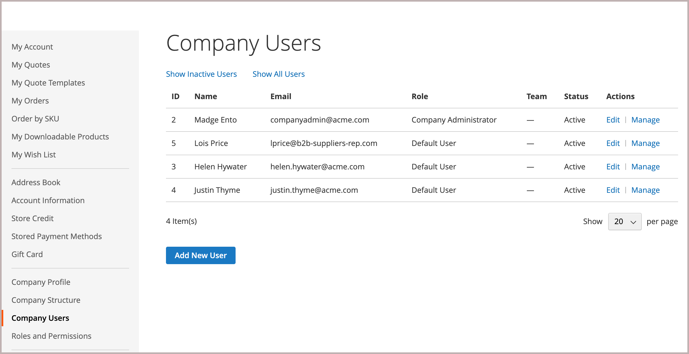

# 公司角色和权限

您可以为具有访问销售信息和资源的各种级别权限的公司用户设置角色。 默认情况下，公司管理员是具有完整权限的&#x200B;*超级用户*。 如果用户没有访问页面的权限，则会显示[访问被拒绝](../content-design/pages.md#access-denied)页面。

具有默认角色的{width="700" zoomable="yes"}

系统具有一个预定义的默认用户角色，您可以按原样&#x200B;*使用*&#x200B;或修改该角色以满足您的需要。 您可以根据需要创建任意数量的角色，以匹配您的公司结构和组织职责，如下所示：

- **默认用户** — 默认用户拥有与销售和报价相关的活动的完全访问权限，以及对公司配置文件和信用信息的仅查看访问权限。

- **高级购买者** — 高级购买者可能有权访问所有销售和报价资源，并有权查看公司配置文件、用户和团队、付款信息和公司业绩。

- **助理购买者** — 助理购买者可能有权使用&#x200B;**[!UICONTROL Checkout with quote]**&#x200B;下订单，并在公司配置文件中查看订单、报价和信息。

## 管理角色和权限

通过公司管理员的店面帐户管理公司角色。

**要打开角色和权限：**

1. 以公司管理员身份登录到店面。

1. 在左侧面板中，选择&#x200B;**[!UICONTROL Roles and Permissions]**。

1. 完成以下任务之一。

### 创建角色

1. 单击&#x200B;**[!UICONTROL Add New Role]**。

   {width="600" zoomable="yes"}

1. 输入描述性&#x200B;**[!UICONTROL Role Name]**。

1. 在&#x200B;**[!UICONTROL Role Permissions]**&#x200B;下，执行以下操作之一：

   - 选中分配给角色的用户有权访问的每个资源或活动的复选框。

   - 选中&#x200B;**[!UICONTROL All]**&#x200B;复选框，并清除分配给该角色的用户无权访问的每个资源或活动的复选框。

1. 单击&#x200B;**[!UICONTROL Save Role]**。

1. 重复这些步骤，根据需要创建任意数量的角色。

### 修改角色

1. 找到要修改的角色，然后单击&#x200B;**[!UICONTROL Edit]**&#x200B;列中的&#x200B;**[!UICONTROL Actions]**。

1. 对名称和权限设置进行必要的更改。

1. 完成后，单击&#x200B;**[!UICONTROL Save Role]**。

### 复制角色

1. 找到要复制的角色，然后单击&#x200B;**[!UICONTROL Duplicate]**&#x200B;列中的&#x200B;**[!UICONTROL Actions]**。

1. 对名称和权限设置进行必要的更改。

1. 完成后，单击&#x200B;**[!UICONTROL Save Role]**。

### Delete a role

1. In the list of roles, find the role to delete.

   只能删除未分配用户的角色。

1. Click **[!UICONTROL Delete]** in the **[!UICONTROL Actions]** column.

1. 提示确认时，单击&#x200B;**[!UICONTROL OK]**。

## 角色列表操作 {#actions}

| 操作 | 描述 |
| --- | --- |
| [!UICONTROL Duplicate] | 创建所选角色的副本。 重复角色的名称已添加`- Duplicated`到末尾。 |
| [!UICONTROL Edit] | 更改名称和权限集。 |
| [!UICONTROL Delete] | 删除角色。 只能删除未分配用户的角色。 |

{style="table-layout:auto"}

## 角色权限

B2B功能由&#x200B;**权限** （ACL资源）控制。 当公司用户打开页面或在店面运行操作时，应用程序会检查其角色是否包含所需的权限。

公司管理员可以通过选择&#x200B;**[!UICONTROL Edit]**，然后选择或清除&#x200B;**[!UICONTROL Role Permissions]**&#x200B;列表中的权限来更新角色的权限配置。

{width="700" zoomable="yes"}

Assign these resources when you **create or edit a company role** in the company account. Users with permission to manage roles can open the role form and set the permission tree.

Role permissions are organized in a tree structure, with main options and subordinate options. Selecting a main option automatically selects all subordinate options. Clearing a main option automatically clears all subordinate options. You can also select or clear subordinate options individually.

### 所有权限

| 权限标签 | 描述 |
| --- | --- |
| 全部 | 分配给此店面角色的&#x200B;**所有**&#x200B;权限的根节点。 |

### 销售权限

| 权限标签 | 描述 |
| --- | --- |
| 销售 | 公司用户结账和订单可见性的父级。 |
| 允许签出 | 在结帐时下订单。 |
| 使用分期付款方法 | 在结帐时使用&#x200B;**分期付款**（公司信用），如果可用。 |
| 查看订单 | 查看用户自己的订单。 |
| 查看下属用户的订单 | 查看层次结构中此用户下的用户下达的订单。 |

### 引号权限

公司权限树中的父节点： **报价**。

| 权限标签 | 描述 |
| --- | --- |
| 引号 | 店面可转让报价操作的父级。 |
| 查看（引号） | 查看可协商的报价。 |
| 请求、编辑、删除 | 根据业务规则请求新报价、编辑报价和删除报价。 |
| 使用引号结帐 | 使用批准的报价完成结帐。 |
| 管理下属用户的报价 | 对下属引号执行操作的父代。 |
| 查看（下属的引号） | 查看下属的引号。 |
| 编辑（下属的引号） | 编辑下属的引号。 |
| 删除（下属的引号） | 删除下属的引号。 |

### Quote templates

Parent node: **Quote Templates** (under **Quotes** in the company tree).

| 权限标签 | 描述 |
| --- | --- |
| Quote Templates | Parent for quote template capabilities on the storefront. |
| 视图（模板） | 查看报价模板。 |
| 请求、编辑、删除 | 创建、更新、取消和管理报价模板。 |
| 从模板生成报价 | 从模板生成可转让报价。 |
| 管理下属用户的报价模板 | 从属模板操作的父级。 |
| 查看（下属的模板） | 查看下属的报价模板。 |
| 编辑（下属的模板） | 编辑下属的报价模板。 |
| Delete (subordinates&#39; templates) | Delete subordinates&#39; quote templates. |

### Order approvals

Parent node: **Order Approvals**. Purchase order and approval rule permissions are nested under this branch in the tree.

### 采购订单

| 权限标签 | 描述 |
| --- | --- |
| 订单审批 | 采购订单和审批功能的父项。 |
| 查看我的采购订单 | 查看此用户创建的采购订单。 |
| 下属视图 | 查看层次结构中此用户以下的用户的采购订单。 |
| 查看所有公司 | 查看公司内的采购订单。 |
| 自动批准在此角色中创建的PO | 在规则允许时自动批准此角色中的用户创建的采购订单。 |

### 采购订单规则

| 权限标签 | 描述 |
| --- | --- |
| 审批没有其他审批的采购订单 | 批准采购订单，即使通常需要其他批准（根据批准规则）。 |
| 查看审批规则 | 查看采购订单审批规则。 |
| 创建、编辑和删除 | 创建、编辑和删除审批规则。 |

### 公司配置文件和联系人

公司配置文件部分的店面权限。 嵌套&#x200B;**Edit**&#x200B;条目仅在角色树中位于其上方的&#x200B;**查看**&#x200B;权限下应用。

| 权限标签 | 描述 |
| --- | --- |
| 公司配置文件 | 以组身份访问公司配置文件区域。 |
| 帐户信息（视图） | 查看公司帐户信息。 |
| 编辑 | 编辑公司帐户信息（在帐户信息下）。 |
| 合法地址（视图） | 查看公司法定地址。 |
| 编辑 | 编辑公司法定地址（位于“法定地址”下）。 |
| 联系人（查看） | 查看公司联系人。 |
| 付款信息（查看） | 查看公司个人资料的付款信息。 |
| 送货信息（视图） | 查看公司配置文件上的装运信息。 |

## 公司用户管理

| 权限标签 | 描述 |
| --- | --- |
| 公司用户管理 | 角色以及用户或团队的父级。 |
| 查看角色和权限 | 查看公司角色及其权限。 |
| 管理角色和权限 | 创建或编辑角色并分配权限。 |
| 查看用户和团队 | 查看公司用户和团队。 |
| 管理用户和团队 | Add, edit, or remove users and teams. |

## Company credit

| 权限标签 | 描述 |
| --- | --- |
| Company Credit | Access the company credit area. |
| 查看（信用历史记录） | 查看公司信用历史记录和相关余额信息。 |

## 将角色分配给公司用户

定义所需的角色后，为每个公司用户分配一个角色。

**要分配角色：**

1. 以公司管理员身份登录到店面。

1. 在左侧面板中，选择&#x200B;**[!UICONTROL Company Users]**。

   {width="700" zoomable="yes"}

1. 在列表中查找用户并单击&#x200B;**[!UICONTROL Edit]**。

1. 为用户选择适当的&#x200B;**[!UICONTROL User Role]**。

   {width="700" zoomable="yes"}

1. 单击&#x200B;**[!UICONTROL Save]**。

>[!MORELIKETHIS]
>
>- [管理公司用户](account-company-users.md)
>- [公司帐户结构](account-company-structure.md)
>- [公司管理员角色](account-company-admin.md)
>- [管理公司](manage-companies.md)
>- [启用B2B功能](enable-basic-features.md)
