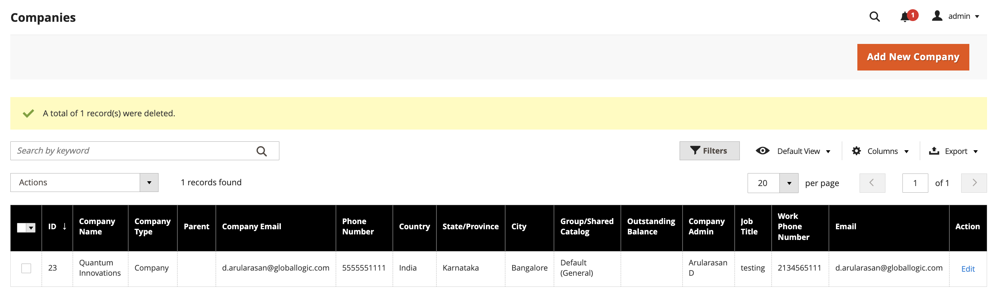

# 公司帐户结构

公司账目可设立以反映业务结构。 最初，公司结构仅包括公司管理员，但可以扩展到包括用户团队。 用户可与团队相关联，或在公司内部门和子部门的层次结构中进行组织。

{width="500"}

在公司管理员帐户仪表板中，公司结构表示为树，最初仅由公司管理员组成。

{width="600" zoomable="yes"}

创建并批准帐户后，公司管理员可以使用公司电子邮件地址或分配不同的电子邮件地址。

担任公司管理员的人员可能在公司内拥有多个角色。 如果为公司管理员输入了单独的电子邮件地址，则初始公司结构包括公司管理员以及公司管理员名下的个人用户帐户。 在这种情况下，公司管理员可以以公司或个人用户的身份登录帐户。

{width="600" zoomable="yes"}

对于商家来说，公司整个结构都反映在 _公司_ 和 _客户_ 网格。 “公司”网格会列出所有公司，而不管其状态如何。 以下示例显示了两个公司的帐户： _ACME_ 公司及 _Vendelay_ 公司。

{width="700" zoomable="yes"}

以下示例显示了 [!UICONTROL Customers] 使用这些公司的初始公司管理员帐户进行网格化。

{width="700" zoomable="yes"}

创建帐户后，公司管理员必须定义的公司结构 [团队](account-company-structure.md)，设置 [公司用户](account-company-users.md)，并建立 [角色和权限](account-company-roles-permissions.md) 每一个。

## 公司结构图标

| 图标 | 描述 |
| ---- | ----------------- |
|  | 表示公司结构中的公司管理员。 |
|  | 表示公司结构中的团队。 |
|  | 表示公司结构中的用户。 |
|  | 将团队移至公司结构中的另一个位置。 |
|  | 在公司结构中展开团队。 |
|  | 折叠公司结构中的团队。 |

{style="table-layout:auto"}

## 创建公司团队

公司帐号的结构应反映采购组织，无论采购组织是简单平整，还是公司各个部门、部门拥有不同团队的复杂组织。

如果商店为 [已配置](enable-basic-features.md) 为了允许公司管理自己的帐户，设置公司结构是公司管理员在帐户获得批准后要完成的首要任务之一。 在公司帐户中，公司结构表示为树状结构，公司管理员位于顶部。

{width="450"}

1. 公司管理员登录其帐户。

1. 在左侧面板中，选择 **[!UICONTROL Company Structure]**.

1. 下 **[!UICONTROL Business Structure]**，点击次数 **[!UICONTROL Add Team]** 并执行以下操作：

   - 进入 **[!UICONTROL Team Title]** 和 **[!UICONTROL Description]**.

     “团队标题”可以是表示公司结构的任何内容，例如团队、办公室或公司内的部门

     {width="700" zoomable="yes"}

   - 完成后，单击 **[!UICONTROL Save]**.

   - 根据需要创建任意数量的团队。

     {width="600" zoomable="yes"}

1. 要创建团队层次结构，请执行以下操作：

   - 选择父团队，然后单击 **[!UICONTROL Add Team]**.

     {width="600" zoomable="yes"}

   - 进入 **[!UICONTROL Team Title]** 和 **[!UICONTROL Description]**.

   - 点击次数 **[!UICONTROL Save]**.

1. 重复这些步骤以根据需要创建尽可能多的团队或部门和细分。

   {width="600" zoomable="yes"}

## 移动团队

当公司管理员处理公司结构时，可以将团队或部门拖到结构中的其他位置。

1. 公司管理员找到要移动的团队。

1. 单击并将团队拖到公司结构中的新位置。

## 删除团队

>[!NOTE]
>
>在删除团队之前，建议确保选择正确的团队 — 无法恢复已删除的团队。

1. 公司管理员选择要删除的团队。

1. 点击次数 **[!UICONTROL Delete Selected]**.

1. 提示确认时，单击 **[!UICONTROL Delete]**.

## 展开或折叠团队结构

当公司管理员处理公司结构时，他们可以折叠或展开树：

- 点击次数 **[!UICONTROL Collapse All]** 或 **[!UICONTROL Expand All]**.

- 点击次数  折叠团队或  以扩展团队。

## 将用户分配给团队

首次将团队和用户添加到 [公司结构](account-company-structure.md)，则它们会被放置在公司管理员下的同一级别。

{width="700" zoomable="yes"}

| 控件 | 描述 |
|--- |--- |
| [!UICONTROL Collapse All / Expand All] | 折叠或展开业务结构树 |
| [!UICONTROL Add User] | 在当前团队下创建用户 |
| [!UICONTROL Add Team] | 创建团队 |
| [!UICONTROL Edit Selected / Delete Selected] | 从业务树中编辑或删除用户 |

{style="table-layout:auto"}

1. 在左侧面板中，公司管理员选择 **[!UICONTROL Company Structure]**.

1. 要将用户分配给现有团队，他们拖动()用户属于相应的团队。

   {width="700" zoomable="yes"}
