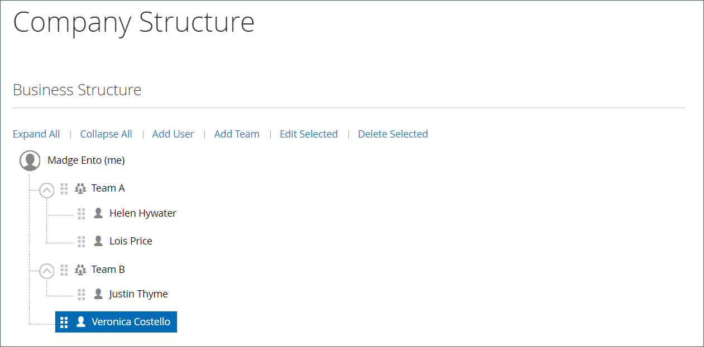

# 管理公司用户帐户

在店面，公司用户由公司管理员分配，并从&#x200B;_[!UICONTROL Company Users]_&#x200B;页面可见。 这些个人通常是具有不同级别权限来访问商店服务和资源的购买者。

公司管理员首先设置[公司结构](account-company-structure.md)，然后根据需要完成以下任务：

- 创建公司用户并将用户分配给团队

- 定义角色和权限，并将用户分配给角色

公司用户只能由公司管理员添加、编辑、停用或删除。

- 移除用户后，帐户状态将更改为&#x200B;*非活动*，并且客户无法再登录到公司。 管理员仍可以访问与用户关联的所有内容。 帐户管理员可以通过从[!UICONTROL Company Users]页面将帐户状态更改为&#x200B;*[!UICONTROL Active]*&#x200B;来恢复访问权限。

- 删除用户帐户时，将从店面中删除该帐户和任何关联内容。 此操作无法还原。

## 添加公司用户

1. 公司管理员从店面登录他们的帐户。

1. 在左侧面板中，选择&#x200B;**[!UICONTROL Company Users]**。

   {width="700" zoomable="yes"}

1. 单击&#x200B;**[!UICONTROL Add New User]**&#x200B;并执行以下操作：

   - 输入新用户的&#x200B;**[!UICONTROL Job Title]**。

   - 如果定义了角色和权限，则选择适当的&#x200B;**[!UICONTROL User Role]**。 否则，他们可以稍后返回以分配角色。

     {width="700" zoomable="yes"}

   - 在剩余字段中添加用户信息：
      - **[!UICONTROL First Name]**&#x200B;和&#x200B;**[!UICONTROL Last Name]**
      - **[!UICONTROL Email]**
      - **[!UICONTROL Work Phone Number]**

   默认情况下，帐户的&#x200B;**[!UICONTROL Status]**&#x200B;为`Active`。

1. 完成后，单击&#x200B;**[!UICONTROL Save]**。

1. 重复该过程以根据需要创建尽可能多的公司用户。

   新用户与“公司管理员”一起显示在“公司用户”列表中。

为了节省首次订购的时间，公司管理员可以提醒每个公司用户将默认的公司帐单和送货地址添加到其[通讯簿](../customers/account-dashboard-address-book.md)。

## 从[!UICONTROL Company structure]中删除用户

公司管理员可以从[!UICONTROL Company Structure]中删除用户。

删除帐户后，用户帐户状态将更改为&#x200B;*非活动*，并且用户无法再登录到店面。
管理员可以通过编辑“公司用户”页面中的用户帐户信息来重新激活帐户。

1. 公司管理员从店面登录他们的帐户。

1. 在左侧面板中，选择&#x200B;**[!UICONTROL Company Structure]**。

1. 选择公司结构中的公司用户。

1. 单击&#x200B;**[!UICONTROL Remove from Structure]**。

   {width="600" zoomable="yes"}

1. 提示确认时，单击&#x200B;**[!UICONTROL Remove]**。

   在管理员中，公司用户仍列在[客户](../customers/customers-all.md)网格中，但处于`Inactive`状态。

## 查看和管理公司用户帐户

公司管理员可以使用[!UICONTROL Company Users]页面上的查看筛选器查看和管理公司用户帐户。

{width="700" zoomable="yes"}

- 通过选择&#x200B;**[!UICONTROL Show Inactive Users]**&#x200B;仅查看非活动用户。
- 通过选择&#x200B;**[!UICONTROL Show Active Users]**&#x200B;仅查看活动用户。
- 通过选择&#x200B;**[!UICONTROL Show All Users]**&#x200B;查看所有用户。

公司管理员可以使用行项目&#x200B;*[!UICONTROL Actions]*&#x200B;管理个人帐户，以编辑帐户信息、管理帐户状态或删除帐户。

### 编辑公司用户帐户信息

公司管理员可以更新用户帐户配置文件信息并更改帐户状态。

1. 在[!UICONTROL Company Users]页面上，查找要更新的用户帐户。 单击&#x200B;**[!UICONTROL Edit]**。

1. 对用户帐户信息进行任何必需的更改，包括更改帐户状态。

1. 单击&#x200B;**[!UICONTROL Save]**&#x200B;应用更改。

>[!NOTE]
>
>如果您编辑公司用户帐户，并发现该配置文件缺少所需的帐户信息（如职称和工作电话号码），则表示该帐户是由Commerce站点管理员添加的。 无法从店面编辑这些帐户。 要更新信息或更改帐户状态，请与站点管理员联系。

### 停用或删除活动帐户

1. 在[!UICONTROL Company Users]页面上，查找要更新的用户帐户。 单击&#x200B;**[!UICONTROL Manage]**。

   {width="600" zoomable="yes"}

1. 出现提示时，根据需要停用或删除用户帐户。

>[!IMPORTANT]
>
>删除公司用户帐户会从系统中删除该帐户和所有相关内容。 此操作无法还原。

## 公司用户帐户配置文件字段描述

| 字段 | 描述 |
|--------------------------------|---------------|
| [!UICONTROL Job Title] | 公司用户的工作标题。 |
| [!UICONTROL User Role] | 分配给公司用户的[角色](account-company-roles-permissions.md)。 选项： `Default User` / （其他角色） |
| [!UICONTROL First Name] | 公司用户的名字。 |
| [!UICONTROL Last Name] | 公司用户的姓氏。 |
| [!UICONTROL Email] | 公司用户的电子邮件地址。 |
| [!UICONTROL Work Phone Number] | 公司用户的工作电话号码。 |
| [!UICONTROL Status] | 公司用户帐户的状态。 选项： `Active` / `Inactive` |

{style="table-layout:auto"}
