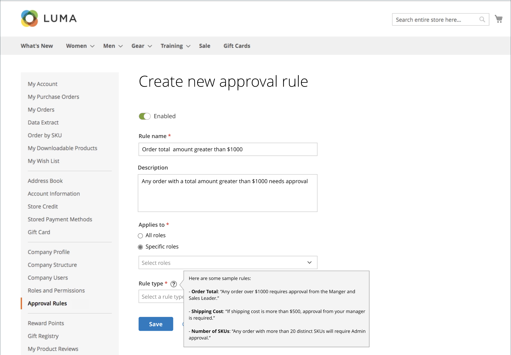

# 采购订单审批规则

大多数公司要求采购订单的订单审批。 通过为其公司帐户添加审批规则，他们可以控制谁可以创建采购订单以及他们可以支出多少。 例如：

* 任何小于X值的PO都会自动获得批准。
* 超过X值但小于Q的PO必须由Y批准。
* 任何超过X值的PO都必须由Y和Z批准。
* 由Director级别或更高级别的人员创建的PO会自动获得批准。

根据公司角色和权限，用户可以创建、编辑、删除或查看审批规则。

>[!IMPORTANT]
>
>批准规则设置需要定义的[公司结构](account-company-structure.md)以指定采购客户经理的批准。

## 支付方式

采购订单审批流程支持在线和离线支付方式。 采购订单审批支持所有默认离线付款方法。 对于在线支付，支持以下方法：

* PayPal Express
* Braintree付款

## 批准规则设置

具有其角色[&#128279;](account-company-roles-permissions.md)所需的权限，B2B客户可以通过单击其客户帐户的左侧面板中的&#x200B;**[!UICONTROL Approval Rules]**&#x200B;来设置批准规则以强制执行公司策略。

{width="700" zoomable="yes"}

要创建审批规则，客户必须完成以下步骤：

1. 单击&#x200B;**[!UICONTROL Add New Rule]**&#x200B;以创建规则。

1. 如果需要，将规则从&#x200B;**[!UICONTROL Enabled]**&#x200B;更改为&#x200B;**[!UICONTROL Disabled]**。

   该规则默认处于启用状态，但客户可以使用禁用的设置创建规则，然后在准备好强制执行该规则时稍后启用它。

1. 对于&#x200B;**[!UICONTROL Rule name]**，为规则输入一个简短但具有描述性的名称，如`Orders less than $100`。

   规则名称必须唯一。

1. 对于&#x200B;**[!UICONTROL Description]**，请输入对规则的更长解释。

1. 对于&#x200B;**[!UICONTROL Applies to]**，选择用于应用规则的一个或多个公司角色。

1. 选择&#x200B;**[!UICONTROL Rule Type]**&#x200B;并定义规则。

   以下部分提供了每种规则类型的详细说明和示例。

   {width="700" zoomable="yes"}

1. 对于&#x200B;**[!UICONTROL Requires approval from]**，根据批准类型选择一个或多个所需的批准者。

   >[!NOTE]
   >
   >* 将角色指定为审批者时，请确保该角色中至少有一位用户。
   >* 如果有两个或更多用户具有相同的审批者角色，则采购订单创建者无法审批该采购订单。 在这种情况下，具有此审批者角色的任何其他用户都需要手动审批。 但是，如果在[角色权限](account-company-roles-permissions.md)中设置了`Auto-approve POs created within this role`选项，则会自动批准采购订单。
   >* 如果只有一个用户具有审批者角色，并且该用户是创建者，则采购订单始终会自动获得批准，而会忽略`Auto-approve POs created within this role`权限设置。

1. 单击&#x200B;**[!UICONTROL Save]**。

### [!UICONTROL Order Total]

此规则类型用于根据订单总额（包括税）要求PO审批。

1. 选择&#x200B;**[!UICONTROL Order Total amount]**&#x200B;选项：

   * `is more than`
   * `is less than`
   * `is more than or equal to`
   * `is less than or equal to`

1. 选择货币类型并输入金额。

{width="600" zoomable="yes"}

### [!UICONTROL Shipping Cost]

此规则类型用于根据发运成本要求PO审批，而许多公司都要求这样做。

1. 设置&#x200B;**[!UICONTROL Shipping cost value]**：

   * `is more than`
   * `is less than`
   * `is more than or equal to`
   * `is less than or equal to`

1. 设置所需的装运数量。

{width="600" zoomable="yes"}

### [!UICONTROL Number of SKUs]

此规则类型用于根据订单中的SKU或独特产品的数量要求PO审批。 它控制不同项目类型的数量，而不是要排序的项目数量。 例如，PO可以包括：

* 两件大白衬衫
* 三件中号白衬衫

此示例指定了五个项目，但指定了两个不同的SKU。

1. 设置&#x200B;**[!UICONTROL Number of SKUs]**&#x200B;值：

   * `is more than`
   * `is less than`
   * `is more than or equal to`
   * `is less than or equal to`

1. 设置SKU的数量。

{width="600" zoomable="yes"}

## 编辑审批规则

要修改现有审批规则，客户可以完成以下步骤：

1. 在其帐户的侧边栏中，客户选择&#x200B;**[!UICONTROL Approval Rules]**。

1. 查找要编辑的批准规则条目。

1. 单击&#x200B;**[!UICONTROL Edit]**。

1. 进行所有需要的更改并单击&#x200B;**[!UICONTROL Save]**。

## 删除审批规则

要删除现有审批规则，客户可以完成以下步骤：

1. 在其帐户的侧栏中，选择&#x200B;**[!UICONTROL Approval Rules]**。

1. 查找要删除的批准规则条目。

1. 单击&#x200B;**[!UICONTROL Delete]**。

1. 要确认操作，请单击&#x200B;**[!UICONTROL OK]**。

## 采购订单审批演示

观看以下视频，了解采购订单的批准：

>[!VIDEO](https://video.tv.adobe.com/v/3410763?quality=12&learn=on&captions=chi_hans)
