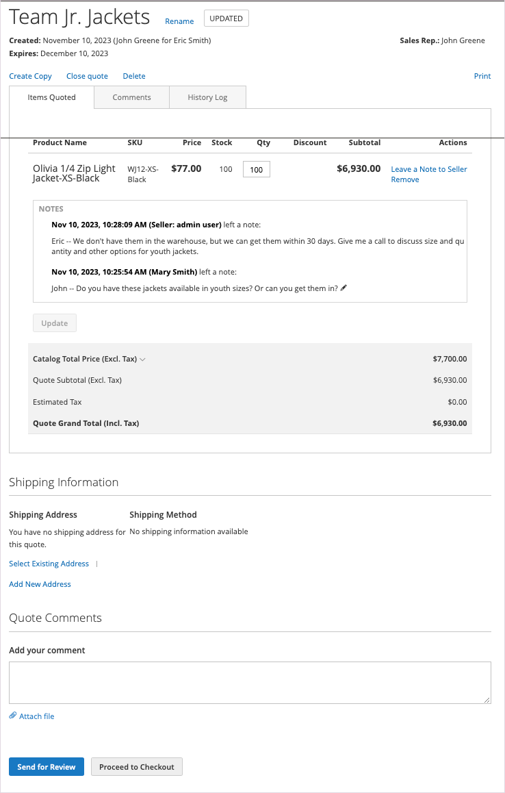

# [!UICONTROL My Quotes]

如果启用了引号，则 _[!UICONTROL My Quotes]_客户帐户控制面板的部分列出了客户提交的所有报价。 根据他们的权限，只有代表公司进行购买的买方才能提交议定购买价格的请求。

{width="700" zoomable="yes"}

采购员通过以下方式开始流程 [提交请求](quote-request.md) 购物车中的报价。 在交易期间，买卖双方会交换电子邮件 [协商过程](quote-price-negotiation.md). 对于买家， [!UICONTROL My Quotes] 页面是谈判过程中买卖双方所有沟通的焦点。 接受卖方提供的议定价格的买方可以直接从报价进入结账页。 无法将附加折扣添加到协商的报价中。

在洽谈报价单时，采购员可以完成以下活动：

* 复查项目定价和更新
* 从跟踪协商过程 [!UICONTROL Comments] 和 [!UICONTROL History] 部分
* 修改报价以删除项目
* 通过在明细项目和报价级别添加备注，与卖方进行沟通和协商
* 将报价发送给卖方以供审查
* 如果条款可接受，则将报价转换为订单
* 关闭报价
* 删除报价
* [!BADGE 1.5.0 Beta版功能]{type=Informative url="/help/b2b/release-notes.md" tooltip="仅供测试版计划参与者使用"}

以下示例显示了一个由买方更新并发送回卖方以供复查的报价。

{width="700" zoomable="yes"}

带引号的 `Updated` 状态将被锁定，直到卖方返回报价。

## 显示引号

带有所需的 [其角色的权限](account-company-roles-permissions.md)，与公司帐户关联的客户可以查看由以下人员请求的报价： [从属用户](account-company-structure.md). 公司管理员可以查看公司帐户的所有报价。

1. 客户登录到店面的帐户。

1. 点击次数 **[!UICONTROL My Quotes]** 在左侧导航中。

1. 要查看其创建的所有引号，请单击 **[!UICONTROL Show My Quotes]** 链接（仅对公司管理员或具有从属用户的帐户显示）。

1. 要查看所有公司用户的所有报价，请单击 **[!UICONTROL Show All Quotes]**.

## 查看报价

1. 客户登录到其帐户。

1. 在左侧面板中，选择 **[!UICONTROL My Quotes]**.

1. 在列表中查找引号并单击 **[!UICONTROL View]** 在 _[!UICONTROL Action]_列。

## 打印报价

1. 在右侧的未结引号中 _[!UICONTROL Items Quoted]_部分，客户点击&#x200B;**[!UICONTROL Print]**.

1. 验证 **[!UICONTROL Destination]** 作为打印机或PDF。

1. 点击次数 **[!UICONTROL Print]**.

## 取消报价请求

1. 在Items Quoted部分正上方的打开报价中，单击 **[!UICONTROL Close quote]**.

   请求已取消，报价状态将更改为 `Closed`. 已关闭的报价将保留在您的报价列表中，并将保留在 _[!UICONTROL Quotes]_从Admin访问网格。

1. 要从报价列表中删除已取消的报价，请单击 **[!UICONTROL Delete]**.

1. 提示确认时，单击 **[!UICONTROL OK]**.

   已关闭的报价将从其报价列表中删除。 然而，该公司仍列于 _[!UICONTROL Quotes]_管理中的网格，使用 `Closed` 状态。

## 报价操作

| 操作 | 描述 |
|---------------|------------------------------------------------------------------------------------------------------------------------------------------------------------------------------------------------------------------------------|
| 重命名 | [!BADGE 1.5.0 Beta版功能]{type=Informative url="/help/b2b/release-notes.md" tooltip="仅供测试版计划参与者使用"} |
| 创建副本 | [!BADGE 1.5.0 Beta版功能]{type=Informative url="/help/b2b/release-notes.md" tooltip="仅供测试版计划参与者使用"} |
| 关闭报价 | 采购员关闭报价单后，将无法重新打开它。 如果需要，买方可以通过使用 [!UICONTROL Create Copy] 操作。 如果报价状态为 `Draft`. |
| 删除报价 | 当采购员删除报价单时，报价单将从系统中删除，并且不再可用。 |
| 打印 | 打开打印表单，将报价保存为PDF、文件，或将其打印到配置的打印机。 |

## 列描述

| 列 | 描述 |
|-------------------------|-------------------------------------------------------------------------------------------------------------------------------------------------------------------------------------------------------------------------------------------------------------------------------------------------------------------------------------------------------------------------------------------------------------------------------------------------------------------------------------------------------------------------------------------------------------------------------------------------------------------------------------------------------------------------------------------------------------------------------------------------------------------------------------------------------------------------------------------------------------------------------------------------------------------------------------------------------------------------------------------------------------------------------------------------------------------------------------------------------------------------------------------------------------------------------------------------------------------------------------------------------------------------------------------------------------------------------------------------------------------------------------------------------------------------------------------------------------------------------------------------------------------------------------------------------------------------------------------------------------------------------------------------------------------------------------------------------------------------------------------------------------------------------------------------------------------------------------------------------------------------------------------------------------------------------------------------------------------------------------------------------------------------------------------------------------------------------------------------------------------------------------------------------------------------------------------------------------------------------------------------------------------------------------------------------------------------------------------------------------------------------------------------------------------------------------------------------------------------------------------------------------------------------------------|
| [!UICONTROL Quote Name] | 买方分配给报价请求的名称。 |
| [!UICONTROL Created] | 首次提交报价请求的日期。 |
| [!UICONTROL Created By] | 提交报价请求的买方的名字和姓氏。 |
| [!UICONTROL Status] | 指示报价的状态。 报价单的状态只能通过买方或卖方一方采取行动来更改。  **[!UICONTROL Submitted]**— 买方询价请求尚未由卖方开启。 在此状态下，买方仍可以修改报价请求。 可用操作： `View` / `Close` / `Edit Quantity` / `Delete SKU` / `Add Comments` / `Edit Shipping Address` **[!UICONTROL Pending]**  — 卖方已提出请求，正在审查请求并准备答复。 可用操作： `View` / `Close`  **[!UICONTROL Updated]**— 卖方向买方发送了回复，买方并 _[!UICONTROL Proceed to Checkout]_按钮已启用。 在此状态下，买方可以继续修改报价。 可用操作： `View` / `Send for Review` / `Proceed to Checkout` / `Delete Quote` / `Close` / `Edit Quantity` / `Delete SKU` / `Add comments` / `Edit Shipping Address` **[!UICONTROL Open]**— 买方仍在更新报价，而且_[!UICONTROL Proceed to Checkout]_ 按钮已禁用。 可用操作： `View` / `Send for Review` / `Delete Quote` / `Edit quantity` / `Delete SKU` / `Add Comments` / `Edit Shipping Address`  **[!UICONTROL Ordered]**— 买方已提交基于议定报价的订单。 报价已锁定，无法编辑。 可用操作：查看 **[!UICONTROL Closed]**  — 买方已结束洽谈并取消报价。 报价已锁定，买方或卖方均无法编辑。 可用操作： `View` / `Delete`  **[!UICONTROL Declined]**— 卖方拒绝了询价，或在谈判过程中提出变更建议。 可在工作流程的任何阶段拒绝报价。 任何自定义定价都将从报价中删除。 采购员可以继续编辑报价单并重新提交，或者使用标准目录价格进行采购。 可用操作： `View` / `Send for Review` / `Delete Quote` / `Edit Quantity` / `Delete SKU` / `Add Comments` / `Edit Shipping Address` **[!UICONTROL Expired]**  — 报价的生命周期已过期。 任何提议的价格都会被重置。 买方可以按照标准目录价格完成采购，也可以启动另一轮谈判。 可用操作： `View` / `Send for Review` / `Delete Quote` / `Edit Quantity` / `Delete SKU` / `Add Comments` / `Edit Shipping Address` |

{style="table-layout:auto"}
