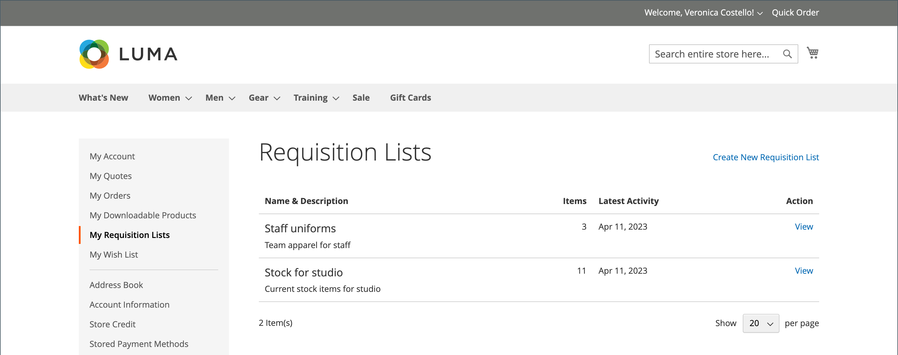

# [!UICONTROL My Requisition Lists]

维护申请列表的主要原因是为了便于对产品重新排序。 授权客户可以通过将申请列表中的项目添加到购物车来轻松对其进行重新排序，并将项目从一个列表移动或复制到另一个列表。

{width="700" zoomable="yes"}

## 打开申请列表

1. 客户从其帐户信息板中选择&#x200B;**[!UICONTROL My Requisition Lists]**。

1. 找到要打开的申请列表，单击&#x200B;**[!UICONTROL View]**&#x200B;并执行以下任一操作：

### 将产品添加到购物车

1. 客户执行以下操作之一以选择要添加的产品：

   - 选中每个项目的复选框。
   - 单击&#x200B;**[!UICONTROL Select All]**。

1. 输入要添加到购物车的&#x200B;**[!UICONTROL Qty]**。

1. 要更改任何产品选项，请执行以下操作：

   - 在行项目中，单击&#x200B;_编辑_ （）图标。
   - 更改任何必要的选项。
   - 单击&#x200B;**[!UICONTROL Update Requisition List]**。

1. 单击&#x200B;**[!UICONTROL Add to Cart]**。

   {width="700" zoomable="yes"}

### 将项目复制到其他列表

1. 客户选中要移动的每个项目的复选框。

1. 单击&#x200B;**[!UICONTROL Copy Selected]**&#x200B;并执行下列操作之一：

   - 选择现有申请列表。
   - 单击&#x200B;**[!UICONTROL Create New Requisition List]**。

### 导出列表

1. 客户打开要导出的申请列表。

1. 单击&#x200B;**[!UICONTROL Export]**&#x200B;链接。

Adobe Commerce生成并下载具有`sku`和`qty`值的CSV列表。

### 将项目移动到其他列表

1. 客户选中要移动的每个项目的复选框。

1. 单击&#x200B;**[!UICONTROL Move Selected]**&#x200B;并执行以下操作之一：

   - 选择现有申请列表。
   - 单击&#x200B;**[!UICONTROL Create New Requisition List]**。

### 打印列表

1. 在列表的右上角，客户单击&#x200B;**[!UICONTROL Print]**。

1. 验证输出设备，然后单击&#x200B;**[!UICONTROL Print]**。

   {width="500" zoomable="yes"}

### 编辑产品选项

要编辑列表中的产品选项，客户将执行以下操作：

1. 单击&#x200B;_铅笔_ （）图标以打开产品页面。

1. 更改任何必要的选项。

1. 单击&#x200B;**[!UICONTROL Update Requisition List]**。

   {width="700" zoomable="yes"}

在以下情况下，可以编辑申请列表中的产品：

- 该产品具有&#x200B;**[!UICONTROL all options set]** （当它是申请列表中的[配置产品](../catalog/product-create-configurable.md)时）。

  产品为&#x200B;**[!UICONTROL added to this Requisition List]**。

- 产品是[带选项的简单产品](../catalog/settings-advanced-custom-options.md)

- 允许对产品类型进行编辑。

### 删除项目

1. 客户选中要删除的每个项目的复选框。

1. 单击&#x200B;**[!UICONTROL Remove Selected]**。

1. 提示确认时，单击&#x200B;**[!UICONTROL Delete]**。

### 重命名列表

1. 在列表标题之后，客户单击&#x200B;**[!UICONTROL Rename]**。

1. 输入其他&#x200B;**[!UICONTROL Requisition List Name]**。

1. 单击&#x200B;**[!UICONTROL Save]**。

   {width="300"}

### 删除申请列表

1. 客户打开要删除的申请列表。

1. 单击&#x200B;**[!UICONTROL Delete Requisition List]**。

1. 提示确认时，单击&#x200B;**[!UICONTROL Delete]**。

>[!NOTE]
>
>此操作无法撤消。

## 操作

| 操作 | 描述 |
|--- |--- |
| [!UICONTROL Rename] | 允许您重命名申请列表并更新说明。 |
| [!UICONTROL Export] | 将申请列表导出到CSV文件中。 |
| [!UICONTROL Print] | 打印当前申请列表。 |
| [!UICONTROL Select] | 管理要作为操作主体的项目选择。  **[!UICONTROL Select All]**— 选择申请列表中的所有项目。 **[!UICONTROL Remove Selected]** — 从申请列表中删除所有选定项目。  **[!UICONTROL Copy Selected]**— 将所有选定项目复制到另一个申请列表。 |
| [!UICONTROL Add to Cart] | 将选定项目添加到购物车。 |
| [!UICONTROL Update List] | 重新计算小计以反映数量的变化。 |
| [!UICONTROL Delete Requisition List] | 从公司用户帐户中删除申请列表。 |

{style="table-layout:auto"}
