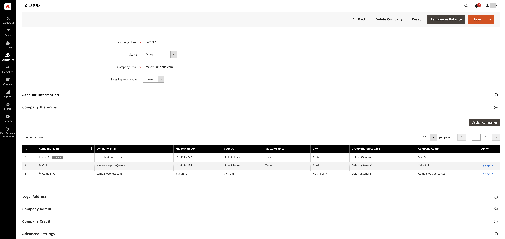
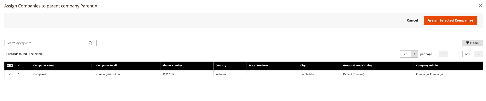

# 管理 [!UICONTROL Company Hierarchy]

[!BADGE 1.5.0（测试版）]{type=Informative url="/help/b2b/release-notes.md" tooltip="仅供测试版计划参与者使用"}

管理员可以构建 [!UICONTROL Company Hierarchy] 将关联公司分配给指定的母公司，即位于组织层次结构顶部的公司。

通过编辑尚未分配给现有公司的公司创建母公司 [!UICONTROL Company Hierarchy]，并分配相关公司。

{width="700"}

将公司分配给层次结构后， [!UICONTROL Company type] 中的列 **公司** 网格将公司标识为 `Parent` 或  `Child` 公司。  如果 [!UICONTROL Company Type] 是 `Company`，该公司不属于公司层次结构，因此有资格成为母公司，或者被分配到现有的母公司。

>[!NOTE]
>
>欲知关于 [!UICONTROL Company Hierarchy] 网格，请参见 [公司层次结构](account-company-create.md#company-hierarchy) 字段描述。

在“管理员”中，您可以通过编辑公司，然后使用 [!UICONTROL Company Hierarchy] 的部分 [!UICONTROL Company] 页面以分配或取消分配公司。

## 将公司分配给母公司

1. 在 _管理员_ 侧栏，导航到 **[!UICONTROL Customers]** > **[!UICONTROL Companies]**.

   {width="700" zoomable="yes"}

1. 在公司网格中，打开公司详细信息页面以创建分配。

   - 要将其他公司分配给现有母公司，请选择 **[!UICONTROL Edit]** 针对母公司的操作。
   - 要创建新的母公司，请选择 **[!UICONTROL Edit]** 为指定为母公司的公司执行的操作。

     您无法从现有的父公司或子公司创建新父公司。

   {width="700" zoomable="yes"}

1. 在公司详细信息页面上，展开 **[!UICONTROL Company Hierarchy]** 下拉列表，然后选择 **[!UICONTROL Assign Companies]**.

   {width="700" zoomable="yes"}

   展开此视图时，您可以查看现有公司分配（如果存在）。 母公司始终显示在 _[!UICONTROL Company Hierarchy]_带有 `current company indicator` 显示在正在编辑的公司行中。

1. 网格中列出了可分配的公司。 选择要分配的公司，然后选择 **[!UICONTROL Assign Selected Companies]**.

1. 您可以 **在此页上选择全部** 或一个特定的公司行项目，然后单击 **[!UICONTROL Assign Selected Companies]**.

   {width="700" zoomable="yes"}

1. 出现提示时，通过选择完成公司分配 **[!UICONTROL Assign]**.

## 从母公司取消分配公司

1. 在 _管理员_ 侧栏，导航到 **[!UICONTROL Customers]** > **[!UICONTROL Companies]**.

   {width="700" zoomable="yes"}

1. 在“公司”页面上，通过选择 **[!UICONTROL Edit]** 操作。

   {width="700" zoomable="yes"}

1. 通过展开 **[!UICONTROL Company Hierarchy]** 下拉菜单。

1. 在公司层次结构网格中，通过选择 **[!UICONTROL Select]** 针对公司的操作，然后选择 **[!UICONTROL Unassign from parent]**.

   {width="700" zoomable="yes"}

1. 出现提示时，通过选择从层次结构中删除分配的公司 **[!UICONTROL Unassign]**.
