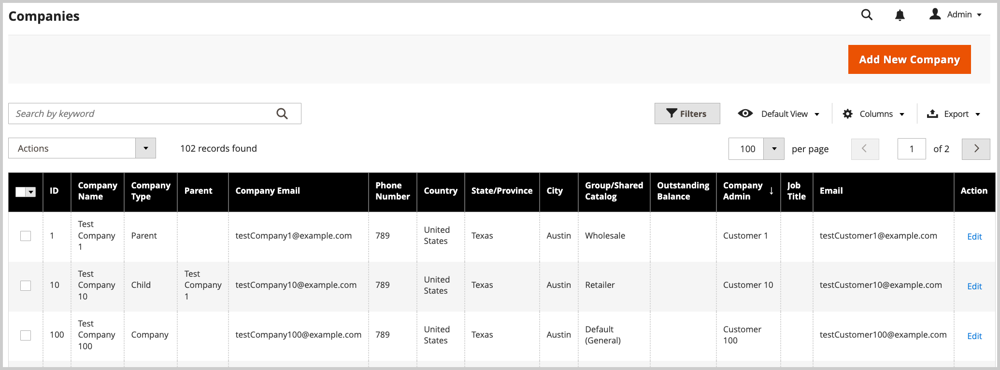

# 管理[!UICONTROL Company Hierarchy]

[!BADGE 1.5.0-beta]{type=Informative url="/help/b2b/release-notes.md" tooltip="仅适用于Beta计划参与者"}

管理员可以通过将相关公司分配给指定的母公司（即位于组织顶部的公司）来构建[!UICONTROL Company Hierarchy]。 如果[!UICONTROL Company Type]是`Company`，则该公司不是组织的一部分，有资格成为母公司，或者被分配到现有的母公司。

在管理员中，您可以通过编辑公司，然后更新[!UICONTROL Company Hierarchy]配置以分配或取消分配公司来管理公司分配。

{width="700"}

>[!NOTE]
>
>有关[!UICONTROL Company Hierarchy]网格的详细信息，请参阅[公司层次结构](account-company-create.md#company-hierarchy)字段描述。

## 将公司分配给组织

1. 在&#x200B;_管理员_&#x200B;侧边栏中，导航到&#x200B;**[!UICONTROL Customers]** > **[!UICONTROL Companies]**。

   {width="700" zoomable="yes"}

1. 在[!UICONTROL Companies]网格中，打开公司详细信息页面以创建分配。

   - 要将其他公司分配给现有的母公司，请选择母公司的&#x200B;**[!UICONTROL Edit]**&#x200B;操作。
   - 要创建母公司，请为要指定为母公司的公司选择&#x200B;**[!UICONTROL Edit]**&#x200B;操作。

     您无法从现有的父公司或子公司创建父公司。

1. 在公司详细信息页面上，展开&#x200B;**[!UICONTROL Company Hierarchy]**。

   {width="700" zoomable="yes"}

   该网格显示现有公司分配（如果存在）。 父公司始终位于[!UICONTROL Company Hierarchy]网格的顶部。 `[!UICONTROL Current]`标志表示正在编辑的公司。

1. 将公司添加到父组织。

   - 通过选择&#x200B;**[!UICONTROL Assign Companies]**&#x200B;从可用公司列表中进行选择。

   - **在此页面中选择“全部”**，或者选择一个或多个特定的公司行项目。

   - 选择&#x200B;**[!UICONTROL Assign Selected Companies]**。

   - 通过选择&#x200B;**[!UICONTROL Assign]**&#x200B;完成公司分配。

     {width="675" zoomable="yes"}

## 从母公司取消分配公司

1. 在&#x200B;_管理员_&#x200B;侧边栏中，导航到&#x200B;**[!UICONTROL Customers]** > **[!UICONTROL Companies]**。

   {width="700" zoomable="yes"}

1. 在[!UICONTROL Companies]网格中，通过选择&#x200B;**[!UICONTROL Edit]**&#x200B;打开父公司的公司详细信息页面。

1. 通过展开&#x200B;**[!UICONTROL Company Hierarchy]**&#x200B;查看已分配公司的列表。

1. 在[!UICONTROL Company Hierarchy]网格中，使用&#x200B;**[!UICONTROL Select]**&#x200B;操作控件取消分配公司以选择&#x200B;**[!UICONTROL Unassign from parent]**。

   {width="700" zoomable="yes"}

1. 出现提示时，通过选择&#x200B;**[!UICONTROL Unassign]**&#x200B;从层次结构中删除分配的公司。
