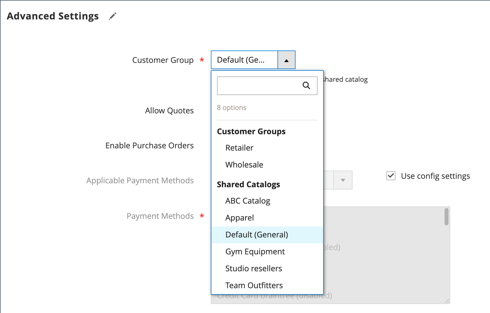

# 将公司分配给共享目录

可使用以下两种方法将公司分配给共享目录。 您可以从&#x200B;_[!UICONTROL Shared Catalogs]_网格中进行分配，或编辑公司并分配共享目录，就像选择客户组一样。

{width="700" zoomable="yes"}

## 方法1：从共享目录分配公司

1. 在&#x200B;_管理员_&#x200B;侧边栏上，转到&#x200B;**[!UICONTROL Catalog]** > **[!UICONTROL Shared Catalogs]**。

1. 对于网格中要分配公司的共享目录，转到&#x200B;**[!UICONTROL Action]**&#x200B;列并选择&#x200B;**[!UICONTROL Assign Companies]**。

   可用公司的列表将显示在网格中。

1. 选择要分配给共享目录的公司，单击&#x200B;**[!UICONTROL Actions]**&#x200B;菜单，然后选择&#x200B;**[!UICONTROL Assign Catalog]**。

   {width="700" zoomable="yes"}

   作为替代方法，您可以单击未分配到目录的任何公司的&#x200B;**[!UICONTROL Action]**&#x200B;列中的&#x200B;**[!UICONTROL Assign]**。

1. 对要分配给共享目录的每个公司重复此操作。

   公司已分配给共享目录。

1. 完成后，单击&#x200B;**[!UICONTROL Save]**。

## 方法2：编辑公司

1. 在&#x200B;_管理员_&#x200B;侧边栏上，转到&#x200B;**[!UICONTROL Customers]** > **[!UICONTROL Companies]**。

1. 对于网格中显示的公司，转到&#x200B;**[!UICONTROL Action]**&#x200B;列并单击&#x200B;**[!UICONTROL Edit]**。

   {width="700" zoomable="yes"}

1. 在公司页面上，向下滚动并展开 **[!UICONTROL Advanced Settings]**&#x200B;部分。

1. 将&#x200B;**[!UICONTROL Customer Group]**&#x200B;设置为相应的共享目录。

   更改共享目录分配也会更改所有公司成员的客户组分配。

   {width="600"}

1. 提示确认时，单击&#x200B;**[!UICONTROL Proceed]**，然后单击&#x200B;**[!UICONTROL Save]**。
