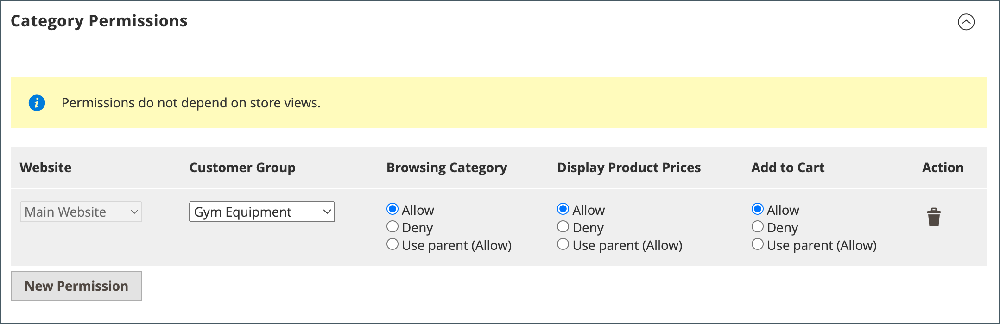
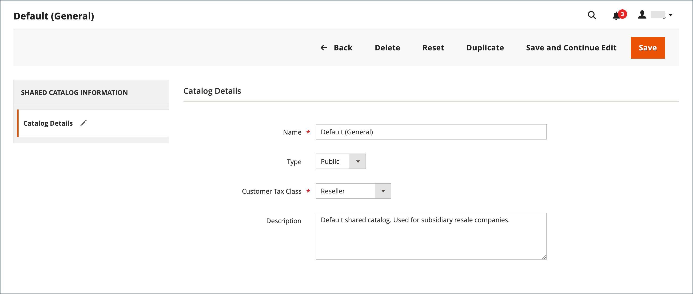

# 管理共享目录

_[!UICONTROL Shared Catalogs]_页面提供管理共享目录所需工具的访问权限。 该页面类似于标准管理员工作区，具有过滤器和操作控件。 网格会列出所有共享目录，包括默认的公共共享目录以及已设置的任何自定义目录。

## 更新产品选择

任何共享目录中的产品选择都可从共享目录网格的&#x200B;_[!UICONTROL Action]_列轻松更新。 您所做的更改对任何关联公司帐户的成员可见。 该过程基本上与为新[目录结构](catalog-shared-pricing-structure.md)选择产品相同，只是该配置的范围无法更改。

1. 在&#x200B;_管理员_&#x200B;侧边栏上，转到&#x200B;**[!UICONTROL Catalog]** > **[!UICONTROL Shared Catalogs]**。

1. 对于网格中的共享目录，转到&#x200B;**[!UICONTROL Action]**&#x200B;列并选择&#x200B;**[!UICONTROL Set Pricing and Structure]**。

   {width="700" zoomable="yes"}

1. 按照[步骤2：选择产品](catalog-shared-pricing-structure.md#step-2-choose-the-products)中的说明操作。

   您可以跳过第一项，因为共享目录的范围在首次保存后无法更改。

如果您使用特定产品，_[!UICONTROL Products In Shared Catalog]_部分将列出该产品可用的每个共享目录。 若要了解详细信息，请参阅[将产品添加到共享目录](catalog-shared-product-add.md)。

{width="600" zoomable="yes"}

## 更新自定义定价

可以从“共享目录”网格的“操作”列轻松更新任何共享目录中的产品的自定义定价。 您所做的更改将在店面中向关联公司或客户组的成员可见。 此过程与设置新[共享目录](catalog-shared-pricing-structure.md)的自定义定价过程基本相同，不同之处在于无法更改配置的范围。

1. 在&#x200B;_管理员_&#x200B;侧边栏上，转到&#x200B;**[!UICONTROL Catalog]** > **[!UICONTROL Shared Catalogs]**。

1. 对于网格中要更新的共享目录，转到&#x200B;**[!UICONTROL Action]**&#x200B;列并选择&#x200B;**[!UICONTROL Set Pricing and Structure]**。

1. 在&#x200B;_[!UICONTROL Catalog Structure]_页面上，单击&#x200B;**[!UICONTROL Configure]**并执行以下操作之一：

   - 在页面顶部的进度指示器中，单击&#x200B;**[!UICONTROL Pricing]**。
   - 单击右上角的&#x200B;**[!UICONTROL Next]**。

1. 按照[步骤3：设置自定义价格](catalog-shared-pricing-structure.md#step-3-set-custom-prices)中的说明操作。

## 更新类别权限

对于从类别树添加到共享目录的产品，[类别权限](../catalog/category-permissions.md)自动设置为`Allow`。 您可以稍后根据需要调整权限或创建其他规则。

>[!NOTE]
>
>**[B2B 1.3.0](release-notes.md#b2b-v130)及更高版本** — 在创建共享目录时，对于在目录权限设置中分配了此类访问权限的客户组，_[!UICONTROL Display Product Prices]_的每个[类别权限](../catalog/category-permissions.md)和_[!UICONTROL Add to Cart]_&#x200B;均设置为`Allow`。 以前，即使将目录权限设置为`Allow`，这些设置也会自动设置为`Deny`。

>[!IMPORTANT]
>
>启用&#x200B;**_[!UICONTROL Shared Catalog]_**&#x200B;功能后，目录中的&#x200B;**_所有_**&#x200B;类别将忽略所有现有[组权限设置](../configuration-reference/catalog/catalog.md#category-permissions)。 [!UICONTROL Shared Catalog]在启用时完全控制目录中的所有类别权限。

1. 在&#x200B;_管理员_&#x200B;侧边栏上，转到&#x200B;**[!UICONTROL Catalog]** > **[!UICONTROL Categories]**。

1. 在类别树中，选择要更新的产品类别。

   要包含所有产品，请在树中选择顶级类别。

1. 向下滚动并展开&#x200B;**[!UICONTROL Category Permissions]**&#x200B;部分的。

1. 单击&#x200B;**[!UICONTROL New Permission]**&#x200B;并执行以下操作：

   {width="600" zoomable="yes"}

   - 选择与共享目录对应的&#x200B;**[!UICONTROL Customer Group]**，并根据需要更改权限设置。

     {width="600" zoomable="yes"}

   - 要为其他客户组创建权限规则，请单击&#x200B;**[!UICONTROL New Permissions]**&#x200B;并重复此过程。

   - 要删除权限规则，请单击&#x200B;_删除_ 图标。

1. 完成后，单击&#x200B;**[!UICONTROL Save]**。

## 更新目录详细信息

可以从“共享目录”网格的“操作”列轻松更新任何共享目录的详细信息。 您所做的更改会反映在任何关联的公司帐户中。

{width="700" zoomable="yes"}

1. 在&#x200B;_管理员_&#x200B;侧边栏上，转到&#x200B;**[!UICONTROL Catalog]** > **[!UICONTROL Shared Catalogs]**。

1. 对于要更新的共享目录，转到&#x200B;**[!UICONTROL Action]**&#x200B;列并选择&#x200B;**[!UICONTROL General Settings]**。

   {width="600" zoomable="yes"}

1. 根据需要更新目录详细信息。

   - 更改共享目录的名称，也会更改相应客户组的名称。
   - 将目录类型从`Custom`更改为`Public`可将现有的公共目录转换为自定义目录。 与原始公共目录关联的任何公司都会被重新分配给替代公司。 公共目录无法转换为自定义目录。

1. 完成后，单击&#x200B;**[!UICONTROL Save]**。

## 共享目录页面引用

### 按钮栏

| 按钮 | 描述 |
|--- |--- |
| [!UICONTROL Back] | 返回到“共享目录”页而不保存新的共享目录。 |
| [!UICONTROL Delete] | 删除目录，并将任何关联公司及其成员重新分配给公共共享目录。 |
| [!UICONTROL Reset] | 清除所有未保存的更改的形式，并恢复原始目录详细信息。 |
| [!UICONTROL Duplicate] | 创建目录](catalog-shared-create.md)的[副本。 对于自定义目录，为原始目录的定价模型和结构，但不包括公司关联。 如果公共共享目录重复，则重复目录的类型将更改为`custom`。 系统还会创建对应的客户组，其名称与重复目录相同。 默认情况下，重复的目录在原始目录中名为&#x200B;_Duplicate of_。 |
| [!UICONTROL Save and Continue Edit] | 保存所有更改，并保持表单在编辑模式下打开。 |
| [!UICONTROL Save] | 保存更改，关闭表单，然后返回到“共享目录”页。 |

{style="table-layout:auto"}

### 目录详细信息

| 字段 | 描述 |
|--- |--- |
| [!UICONTROL Name] | 在整个管理员以及可用目录的客户帐户中标识共享目录。 目录名称应为描述性的，长度不超过32个字符。 不能有两个名称相同的共享目录。 最大字符数：32 |
| [!UICONTROL Type] | **[!UICONTROL Custom]** — 标识具有自定义定价的目录，该目录仅对分配该目录的特定公司可用。 **[!UICONTROL Public]**— 标识可供所有来宾访客以及未与公司关联的登录客户使用的共享目录。 安装Adobe Commerce B2B时会创建“默认”公共共享目录，但必须由管理员配置。 一次只能存在一个公共共享目录。 |
| [!UICONTROL Customer Tax Class] | 确定用于从目录采购的税分类。 这些选项包括所有可用的税分类。 |
| [!UICONTROL Description] | 有关如何使用目录的简要说明。 |

{style="table-layout:auto"}
