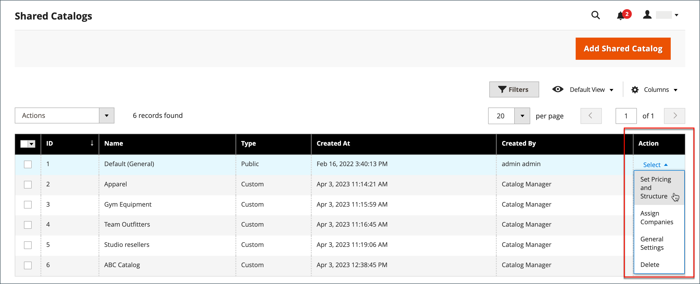
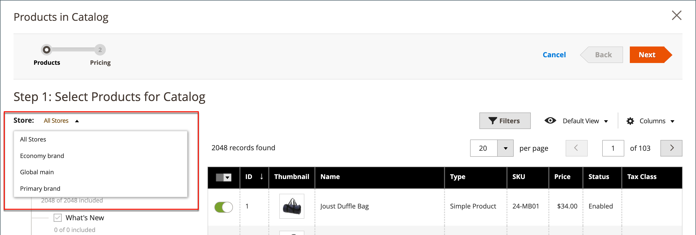
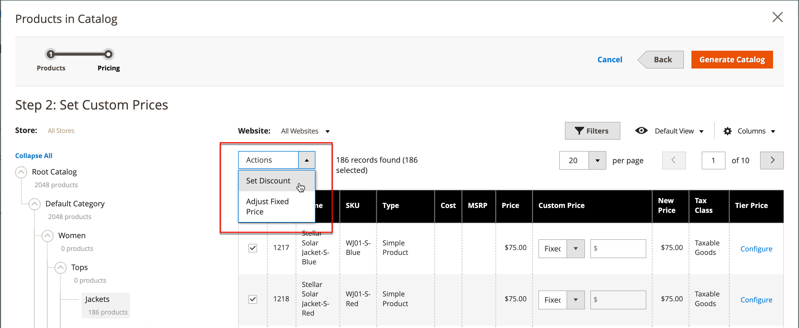
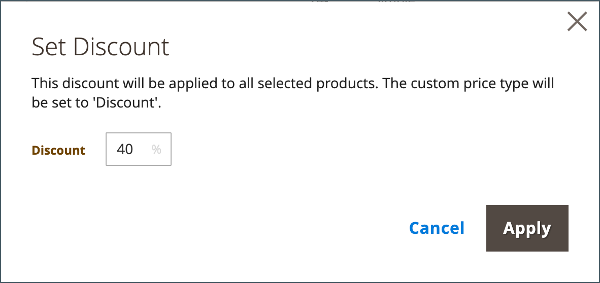
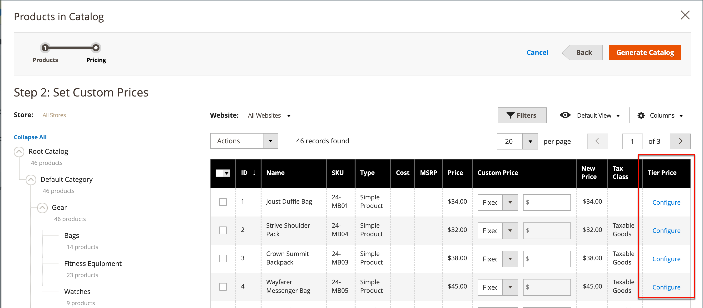
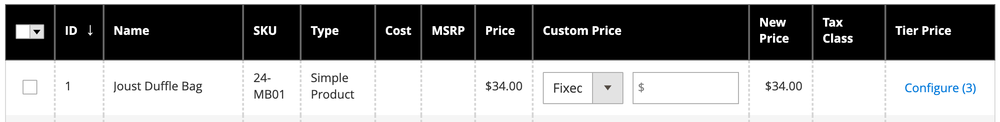

# 设置共享目录定价和结构

设置共享目录的定价和结构需要两个步骤。 您在流程中的当前位置在页面顶部的进度条中以数字突出显示。 您可以随时通过单击进度条查看进程中的其他步骤。 例如，如果您正在处理自定义定价，则可能需要返回到产品选择页面以供参考。 只需单击 **[!UICONTROL Products]** ，然后单击 **[!UICONTROL Pricing]** 以返回自定义定价页面。 在此过程中，您的工作不会丢失。

{width="700" zoomable="yes"}

在标准类别树中，根类别是最顶层的容器，称为 _默认类别_ 在示例数据中。 但是，启用共享目录后，类别树具有一个名为的外部容器 _根目录_. 根目录包含系统中存在的所有其他类别结构。 有关更多信息，请参阅 [目录范围](../catalog/introduction.md#catalog-scope).

## 第1步：打开共享目录定价和结构配置

1. 在 _管理员_ 侧栏，转到 **[!UICONTROL Catalog]** > **[!UICONTROL Shared Catalogs]**

1. 对于网格中的共享目录，请转到 _[!UICONTROL Action]_列并单击&#x200B;**[!UICONTROL Set Pricing and Structure]**.

   {width="700" zoomable="yes"}

1. 首次配置共享目录时，单击 **[!UICONTROL Configure]** 以继续执行以下步骤。

## 第2步：选择产品

此流程的第一步是选择要包含在共享目录中的产品。 产品选择页面具有 [类别树](../catalog/category-create.md) 和右侧的“已同步的产品”网格。 如果单击树中的某个类别，则该类别中的产品将显示在网格中。

只有包含选定产品的类别才会显示在 [顶部导航](../catalog/navigation-top.md) 从店面查看共享目录时。 默认情况下，店面导航中只包含前三个类别级别，不包括根类别。

1. 使用 **存储** 选择器设置 [范围](../catalog/introduction.md#product-scope) 配置中。

   只能在首次保存共享目录之前设置配置的范围。 如果您稍后编辑产品选择，则“商店”选择器将不可用。

   {width="600" zoomable="yes"}

1. 在类别树中，执行以下任一操作：

   - 要包含所有产品，请单击 **[!UICONTROL Select all]** 或选中父类别的复选框。
   - 要包含特定类别的产品，请选中要包含的每个类别的复选框。
   - 要包含或排除单个产品，请选中或取消选中产品的复选框。

   树中每个类别下面的表示法显示当前包含在共享目录中的类别中的产品数量。 下面的表示法 [根类别](../catalog/category-root.md) 显示当前为共享目录选择的所有类别中的产品总数。

1. 要查看网格中的类别产品，请单击树中类别的名称。 选择类别时，会发生以下情况：

   - 网格第一列中的切换设置为绿色 _开启_ 每个所选产品的位置。
   - 如果将产品分配给多个类别，并且产品未在一个类别中选择，则它仍可通过其他类别使用，在使用时也可使用 [目录搜索](../catalog/search.md).
   - 系统自动设置 [类别权限](../catalog/category-permissions.md) 到 `Allow` 所选产品的。

1. 如有必要，请使用筛选器和其他网格控件来查找要包含在共享目录中的产品。

   您可以通过单击第一列中的切换来单独选择或忽略各个产品。

   如果您选择的类别没有产品，但是已链接到CMS内容或外部链接，则该类别会显示在店面的顶部导航中。

   在保存配置之前，您所做的类别设置不会永久记录在数据库中。 但是，当您处理结构和定价时，它们会暂时保存。

1. 单击 **[!UICONTROL Next]**.

   {width="600" zoomable="yes"}

## 步骤3：设置自定义价格

您可以单独为每个产品设置自定义定价，也可以使用 _[!UICONTROL Action]_控件，用于将自定义定价设置为多个产品记录的固定金额或百分比。

- **[!UICONTROL Fixed]**：指定最终产品价格。 例如，如果您输入的固定价格为$10.00，则相应公司的店面价格为$10.00。

  >[!NOTE]
  >
  >基本价格和输入的固定值之间的最小值用作最终产品价格。

  >[!NOTE]
  >
  >**_固定价格_** 产品可自定义选项包括 _非_ 受组价格、层价格、特殊价格或目录价格规则影响。

- **[!UICONTROL Percentage]**：根据折扣百分比确定自定义价格。 例如，要提供10%的折扣，请将自定义价格类型设置为 `Percentage` 并输入 `10`. 折扣的定制价格是原始产品价格的90%。

要将以下产品类型的折扣设置为固定金额或百分比，请使用 _[!UICONTROL Custom Price]_网格中的列：

- [简单](../catalog/product-create-simple.md) （包括可配置的产品变体）
- [捆绑](../catalog/product-create-bundle.md)
- [可下载](../catalog/product-create-downloadable.md)
- [虚拟](../catalog/product-create-virtual.md)

对于以下项，自定义价格列为空 [可配置](../catalog/product-create-configurable.md) 和 [已分组](../catalog/product-create-grouped.md) 产品类型和 [礼品卡](../catalog/product-gift-card-create.md).

网格中的产品选择不能从 _自定义价格_ 页面。 但是，您可以使用页面顶部的进度指示器返回到上一步并更改产品选择。

{width="600" zoomable="yes"}

### 应用自定义价格

1. 对于多站点安装，请设置 **[!UICONTROL Website]** 到应用定制价格的网站。

   {width="600" zoomable="yes"}

1. 使用以下方法之一选择要应用自定义定价的产品。

   - 使用类别树选择特定类别中的所有产品。
   - 设置 _[!UICONTROL Mass Actions]_标题中的控件至 `Select All`.
   - 选中各个产品的复选框。

   网格显示当前选定类别中的产品，您可以使用标准控件查找产品并筛选列表。

   {width="600" zoomable="yes"}

1. 设置 **[!UICONTROL Actions]** 更改为以下任一项：

   - `Set Discount`  — 将折扣百分比应用于所有选定产品。 每个受影响的产品价格均显示为 **_已折扣_** 价格。
   - `Adjust Fixed Price`  — 对所有选定产品应用固定价格折扣百分比。 每个受影响的产品价格都会显示为 **_已调整固定_** 价格。

   {width="600" zoomable="yes"}

1. 出现提示时，输入折扣或价格调整，然后单击 **[!UICONTROL Apply]**.

   {width="400"} 

   {width="400"}

   折扣将应用于所有选定的产品，并且 _自定义价格_ 列反映应用的折扣类型和金额。

   {width="600" zoomable="yes"}

### 应用层价格

[分层定价](../catalog/product-price-tier.md) 允许您为共享目录中的产品提供数量折扣。 此 _层价格_ 网格的列包含指向以下内容的链接： _高级定价_ 专门应用于共享目录的选项。 如果产品已包含层定价，则链接后的括号中会显示现有层的数量。

以下说明显示了如何将分层定价应用于单个产品。 要对多个产品应用分层定价，请参阅 [导入层价格](../systems/data-import-price-tier.md).

1. 对于网格中的产品，请转到 _层价格_ 列并单击 **[!UICONTROL Configure]**.

   {width="600" zoomable="yes"}

1. 在 _高级定价_ 页面，单击 **[!UICONTROL Add Price]** 并执行以下操作：

   {width="600" zoomable="yes"}

   - 设置 **[!UICONTROL Website]** 到应用层价格的网站。
   - 输入必须购买才能获得折扣的产品数量。
   - 设置 **[!UICONTROL Price]** 折扣类型之一：
      - `Fixed`
      - `Discount`
   - 输入折扣金额。
   - 要输入另一层，请单击 **添加价格** 并重复该过程以定义下一层。

   {width="600" zoomable="yes"}

1. 完成后，单击 **[!UICONTROL Done]**.

   在网格中，层数显示在中的括号中 _[!UICONTROL Tier Price]_列。

   {width="600" zoomable="yes"}

## 保存结构和定价

自定义定价完成后，单击 **[!UICONTROL Generate Catalog]** 则 **[!UICONTROL Save]**.

共享目录现已保存到数据库。 其名称显示在 _[!UICONTROL Shared Catalog]_列_[!UICONTROL Products]_ 网格。 下一步是 [将共享目录分配给公司](./catalog-shared-assign-companies.md).
