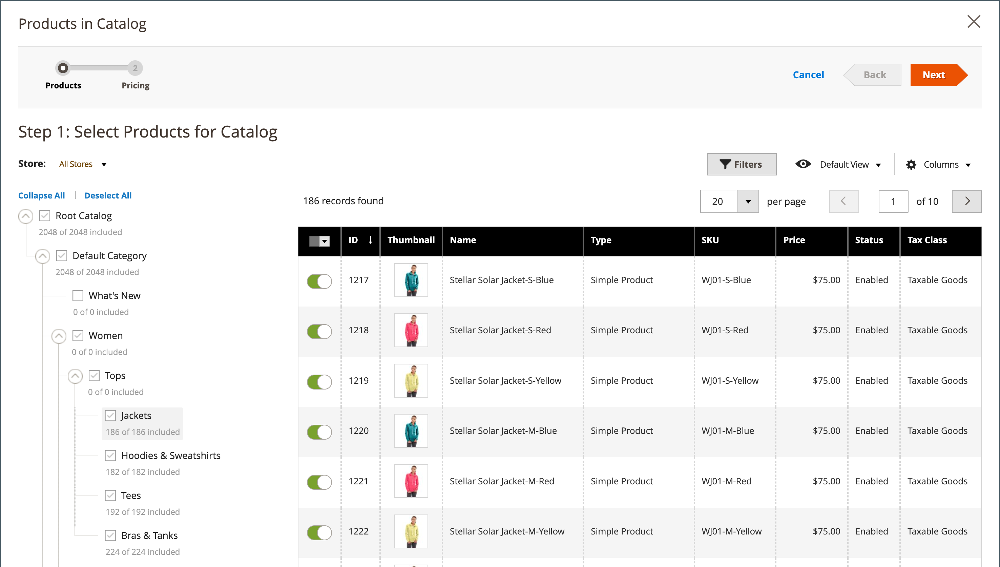
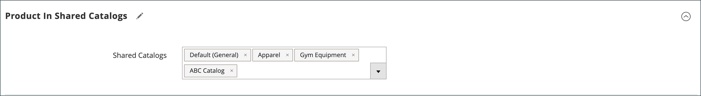

# 将产品添加到共享目录

产品可以单独或按类别以多个产品的组添加到共享目录中。

复杂产品（例如捆绑包、分组或可配置）必须满足以下要求，才能从共享目录的店面中可见：

- 所有[关联产品](../catalog/product-configurations.md)和选项必须分配给同一共享目录并在主目录中启用。
- 对于[可配置](../catalog/product-create-configurable.md)和[已分组](../catalog/product-create-grouped.md)的产品，仅显示启用的关联产品。
- 对于[捆绑包](../catalog/product-create-bundle.md)产品，所有选项都必须包含在共享目录中。

  {width="600" zoomable="yes"}

## 方法1：添加单个产品

1. 在&#x200B;_管理员_&#x200B;侧边栏上，转到&#x200B;**[!UICONTROL Catalog]** > **[!UICONTROL Products]**。

1. 对于网格中要添加的产品，请转到&#x200B;_[!UICONTROL Action]_&#x200B;列并单击&#x200B;**[!UICONTROL Edit]**。

1. 向下滚动，展开 _[!UICONTROL Product in Shared Catalogs]_&#x200B;部分，然后执行以下操作：

   - 选中产品应出现的每个共享目录的复选框。 要选择所有目录，请单击&#x200B;**[!UICONTROL Select all]**。

     {width="600" zoomable="yes"}

     每个选定目录的名称将出现在&#x200B;_[!UICONTROL Shared Catalogs]_&#x200B;字段中。

     {width="600" zoomable="yes"}

   - 单击&#x200B;**[!UICONTROL Done]**&#x200B;保存设置。

1. 完成后，单击&#x200B;**[!UICONTROL Save]**。

## 方法2：添加多个产品

1. 在&#x200B;_管理员_&#x200B;侧边栏上，转到&#x200B;**[!UICONTROL Catalog]** > **[!UICONTROL Shared Catalogs]**。

1. 对于网格中的共享目录，转到&#x200B;_[!UICONTROL Action]_&#x200B;列并选择&#x200B;**[!UICONTROL Set Pricing and Structure]**。

1. 在类别树中，执行以下任一操作：

   - 要包含所有产品，请单击&#x200B;**[!UICONTROL Select all]**&#x200B;或选中父类别的复选框。
   - 要包含特定类别的产品，请选中要包含的每个类别的复选框。
   - 要包含或排除单个产品，请选中或取消选中产品的复选框。

   树中每个类别下面的表示法显示当前包含在共享目录中的类别中的产品数量。 [根类别](../catalog/category-root.md)下的表示法显示当前为共享目录选择的所有类别中的产品总数。

1. 要查看网格中的类别产品，请单击树中类别的名称。

   选择类别时，会发生以下情况：

   - 对于每个所选产品，网格第一列中的切换设置为`On`。
   - 如果将产品分配给多个类别并在其中一个类别中省略，则它仍可通过其他类别和[目录搜索](../catalog/search.md)使用。
   - 系统自动将所选产品的[类别权限](../catalog/category-permissions.md)设置为`Allow`。
