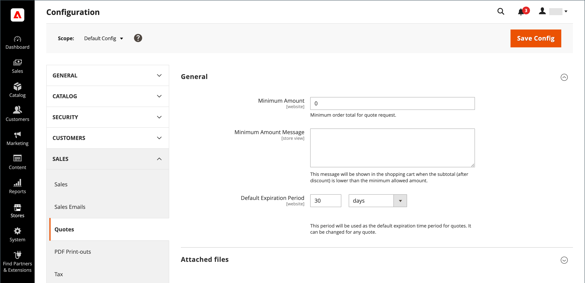

# 配置引号

如果在常规[B2B功能](enable-basic-features.md)中启用了引号，则可以在Admin中配置对引号的支持。 报价配置确定了报价请求所需的最低订单量、报价存留期以及附件支持的文件格式。

>[!NOTE]
>
>报价配置选项和使用报价洽谈功能的能力使用[角色资源](../systems/permissions-user-roles.md#role-resources)进行控制。 必须为分配给管理员用户帐户的管理员用户角色选择这些角色资源。 要授予对管理员中报价函数的访问权限，请转到&#x200B;**[!UICONTROL System]** > _[!UICONTROL Permissions]_>**[!UICONTROL User Roles]**，选择角色，然后导航到_&#x200B;角色资源&#x200B;_树中的[!UICONTROL Sales] > [!UICONTROL Operations] > [!UICONTROL Quotes]。

1. 在&#x200B;_管理员_&#x200B;侧边栏上，转到&#x200B;**[!UICONTROL Stores]** > _[!UICONTROL Settings]_>**[!UICONTROL Configuration]**。

1. 在左侧面板中，展开&#x200B;**[!UICONTROL Sales]**&#x200B;并选择&#x200B;**[!UICONTROL Quotes]**。

1. 展开&#x200B;**[!UICONTROL General]**&#x200B;部分中的并执行以下操作：

   {width="700" zoomable="yes"}

   有关引号功能选项及其功能的完整列表，请参阅&#x200B;_配置引用_&#x200B;中的[引号](../configuration-reference/sales/quotes.md)。

   - 输入在提交报价请求之前必须满足的购物车中的&#x200B;**[!UICONTROL Minimum Amount]**。

   - 对于&#x200B;**[!UICONTROL Minimum Amount Message]**，输入当购物车总数不符合所需的最小数量时要显示的消息。

   - 对于&#x200B;**[!UICONTROL Default Expiration Period]**，输入报价要保持有效的&#x200B;**[!UICONTROL days]**、**[!UICONTROL weeks]**&#x200B;或&#x200B;**[!UICONTROL months]**&#x200B;的数字。

1. 展开&#x200B;**[!UICONTROL Attached files]**&#x200B;部分中的并执行以下操作：

   - 对于&#x200B;**[!UICONTROL File formats for upload]**，输入您支持附加到引号的文件类型的后缀。

     以小写输入每个文件后缀，并用逗号分隔。

     默认情况下，支持以下格式： `doc`、`docx`、`xls`、`xlsx`、`pdf`、`txt`、`jpg`、`png`和`jpeg`

   - 对于&#x200B;**[!UICONTROL Maximum file size]**，输入附加文件的最大大小（以MB为单位）。

     输入的值可能会被服务器设置覆盖。

     {width="600" zoomable="yes"}

1. 完成后，单击&#x200B;**[!UICONTROL Save Config]**。
