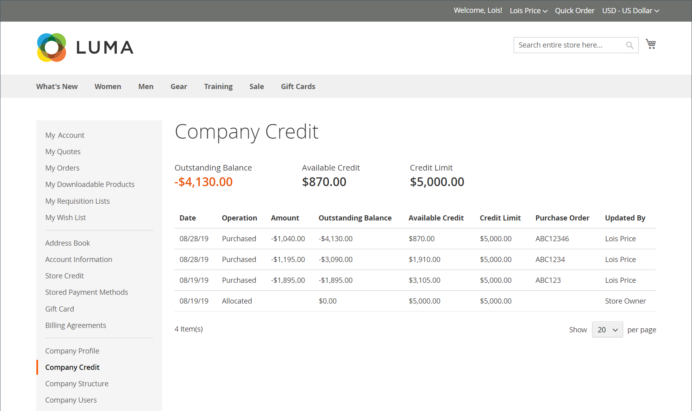

# 管理公司信用

如果在配置中启用了[帐户付款](../getting-started/../b2b/enable-basic-features.md#configure-payment-on-account)，则公司可以在其帐户上进行购买，但最多可达到授予公司的信用额度。 启用后，客户可以从其帐户信息板检查其公司贷记的状态。

{width="700" zoomable="yes"}

您可以为每个公司配置文件设置以下与信用相关的参数：

- 贷方货币
- 信用额度
- 允许超出信用额度
- 更改原因

如果公司有未清余额，则当从管理员查看时，在销售订单的顶部会显示一份发送给商店管理员的通知。 若要了解详细信息，请参阅[创建公司帐户](account-company-create.md)。

## 公司信用活动

公司配置文件的[!UICONTROL Company Credit]部分显示客户信用活动的摘要，以及公司信用历史记录的网格。

{width="700" zoomable="yes"}

| 列 | 描述 |
|--- |--- |
| [!UICONTROL Date] | 交易的日期。 要显示日期和时间，请将鼠标悬停在日期上。 |
| [!UICONTROL Operation] | 与交易记录关联的活动的类型。 值：  **[!UICONTROL Allocated]**— 分配给公司的信用。 **[!UICONTROL Updated]** — 更改应用于以下字段之一：[!UICONTROL Credit limit] / [!UICONTROL Credit currency] / [!UICONTROL Allow to exceed credit limit]  **[!UICONTROL Purchased]**— 已下订单。 **[!UICONTROL Reimbursed]** — 已偿还未清余额。  **[!UICONTROL Refunded]**— 贷项通知单金额已退款。 **[!UICONTROL Reverted]** — 订单已取消，金额已返回贷方余额。 |
| [!UICONTROL Amount] | 与以下交易类型关联的交易金额： `Purchased` / `Reimbursed` / `Refunded` / `Reverted`  对于购买金额，金额以商店的显示货币和贷方货币设置的格式显示，后跟当前兑换率（如果适用）。 例如： EUR 20,000.00 ($22,400.00)  USD/EUR 0.8928 |
| [!UICONTROL Outstanding Balance] | 退款金额减去使用“分期付款”方法下达的所有订单的应付总额。 数量可能显示为正值或负值。  **[!UICONTROL Positive value]**— 预付款以正值表示。 **[!UICONTROL Negative value]** — 到期金额表示为负值。 |
| [!UICONTROL Available Credit] | _[!UICONTROL Credit Limit]_&#x200B;和_[!UICONTROL Outstanding Balance]_&#x200B;的总和。 如果公司已超出信用限额，则金额将显示为负值。 |
| [!UICONTROL Credit Limit] | 给予公司的贷方金额。 |
| [!UICONTROL Updated By] | 发起操作的人员的姓名。 |
| [!UICONTROL Custom Reference Number] | 与交易记录关联的自定义参考编号。 |
| [!UICONTROL Comment] | 根据操作类型，`Reason for Change`字段中的值的编译。  **[!UICONTROL Purchased]**— 包含采购注释、订单编号和订单链接。 **[!UICONTROL Reimbursed]** — 包含已报销交易记录的注释。 |
| [!UICONTROL Action] | 仅用于`Reimbursed`操作。 **[!UICONTROL Edit]** — 允许更新报销金额。 |

{style="table-layout:auto"}

## 更新信用信息

当客户将其未结信用支付给商家时，商店管理员必须在管理员中更新客户信用信息。

1. 在&#x200B;_管理员_&#x200B;侧边栏上，转到&#x200B;**客户>公司**。

1. 在网格中查找公司并在&#x200B;_编辑_&#x200B;模式下打开。

1. 展开&#x200B;**公司业绩**&#x200B;部分。

1. 对于&#x200B;**信用额度**，请输入新值。

1. 根据需要更改其他值。

1. 更新完成后，单击&#x200B;**[!UICONTROL Save]**。

## 接收付款

偿还余额是公司对其帐户余额进行的离线付款。 商店管理员使用&#x200B;_报销余额_&#x200B;按钮，在公司配置文件中手动输入金额。 在提交金额时，系统会重新计算未清余额和可用的公司信用，并在公司信用历史记录中记录操作。 按照配置中的指定，以贷方币种输入偿还金额。

### 用付款核销公司帐户

1. 在&#x200B;_管理员_&#x200B;侧边栏上，转到&#x200B;**[!UICONTROL Customers]** > **[!UICONTROL Companies]**。

1. 在列表中查找公司记录并在&#x200B;**[!UICONTROL Edit]**&#x200B;模式下打开。

1. 在页面顶部，单击&#x200B;**偿还余额**。

1. 在对话框中，添加付款信息：

   {width="500"}

   - 输入付款的&#x200B;**金额**。

     金额可以输入为正值或负值。

   - 如果适用，请输入&#x200B;**自定义参考编号**&#x200B;以供参考。

     每个报销只能输入一个自定义参考编号。 要将付款应用于多个PO，请为每个PO创建单独的报销。

   - 根据需要，输入&#x200B;**注释**&#x200B;以描述报销情况。

1. 单击&#x200B;**报销**。

   本公司将重新计算未偿还余额及可用信贷，本公司信贷记录将更新以反映有关偿付。

### 编辑报销

1. 以&#x200B;**[!UICONTROL Edit]**&#x200B;模式打开公司配置文件。

1. 展开&#x200B;**公司业绩**&#x200B;部分的。

1. 在网格中查找报销交易记录，然后单击&#x200B;**[!UICONTROL Edit]**。

1. 对&#x200B;**自定义参考编号**&#x200B;和&#x200B;**评论**&#x200B;进行任何必要的更改。

   无法更改报销金额。

1. 单击&#x200B;**[!UICONTROL Save]**。

## 店面信用信息

对于公司管理员，帐户仪表板显示&#x200B;_公司信用_&#x200B;部分。 它提供当前未结余额、可用信用额以及分配至其公司帐户的信用额度，随后提供未结发票的列表。

如果商家取消从公司贷记中扣除的订单，则该订单的金额将返回到公司余额，并且&#x200B;_贷记分配历史记录_&#x200B;包含该操作的记录。

{width="700" zoomable="yes"}

## 公司信用演示

通过观看此演示视频了解如何管理公司信用：

>[!VIDEO](https://video.tv.adobe.com/v/344445?quality=12&learn=on)
