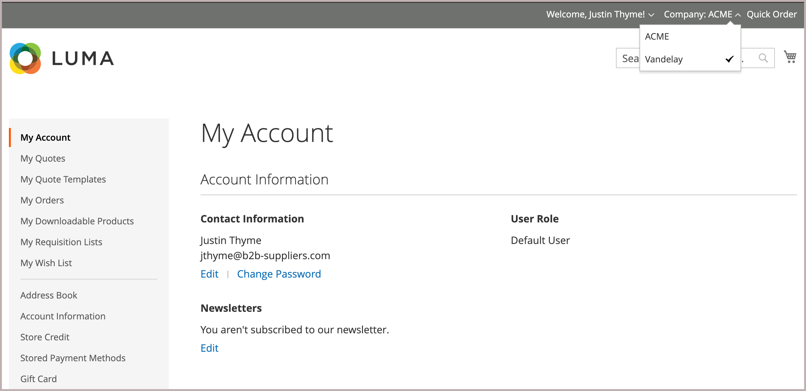

# 将用户添加到公司帐户

在配置中启用后，公司管理员将从店面添加和管理公司用户。 但是，也可以从管理员添加和管理公司用户帐户。

如果需要，您可以将用户分配给多个公司。 例如，如果B2B购买者支持多家公司，则可以将他们的用户帐户添加到与其开展业务的所有公司。 在店面，分配给多个公司的购买者可以通过从&#x200B;*[!UICONTROL Company]*&#x200B;菜单中的可用公司中进行选择而在公司帐户之间切换。

{width="700"}

>[!NOTE]
>
>如果个人已在您的商店中拥有个人帐户，并且稍后去公司工作，则不要将该人员的个人帐户分配给公司。 请为具有公司电子邮件地址的人员创建公司用户帐户。

## 添加公司用户

添加公司用户时，与该用户帐户关联的第一个公司是默认公司。

1. 在管理员侧边栏上，转到&#x200B;**[!UICONTROL Customers > All Customers]**。

1. 单击&#x200B;**[!UICONTROL Add new customer]**。

1. 配置新帐户。

   1. 通过设置&#x200B;**[!UICONTROL Customer Active]**&#x200B;切换来指定初始帐户状态。

      将其打开可立即激活帐户，或禁用它以创建非活动帐户。

   1. 从&#x200B;**[!UICONTROL Associate to Website]**&#x200B;列表中选择网站范围。

   1. 单击&#x200B;**[!UICONTROL Associate to Company]**&#x200B;查看可用的公司。

      {width="675"}

      如果需要，请在输入框中键入公司名称的前几个字母来过滤列表。

   1. 在列表中，选择要为其分配客户的一个或多个公司，然后单击&#x200B;**[!UICONTROL Done]**。

      公司用户会自动添加到与其帐户关联的每个公司的客户组（或[共享目录](catalog-shared.md)）。

   1. 输入必需的用户帐户信息： **[!UICONTROL First Name]**、**[!UICONTROL Last Name]**&#x200B;和&#x200B;**[!UICONTROL Email]**。

   1. 通过启用&#x200B;**[!UICONTROL Allow remote shopping assistance]**，允许销售代表代表客户登录店面。

   1. 单击&#x200B;**[!UICONTROL Save Customer]**&#x200B;应用更改。

      具有公司分配的{width="675"}

[!UICONTROL Customers grid]针对用户所分配到的每个公司显示单独的行。 将更新以下列。

- _[!UICONTROL Customer Type]_&#x200B;列更新以显示分配给用户的角色。

  如果这是首次将客户分配给公司，则&#x200B;_[!UICONTROL Customer Type]_&#x200B;列将从&#x200B;_[!UICONTROL Individual user]_&#x200B;更新为&#x200B;_[!UICONTROL Company User]_。

- _[!UICONTROL Group]_&#x200B;列将更改为分配给公司的客户组（或共享目录）的名称。

- _[!UICONTROL Company]_&#x200B;列显示现在与客户配置文件关联的公司的名称。

## 将用户分配给一个或多个公司帐户

分配新用户时，与该用户帐户关联的第一个公司是默认公司。

1. 在&#x200B;_管理员_&#x200B;侧边栏上，转到&#x200B;**[!UICONTROL Customers]** > **[!UICONTROL All Customers]**。

1. 在网格中查找客户，然后单击&#x200B;_[!UICONTROL Action]_&#x200B;列中的&#x200B;**[!UICONTROL Edit]**。

1. 在左侧面板中，选择&#x200B;**[!UICONTROL Account Information]**。

1. 从&#x200B;**[!UICONTROL Associate to Company]**&#x200B;列表中，选择要分配给公司用户的一个或多个公司，然后单击&#x200B;**[!UICONTROL Done]**。

1. 单击&#x200B;**[!UICONTROL Save Customer]**&#x200B;应用更改。

## 从用户帐户中删除公司分配

从用户配置文件中移除公司会撤销用户对该公司的访问权限。 用户数据仍可在Admin中访问。 如果删除所有公司分配，_[!UICONTROL Customer Type]_&#x200B;将更改为&#x200B;*[!UICONTROL Individual user]*&#x200B;禁用帐户的B2B功能。

1. 在“管理员”的“客户”网格中，编辑要更新的客户配置文件。

1. 在&#x200B;*[!UICONTROL Account Information]部分中，通过单击公司名称标签中的&#x200B;**[!UICONTROL X]**，从&#x200B;**[!UICONTROL Associate to Company]**&#x200B;字段中移除分配的公司。

1. 单击&#x200B;**[!UICONTROL Save Customer]**&#x200B;应用更改。

>[!NOTE]
>
>如果公司用户被指定为公司管理员，则在更新公司帐户以分配新的公司管理员之前，不能从该用户创建公司关联。
