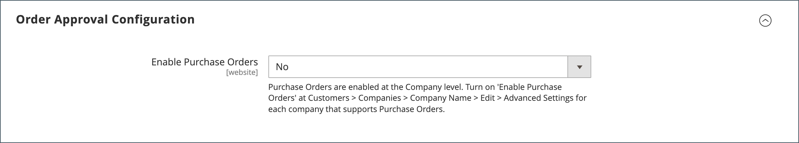
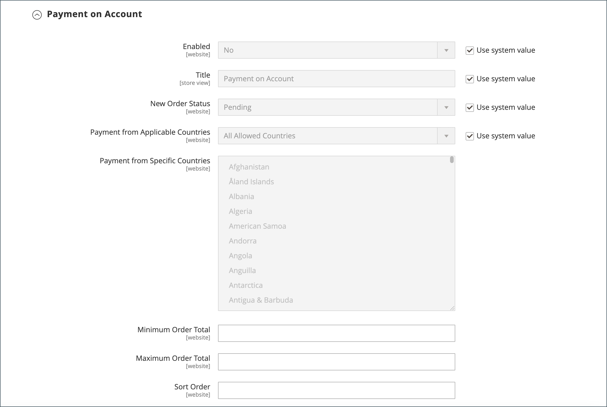

# 启用B2B功能

默认情况下，所有B2B功能最初都处于禁用状态。 商店管理员可以根据需要启用或禁用Commerce商店的B2B功能。 有关B2B配置设置的完整列表，请参阅[B2B功能配置参考](../configuration-reference/general/b2b-features.md)。

启用对客户公司的支持时，会自动启用其他B2B功能：

- [!DNL Shared Catalog]

  支持不同公司的自定义定价配置，还支持所有商店的类别权限。

- [!DNL Enable Shared Catalog direct products price assigning]

  通过在价格索引中仅存储分配给共享目录的产品来提高网站性能。 对于拥有许多共享目录的商家来说，启用此功能是管理不同公司的自定义定价的最佳实践。

- [!DNL B2B Quotes]

  让卖家和公司买家能够协商价格。

- [!DNL B2B default payment and shipping methods]

  确定店面B2B购买者可用的付款和运送选项选择。

仅当[!DNL Enable Company]设置为`Yes`时，这些功能的配置设置才可见。

可以单独启用和禁用B2B [!DNL Quick Order]和[!DNL Requisition List]功能。

## 配置B2B功能

1. 在&#x200B;_管理员_&#x200B;侧边栏上，转到&#x200B;**[!UICONTROL Stores]** > _[!UICONTROL Settings]_>**[!UICONTROL Configuration]**。

   如果您有多站点安装，请将左上角的&#x200B;**[!UICONTROL Store View]**&#x200B;控件设置为应用配置的网站。

1. 在左侧面板中的&#x200B;_[!UICONTROL General]_下，选择&#x200B;**[!UICONTROL B2B Features]**：

   {width="600"}

   - 通过将&#x200B;**[!UICONTROL Enable Company]**&#x200B;设置为`Yes`，允许客户管理自己的公司帐户并支持其他B2B功能。

     启用公司支持后，将自动启用“共享目录”、“B2B报价”、“B2B付款方法”和“B2B发运方法”。

   - 若要允许客户和来宾根据SKU或产品名称快速下订单，请将&#x200B;**[!UICONTROL Enable Quick Order]**&#x200B;设置为`Yes`。

   - 若要允许客户从其帐户信息板创建和管理申请列表，请将&#x200B;**[!UICONTROL Enable Requisition List]**&#x200B;设置为`Yes`。

     您还可以[配置客户可以拥有其帐户的最大列表数](configure-requisition-lists.md)。

1. 完成后，单击&#x200B;**[!UICONTROL Save Config]**。

## 配置默认B2B付款和配送方式

1. 展开&#x200B;**[!UICONTROL Default B2B Payment Methods]**&#x200B;部分的。

1. 要为B2B订单建立默认付款方式，请将&#x200B;**[!UICONTROL Applicable Payment Methods]**&#x200B;设置为以下项之一：

   - `All Payment Methods`

   - `Selected Payment Methods`

     对于特定选项，请在单击每个选项时按住Ctrl键(PC)或Command键(Mac)，选择要提供给客户的&#x200B;**[!UICONTROL Payment Methods]**。

   [付款方法](../configuration-reference/sales/payment-methods.md)列表显示了当前在您的商店中启用或禁用的选项。 除了标准支付方式外，该列表还包括以下各项：

   - 不需要付款信息
   - [分期付款](#configure-payment-on-account)
   - 存储的帐户
   - 存储的卡片

   {width="600"}

1. 展开&#x200B;**[!UICONTROL Default B2B Shipping Methods]**&#x200B;部分的。

1. 要为B2B订单指定默认配送方式，请将&#x200B;**[!UICONTROL Applicable Shipping Methods]**&#x200B;设置为以下任一项：

   - `All Shipping Methods`
   - `Selected Shipping Methods`

     对于特定选项，请在单击每个选项时按住Ctrl键(PC)或Command键(Mac)，选择要提供给客户的&#x200B;**[!UICONTROL Shipping Methods]**。

     配送方式列表显示了当前为[启用或禁用的](../configuration-reference/sales/delivery-methods.md)。

   {width="600"}

1. 完成后，单击&#x200B;**[!UICONTROL Save Config]**。

## 配置公司电子邮件选项

默认情况下，将指定为公司主要联系人的[销售代表](account-company-manage.md#assign-a-sales-representative)配置为许多自动发送给公司的电子邮件的发件人。

1. 在&#x200B;_管理员_&#x200B;侧边栏上，转到&#x200B;**[!UICONTROL Stores]** > _[!UICONTROL Settings]_>**[!UICONTROL Configuration]**。

1. 在左侧面板中，展开&#x200B;**[!UICONTROL Customers]**&#x200B;并选择&#x200B;**[!UICONTROL Company Configuration]**。

1. 如有必要，请将&#x200B;**[!UICONTROL Store View]**&#x200B;设置为存储视图以定义配置的[作用域](../getting-started/websites-stores-views.md#scope-settings)。

1. 完成&#x200B;**[!UICONTROL Company Registration]**&#x200B;部分：

   >[!NOTE]
   >
   >清除&#x200B;**[!UICONTROL Use system value]**&#x200B;复选框以使字段可编辑。

   - 将&#x200B;**[!UICONTROL Company Registration Email Recipient]**&#x200B;设置为[商店联系人](../getting-started/store-details.md#store-email-addresses)，在收到新的公司注册请求时会通知该联系人。

   - 对于&#x200B;**[!UICONTROL Send Company Registration Email Copy To]**，输入每个将接收注册通知副本的人员的电子邮件地址。 用逗号分隔多个电子邮件地址。

   - 要确定通知副本的发送方式，请将&#x200B;**发送电子邮件副本方法**&#x200B;设置为以下项之一：

      - `Bcc` — 通过在发送给客户的同一电子邮件的标头中包含收件人，发送&#x200B;_免费副本_。 客户看不到密件抄送收件人。
      - `Separate Email` — 将副本作为单独的电子邮件发送。

   - 如果您已准备要使用的电子邮件模板而不是默认模板，请将&#x200B;**[!UICONTROL Default Company Registration Email]**&#x200B;设置为模板的名称。 默认情况下，使用`Company Registration Request`模板。

     {width="600"}

1. 完成&#x200B;**[!UICONTROL Customer-Related Emails]**&#x200B;部分：

   如果您已准备要使用的备用电子邮件模板而不是默认模板，请选择要用于以下各项的模板：

   - **[!UICONTROL Default 'Sales Rep Assigned' Email]**
   - **[!UICONTROL Default 'Assign Company to Customer' Email]**
   - **[!UICONTROL Default 'Assign Company Admin' Email]**
   - **[!UICONTROL Default 'Company Admin Inactive' Email]**
   - **[!UICONTROL Default 'Company Admin Changed to Member' Email]**
   - **[!UICONTROL Default 'Customer Status Active' Email]**
   - **[!UICONTROL Default 'Customer Status Inactive' Email]**

   {width="600"}

1. 完成&#x200B;**[!UICONTROL Company Status Change]**&#x200B;部分：

   - 对于&#x200B;**[!UICONTROL Send Company Status Change Email Copy To]**，输入每个要接收状态更改通知副本的人员的电子邮件地址。 用逗号分隔多个电子邮件地址。

   - 要确定通知副本的发送方式，请将&#x200B;**发送电子邮件副本方法**&#x200B;设置为以下项之一：

      - `Bcc` — 通过在发送给客户的同一电子邮件的标头中包含收件人，发送&#x200B;_免费副本_。 客户看不到密件抄送收件人。
      - `Separate Email` — 将副本作为单独的电子邮件发送。

   - 如果您准备了一个电子邮件模板，当公司状态从`Pending Approval`更改为`Active`时，请将&#x200B;**[!UICONTROL Default 'Company Status Change to Active 1' Email]**&#x200B;设置为模板的名称。 默认情况下，使用`Company Status Active 1`模板。

   - 如果您准备了一个电子邮件模板，当公司状态从`Rejected`或`Blocked`更改为`Active`时，将模板名称设置为&#x200B;**[!UICONTROL Default 'Company Status Change to Active 2' Email]**。 默认情况下，使用`Company Status Active 2`模板。

   - 如果您已准备要在公司状态更改为`Rejected`时使用的电子邮件模板，请将&#x200B;**[!UICONTROL Default 'Company Status Change to Rejected' Email]**&#x200B;设置为模板的名称。 默认情况下，使用`Company Status Rejected`模板。

   - 如果您已准备要在公司状态更改为`Blocked`时使用的电子邮件模板，请将&#x200B;**[!UICONTROL Default 'Company Status Change to Blocked' Email]**&#x200B;设置为模板的名称。 默认情况下，使用`Company Status Blocked`模板。

   - 如果您已准备要在公司状态更改为`Pending Approval`时使用的电子邮件模板，请将&#x200B;**[!UICONTROL Default 'Company Status Change to Pending Approval' Email]**&#x200B;设置为模板的名称。 默认情况下，使用`Company Status Pending Approval`模板。

   {width="600"}

1. 完成&#x200B;**[!UICONTROL Company Credit Emails]**&#x200B;部分：

   - 将&#x200B;**[!UICONTROL Company Credit Change Email Sender]**&#x200B;设置为[商店联系人](../getting-started/store-details.md#store-email-addresses)，当分配给公司的信用额度发生更改时，将通知该联系人。 默认情况下，该通知将发送给&#x200B;_销售代表_。

   - 对于&#x200B;**[!UICONTROL Send Company Credit Change Email Copy To]**，输入每个要接收信用更改通知副本的人员的电子邮件地址。 用逗号分隔多个电子邮件地址。

   - 要确定通知副本的发送方式，请将&#x200B;**发送电子邮件副本方法**&#x200B;设置为以下项之一：

      - `Bcc` — 通过在发送给客户的同一电子邮件的标头中包含收件人，发送&#x200B;_免费副本_。 客户看不到密件抄送收件人。
      - `Separate Email` — 将副本作为单独的电子邮件发送。

   - 如果您已准备要使用的电子邮件模板而不是默认模板，请为发送给公司管理员的以下每个通知选择模板。

      - **[!UICONTROL Allocated Email Template]**
      - **[!UICONTROL Updated Email Template]**
      - **[!UICONTROL Reimbursed Email Template]**
      - **[!UICONTROL Refunded Email Template]**
      - **[!UICONTROL Reverted Email Template]**

   {width="600"}

1. 完成后，单击&#x200B;**[!UICONTROL Save Config]**。

## 配置订单审批

跟踪订单处理和采购订单的功能使公司管理员能够控制公司买方的操作。 当商店管理员启用采购订单功能时，订单审批功能可用。

1. 在&#x200B;_管理员_&#x200B;侧边栏上，转到&#x200B;**[!UICONTROL Stores]** > _[!UICONTROL Settings]_>**[!UICONTROL Configuration]**。

1. 在左侧面板中，展开&#x200B;**[!UICONTROL General]**&#x200B;并选择&#x200B;**[!UICONTROL B2B Features]**。

1. 展开&#x200B;**[!UICONTROL Order Approval Configuration]**&#x200B;部分的。

   {width="600"}

1. 要允许公司创建自己的采购订单，请将&#x200B;**[!UICONTROL Enable Purchase Orders]**&#x200B;设置为`Yes`。

1. 完成后，单击&#x200B;**[!UICONTROL Save Config]**。

   在网站级别启用采购订单功能。 要为公司启用此类订单，请使用每个[公司配置文件](account-company-manage.md)中的相应设置执行相同的操作。

## 配置采购订单

1. 在&#x200B;_管理员_&#x200B;侧边栏上，转到&#x200B;**[!UICONTROL Customers]** > **[!UICONTROL Companies]**。

1. 在列表中查找公司并单击&#x200B;**[!UICONTROL Edit]**。

1. 展开&#x200B;**[!UICONTROL Advanced Settings]**&#x200B;部分的。

1. 将&#x200B;**[!UICONTROL Enable Purchase Orders]**&#x200B;设置为`Yes`。

1. 完成后，单击&#x200B;**[!UICONTROL Save]**。

激活后，**[!UICONTROL Approval Rules]**&#x200B;部分会显示在公司管理员的店面[帐户仪表板](../customers/account-dashboard.md)上。

>[!NOTE]
>
>必须由公司管理员根据[公司用户角色权限](account-company-roles-permissions.md)授予对店面的采购订单访问权限。

## 配置分期付款

分期付款是一种离线付款方法，允许公司以在其用户档案中指定的信用额度进行购买。 “帐户付款”可以全局启用，也可以按公司启用，并且仅在启用时才在结账期间显示。 当使用&#x200B;_帐户付款_&#x200B;作为付款方式时，订单顶部将显示一条消息，指示帐户的状态。 要为特定公司配置此付款方式，请参阅[管理公司帐户](account-company-manage.md)。

>[!NOTE]
>
>具有[多个送货地址](../stores-purchase/shipping-settings.md#multiple-addresses)的订单不支持“按帐户付款”，并且这些订单的付款选项中不会显示这些订单。

要为您的商店启用分期付款功能，请执行以下操作：

1. 在&#x200B;_管理员_&#x200B;侧边栏上，转到&#x200B;**[!UICONTROL Stores]** > _[!UICONTROL Settings]_>**[!UICONTROL Configuration]**。

1. 在左侧面板中，展开&#x200B;**[!UICONTROL Sales]**&#x200B;并选择&#x200B;**[!UICONTROL Payment Methods]**。

1. 展开&#x200B;**[!UICONTROL Payment on Account]**&#x200B;部分的。

   {width="600"}

   >[!NOTE]
   >
   >如有必要，请先取消选中&#x200B;**[!UICONTROL Use system value]**&#x200B;复选框以更改这些设置。

1. 若要允许分期付款，请将&#x200B;**[!UICONTROL Enabled]**&#x200B;设置为`Yes`。

1. 输入在结账时标识付款方式的&#x200B;**[!UICONTROL Title]**，或者您可以接受`Payment on Account`默认标题。

1. 如果订单通常等待批准，请接受默认&#x200B;**[!UICONTROL New Order Status]**&#x200B;作为`Pending`，直到它获得批准。

   如果您愿意，可以使用此付款方式为新订单使用`Processing`或`Suspected Fraud`状态。

1. 将&#x200B;**[!UICONTROL Payment from Applicable Countries]**&#x200B;设置为以下项之一：

   - `All Allowed Countries` — 来自您商店配置中指定的所有[国家/地区](../getting-started/store-details.md#country-options)的客户都可以使用此付款方式。
   - `Specific Countries` — 选择此选项后，将显示&#x200B;_[!UICONTROL Payment from Specific Countries]_列表。 要选择多个国家/地区，请按住Ctrl键(PC)或Command键(Mac)并单击每个选项。

1. 将&#x200B;**[!UICONTROL Minimum Order Total]**&#x200B;和&#x200B;**[!UICONTROL Maximum Order Total]**&#x200B;设置为符合此付款方法条件的订单金额。

   >[!NOTE]
   >
   >如果合计在最小或最大合计值之间，或者与最小或最大合计值完全匹配，则订单合格。

1. 输入一个&#x200B;**[!UICONTROL Sort Order]**&#x200B;数字，该数字设置此项目在结帐期间显示的付款方法列表中的位置。

   该值相对于其他支付方式。 （`0` =第一，`1` =第二，`2` =第三，依此类推。）

1. 完成后，单击&#x200B;**[!UICONTROL Save Config]**。
