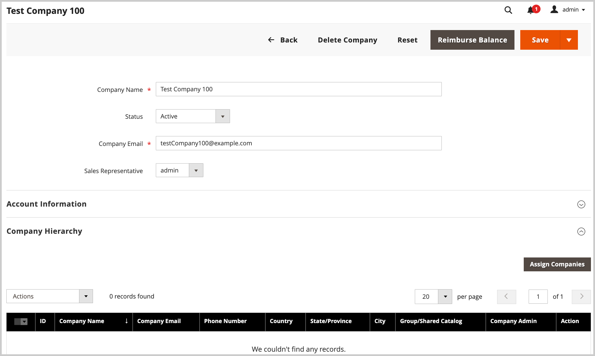

# 公司管理

[!BADGE 1.5.0（测试版）]{type=Informative url="/help/b2b/release-notes.md" tooltip="仅供测试版计划参与者使用"}

公司管理简化了具有复杂组织结构的公司的业务运营。 管理员用户可以通过将公司分配给指定的母公司来构建公司层次结构以镜像B2B组织。 此分配允许父公司管理员查看和管理组织内的公司。

从启动公司管理任务 *[!UICONTROL Companies]* 视图。 从管理员，转到  **[!UICONTROL Customers]** > **[!UICONTROL Companies]**.

{width="700" zoomable="yes"}

在 *[!UICONTROL Companies grid]*， *[!UICONTROL Company Type]* 列指示公司是作为组织的一部分进行管理，还是作为单独的公司管理。

- `Parent` 是具有一个或多个已分配公司的业务组织。 不能将母公司分配为其他公司的子公司。

- `Child` 是已分配给组织的公司。 公司只能分配给一个母公司。

- `Company` 表示单个公司。 单个公司可以通过将其设为母公司或将其分配给现有母公司而成为组织的一部分。

编辑父公司或子公司时，展开 *[!UICONTROL Company Hierarchy]* 查看组织中的所有公司。 A `Current` 标记表示您正在编辑的公司。

{width="700" zoomable="yes"}

## 查看和配置 [!UICONTROL Company Hierarchy]

在最初创建公司时， [!UICONTROL Company Hierarchy] 网格为空。 如果公司是单一公司，则此区域也是空的。

{width="700" zoomable="yes"}

对于母公司，具有适当权限的管理员用户可以完成以下任务：

- 通过创建新父组织或更新现有组织来构建公司层次结构。
- 管理现有组织以添加或删除公司。

有关详细信息，请参阅 [管理公司层次结构](assign-companies.md).
