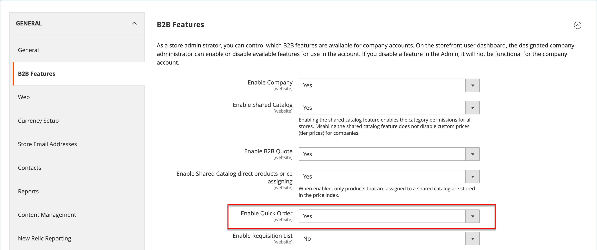

# 快速订单

“_快速订购_”功能可将订购过程减少为知道要订购产品的产品名称或SKU的客户几次点击。 您可以手动输入具有多个SKU的订单，或将其导入“快速订购”表单。 快速订购可供登录到其帐户的客户和来宾使用。 启用后，_快速订购_&#x200B;链接将显示在页面顶部的客户名称旁边。

{width="700" zoomable="yes"}

## 为您的商店启用快速订单

1. 在&#x200B;_管理员_&#x200B;侧边栏上，转到&#x200B;**[!UICONTROL Stores]** > _[!UICONTROL Settings]_>**[!UICONTROL Configuration]**。

1. 在左侧面板的&#x200B;_[!UICONTROL General]_部分中，选择&#x200B;**[!UICONTROL B2B Features]**。

1. 将&#x200B;**[!UICONTROL Enable Quick Order]**&#x200B;设置为`Yes`。

   {width="600" zoomable="yes"}

1. 单击&#x200B;**[!UICONTROL Save Config]**。

1. 出现提示时，单击[缓存管理](../systems/cache-management.md)并刷新任何无效的缓存。

## 快速订购工作流

客户可以使用以下任一方法为快速订单指定产品。

### 方法1：输入单个产品

1. 客户单击&#x200B;**[!UICONTROL Quick Order]**&#x200B;链接。

1. 按SKU或产品名称选择产品：

   要通过SKU **快速下单**，客户将执行以下操作：

   - 进入&#x200B;**[!UICONTROL SKU]**。

   - 单击&#x200B;**[!UICONTROL Add to List]**。

     SKU显示在输入行中，产品详细信息如下。

     {width="600" zoomable="yes"}

   若要按产品名称&#x200B;**快速下单**，客户将执行以下操作：

   - 输入&#x200B;**[!UICONTROL Product Name]**&#x200B;的前几个字符。

     >[!NOTE]
     >
     >请勿使用&#x200B;_Enter_&#x200B;键选择产品名称。

   - 出现可能的匹配项列表时，客户单击要订购的产品。

     {width="700" zoomable="yes"}

1. 进入&#x200B;**[!UICONTROL Qty]**。

1. 使用下一输入行，根据需要重复此过程。

1. 单击&#x200B;**[!UICONTROL Add to Cart]**。

### 方法2：输入多个产品

1. 在&#x200B;**[!UICONTROL Enter Multiple SKUs]**&#x200B;框中，客户执行以下操作之一：

   - 每行输入一个SKU

   - 在同一行中输入所有SKU，用逗号分隔，不带空格。

     {width="600" zoomable="yes"}

1. 要将产品添加到列表，请单击&#x200B;**[!UICONTROL Add to List]**。

1. 输入要为列表中的每个项排序的&#x200B;**[!UICONTROL Qty]**。

   {width="600" zoomable="yes"}

   >[!NOTE]
   >
   >如果产品具有所需的选项，则系统会提示客户选择选项。 他们可以等到到达购物车以添加产品选项。

   {width="600" zoomable="yes"}

### 方法3：上传产品列表

1. 在&#x200B;_[!UICONTROL Add from File]_部分中，单击&#x200B;**[!UICONTROL Download Sample]**以下载订单模板。

   {width="600" zoomable="yes"}

1. 打开下载的文件。

1. 使用模板添加要上传以用于快速订购列表的产品SKU。

1. 完成后，单击&#x200B;**[!UICONTROL Save]**。

   要上载的{width="400" zoomable="yes"}

1. 要上传文件，请单击&#x200B;**[!UICONTROL Choose]**&#x200B;并从其系统中选择文件。

   项目即添加到“快速订购”列表中。

1. 准备就绪后，单击&#x200B;**[!UICONTROL Add to Cart]**。

客户创建快速订单后，可以照常完成结帐。

{width="700" zoomable="yes"}
