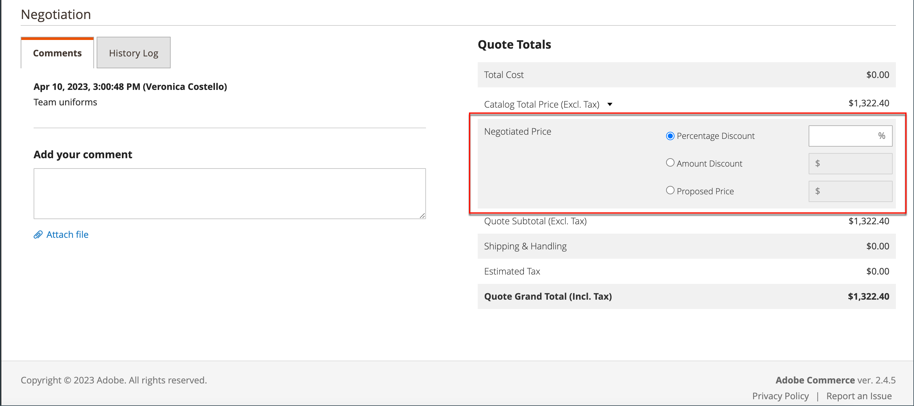
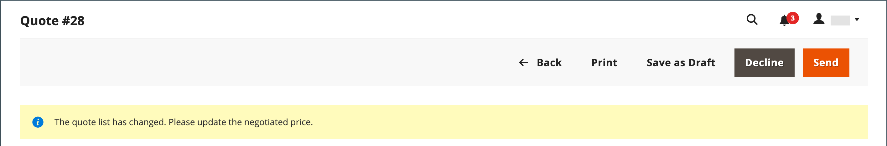

# 协商报价

如果 [B2B报价已启用](configure-quotes.md) 在配置中，价格洽谈可以由授权采购员从公司或销售代表启动。

采购员通过以下方式启动价格洽谈流程 [请求报价](quote-request.md) 从购物车中。 销售代表可以通过以下方式启动洽谈 [为采购员创建拟定报价](sales-rep-initiates-quote.md)，使用初始订单项目和定价更新报价，然后发送给买方。

当价格洽谈开始时，报价将列在 [引号](quotes.md) 网格。 买卖双方之间的所有协商均通过电子邮件进行，并且从报价的详细信息视图中启动和跟踪。

在协商过程中，卖方可以从管理员处执行以下操作：

- 添加或删除产品
- 更改数量
- 将折扣应用到行项目或总价
- 添加或更改配送方式
- 添加评论
- 将更新后的报价发送给采购员，或另存为草稿

采购员使用从店面管理报价议价流程 [[!UICONTROL My Quotes]](account-dashboard-my-quotes.md). 当报价单处于未结复查状态时，其在采购员帐户中的状态将设置为 `Pending`. 即使报价单被拒绝或过期，买方也可以更改并重新提交报价。

## 第1步：查看请求

1. 在管理员侧边栏上，转到 **[!UICONTROL Sales]** > **[!UICONTROL Quotes]**.

   新请求将显示在 _[!UICONTROL Quotes]_网格。

1. 在 _操作_ 列，单击 **[!UICONTROL View]**.

   {width="700" zoomable="yes"}

## 第2步：修改报价

1. 下 _[!UICONTROL Quote & Account Information]_，单击_&#x200B;日历&#x200B;_()图标。

   {width="575" zoomable="yes"}

1. 选择一个 **[!UICONTROL Expiration Date]** 为报价单。

1. 向下滚动到 _[!UICONTROL Quote Totals]_部分并更新&#x200B;**[!UICONTROL Negotiated Price]**根据需要。

   {width="600" zoomable="yes"}

   如果采购员更改了报价中任何项目的数量，则报价顶部将显示一则通知，指明项目列表已更改，并且必须更新协议价格。

   {width="600" zoomable="yes"}

### 向报价中添加新产品

1. 单击 **[!UICONTROL Add Products by SKU]**.

1. 输入 **[!UICONTROL SKU]** 和 **[!UICONTROL Qty]** 将添加。

   {width="600" zoomable="yes"}

### 应用行项目更新

将行项目更改应用于 _[!UICONTROL Items Quoted]_部分（如果需要）。

{width="600" zoomable="yes"}

- 更改 **[!UICONTROL Quantity]** 必须按建议价格购买。

- 选择 **[!UICONTROL Configure]** 并更改产品选项。

  此 [!UICONTROL Configure] 选项仅在可配置产品的行项目中可用

- 在 **[!UICONTROL Action]** 菜单，选择操作以更新项目：
   - **折扣项目** 将折扣应用为百分比、固定金额或首选定价。
（可选）您可以锁定折扣金额以防止进一步折扣。 如果未锁定折扣，则行项目折扣和任何报价级别折扣都将应用于产品价格。
   - **给采购员留言** 向采购员提供有关物料的附加信息
   - **移除** 以从报价中删除项目。

### 应用更改并更新

- 要应用更改，请单击 **[!UICONTROL Add to Quote]**.

- 要更新报价，请单击 **[!UICONTROL Recalculate the Quote]**.

- 要应用更改并将报价更新到共享目录和价格规则，请单击 **[!UICONTROL Update Prices]** 然后单击 **[!UICONTROL Proceed]** 以确认更新。

  {width="600" zoomable="yes"}

### 更新配送信息

1. 如果买方包括 _收货方_ 报价中的地址，请单击 **[!UICONTROL Get shipping methods and rates]**.

1. 从可用选项中选择一种配送方式。

1. 输入 **[!UICONTROL Proposed Shipping Price]**.

   此 _[!UICONTROL Quote Totals]_更新以反映建议的运费。

### 附加支持文档

1. 在 _添加您的评论_ 框中，单击 **[!UICONTROL Attach file]**.

   默认情况下， [附加文件](../configuration-reference/sales/quotes.md) 采用以下任意文件格式时最大可达2 MB：DOC、DOCX、XLS、XLSX、PDF、TXT、JPG或JPEG、PNG。

1. 从目录中选择文件。

## 第3步：更新报价级别信息，并发送回复

1. 在 _[!UICONTROL Negotiation]_部分，位于_[!UICONTROL Comments]_ 选项卡，在 **[!UICONTROL Add your comment]** 部分。

1. 要包含支持文档，请单击 **[!UICONTROL Attach file]** 并从目录中选择文件。

   附件允许的最大文件大小为2 MB。

1. 要将折扣应用到整个报价，请执行以下操作：

   - 下 _[!UICONTROL Quote Totals]_在_[!UICONTROL Negotiated Price]_ 部分，选择以下折扣类型之一：

      - `Percentage Discount`
      - `Amount Discount`
      - `Proposed Price`

   - 以百分比或统一价格输入金额。

     {width="600" zoomable="yes"}

1. 发送或保存报价：

   - 如果报价已准备就绪，可以发回给采购员，请单击 **[!UICONTROL Send]**.

   - 要稍后继续处理报价，请单击 **[!UICONTROL Save as Draft]**.

## 第4步：对报价进行跟进

当您发送报价时，系统会通知买方和管理公司帐户的销售代表。 电子邮件中包含指向买方帐户中报价的链接以及报价的到期日期。 在洽谈过程中，采购员可以执行以下任何操作：

- 接受议定的报价并完成购买。
- 发送带有还价报价的回复并继续协商。
- 结束协商。

要监视其在工作流中的位置，请检查您的电子邮件以及报价在网格中的状态。 您可以根据需要继续协商过程。

## 按钮栏

| 按钮 | 描述 |
|----------------------------|---------------------------------------------------------------------------------------------------------------------------------------------------------------------------------------------------------------------------------------------------------------------------------------------------------------------------------------------------------------|
| [!UICONTROL Back] | 返回到 _[!UICONTROL Quotes]_页面，而不保存更改。 |
| [!UICONTROL Print] | 将报价发送至打印机或将其保存为PDF文件。 |
| [!UICONTROL Create Copy] | [!BADGE 1.5.0 Beta版功能]{type=Informative url="/help/b2b/release-notes.md" tooltip="仅供测试版计划参与者使用"}`(copy)` 附加到原始名称之后。 通过编辑 [!UICONTROL Name] 字段。 将新报价另存为草稿或发送给客户来处理它。 |
| [!UICONTROL Save as Draft] | 保存对报价所做的任何更改，但不要将其发送回买方。 |
| [!UICONTROL Decline] | 拒绝就价格进行谈判的要求，无论是在初步调查中还是在正在进行的谈判中。 当报价被拒绝时，卖方应添加评论来解释这一决定。 当报价被拒绝时，所有议价价格都将重置为原始值。 当卖方等待买方的回复时，此按钮被禁用。 |
| [!UICONTROL Send] | 发送更新后的报价作为对买方查询的回复。 如果卖方正在等待买方的回复，则此按钮被禁用。 |

{style="table-layout:auto"}

## 字段描述

管理员中的报价信息和功能分为以下部分。

### [!UICONTROL Quote & Account Information]

| 字段 | 描述 |
|-------------------------------------------------|------------------------------------------------------------------------------------------------------------------------------------------------------------------------------------------------------------------------------------------------------------------------------------------------------------------------------------------------------------------------------------------------------------------------------------------------------------------------------------------------------------------------------------------------------------------------------------------------------------------------------------------------------------------------------------------------------------------------------------------------------------------------------------------------------------------------------------------------------------------------------------------------------------------------------------------------------------------------------------------------------------------------------------------------------------------------------------------------------------|
| [!UICONTROL Name] | 由分配给报价请求的名称 [购买者](account-company-roles-permissions.md). |
| [!UICONTROL Status] | 指示报价的当前状态。 报价单的状态只能通过买方或卖方一方采取行动来更改。 另请参阅 [状态设置](quotes.md) 来自管理员和 [买方帐户](account-dashboard-my-quotes.md). |
| [!UICONTROL Created] | 买方首次提交报价申请的日期和时间。 |
| [!UICONTROL Created By] | 提交报价请求的公司买方的名字和姓氏。 |
| [!UICONTROL Expiration Date] | 指示当前报价有效的最后一天。 在配置中，默认到期日设置为采购员提交报价请求后的30天。   卖方可以通过输入不同的日期(YYYY MM DD )或从日历中选择日期来覆盖默认的到期日期。 如果将字段留空，报价将永不过期。   对于未结报价，卖方将收到 [电子邮件通知](../systems/email-templates.md) 报价单预定过期前48小时。 买家将在到期日前24小时收到通知。   报价的状态将更改为 _已过期_ 而买方则不能对报价单进行进一步的更改。 报价中的建议价格恢复为目录中的原始值。   如果在报价设置为过期时开放供卖方复查的报价，则根据配置中设置的范围重置到期日期。   “到期日期”是 _报价和帐户_ 可在审阅过程中编辑的部分。 |
| [!UICONTROL Company] | 的法定名称 [公司](account-companies.md) 买家所代表的。 |
| [!UICONTROL Company Admin Email] | 的电子邮件地址 [公司管理员](account-company-admin.md). |
| [!UICONTROL Sales Rep] | 此 [销售代表](account-company-manage.md) 为卖方工作，并且是分配给公司帐户的主要联系人。 |
| [!UICONTROL Shared Catalog (or Customer Group)] | 此 [共享目录](catalog-shared.md) 或 [客户组](account-company-customer-group.md) 公司分派到的用户。 报价可能包括共享目录中分配给公司的自定义价格。 |

{style="table-layout:auto"}

### [!UICONTROL Add to Quote by SKU]

| 字段 | 描述 |
|---------------------------|-----------------------------------------------------------|
| [!UICONTROL Enter SKU] | 要添加到报价中的产品的SKU。 |
| [!UICONTROL Qty] | 要添加到报价中的此SKU的项目数。 |
| [!UICONTROL Add to Quote] | 将指定产品的数量添加到报价中。 |

{style="table-layout:auto"}

### [!UICONTROL Items Quoted]

| 字段 | 描述 |
|-----------------------------------------|---------------------------------------------------------------------------------------------------------------------------------------------------------------------------------------------------------------------------|
| [!UICONTROL Name & SKU] | 链接的产品名称和库存单位(SKU)。 |
| [!UICONTROL Stock] | 此SKU下当前可供销售的产品数。 |
| [!UICONTROL Cost] | 卖方为购买产品而支付的金额。 |
| [!UICONTROL Catalog Price] | 买方目录中的产品价格，基于分配给买方公司的客户组或共享目录。 |
| [!UICONTROL Cart Price] | 购物车中项目的原始价格，减去从购物车应用的任何折扣。 如果有适用于买方客户组的折扣或购物车规则，则购物车价格可能与目录价格不同。 |
| [!UICONTROL Discount] | 应用于物料的行物料折扣。 该值可以是百分比、固定金额或建议价格。 |
| [!UICONTROL Qty] | 此SKU中作为报价基础的单位数。 只能输入大于零的正数。 如果要将数量更改为零，请从报价中删除行项目。 |
| [!UICONTROL Subtotal] | 建议价格乘以订购的物料数量。 |
| [!UICONTROL Estimated Tax] | 根据配置，为此行项目估计的税额。 根据计税设置，预计税额可以基于以下任何值：单价/行合计/合计 |
| [!UICONTROL Subtotal (Incl./Excl. Tax)] | 根据配置，此列可以显示含或不含估计税的小计。 |
| [!UICONTROL Action] | 可应用于行项目的操作的选择菜单：<ul><li>**[!UICONTROL Discount item]**</li><li>**[!UICONTROL Leave a note to Buyer]**</li><li>**[!UICONTROL Remove an item from the quote]**</li></ul>. |
| [!UICONTROL Configure] | 允许您更改可配置产品的产品选项。 |
| [!UICONTROL Update Prices] | 使用共享目录和价格规则的最新更改更新报价。 |
| [!UICONTROL Recalculate Quote] | 重新计算所有报价价格、购物车价格规则和税费，以反映报价的更改。 |

{style="table-layout:auto"}

### [!UICONTROL Shipping Information]

| 字段 | 描述 |
|--------------------------------------|------------------------------------------------------------------------------------------------------------------------------------------------------------------------------|
| [!UICONTROL Shipping Address] | 显示采购员帐户中指定的发运地址。 如果买方在提交请求之前未指定地址，则发运地址为空。 |
| [!UICONTROL Shipping Method & Price] | 如果采购员包括 _收货方_ 报价中的地址。 |

{style="table-layout:auto"}

### [!UICONTROL Negotiation]

| 字段 | 描述 |
|--------------------------|----------------------------------------------------------------------------------------------------------------------------------------------------------------------------------------------------------------------------------------------------------------------------------------------------------------------------------------------------------------------------------------------------------------------------------------------------------------------------------------------------------------------------------------------------------------------------------------------------------------------------------------------------------|
| [!UICONTROL Comments] | “洽谈”部分的“备注”标签用于向采购员输入有关报价的消息。  **[!UICONTROL Add your comment]**— 在洽谈过程中使用备注与采购员沟通。 使用备注解释报价中提供的任何折扣，或报价请求被拒绝的原因。 **[!UICONTROL Attach file]**  — 支持的最大文件大小和文件类型 [附加文件](configure-quotes.md) 由配置决定。 默认情况下，附加文件最大为2 MB，并且可以是以下任意文件类型：DOC、DOCX、XLS、XLSX、PDF、TXT、JPG或JPEG、PNG。 |
| [!UICONTROL History Log] | 此标签页显示报价的完整历史记录，其中包括日期、报价状态和备注。 |

{style="table-layout:auto"}

### [!UICONTROL Quote Totals]

| 字段 | 描述 |
|-----------------------------------------------------|-----------------------------------------------------------------------------------------------------------------------------------------------------------------------------------------------------------------------------------------------------------------------------------------------------------------------------------------------------------------------------------------------------------------------------------------------------------------------------------------------------------------------------------------------------------------------------------------------------------------------------------------------------------------------|
| [!UICONTROL Total Cost] | 向卖方提供的报价中所包含项目的总成本。 |
| [!UICONTROL Catalog Total Price  (Incl./Excl. Tax)] | 报价单中的项目总价（不含税），根据作为报价单依据的共享目录或主目录中的价格确定。 展开部分以显示计算中使用的值，具体取决于 [显示小计](../configuration-reference/sales/tax.md) 在配置中设置。 选项：  **[!UICONTROL Subtotal (Excl. Tax)]**— 目录总价（不含估计税）。 **[!UICONTROL Subtotal (Incl. Tax)]**  — 目录总价（不含估计税）。  **[!UICONTROL Estimated Tax]**— 估计要应用于目录总价的税额。 |
| 议定价格 | 提供给买方的折扣可基于以下任一项：  **[!UICONTROL Percentage Discount]**— 以百分比表示的折扣。 **[!UICONTROL Amount Discount]**  — 固定金额形式的折扣。  **[!UICONTROL Proposed Price]**— 卖方提出的价格。
如果报价中的所有项目都有锁定的项目折扣，则 [!UICONTROL Negotiated Price] 部分已禁用，因为无法应用其他折扣。

如果产品具有未锁定的行项目折扣，则行项目折扣和报价级别折扣都将应用于产品价格。
 |
| [!UICONTROL Quote Subtotal (Incl./Excl. Tax)] | 报价单中每个行项目的建议总价（含税或不含税），取决于 [计税](../configuration-reference/sales/tax.md) 配置中的设置。 |
| [!UICONTROL Shipping & Handling] | 卖方在报价单的Shipping Information部分的Proposed Shipping Price字段中输入的金额。 如果该字段为空，则金额基于所选的配送方式。 |
| [!UICONTROL Estimated Tax] | 在配置中指定的预计到期的税额 [显示设置](../configuration-reference/sales/tax.md). |
| [!UICONTROL Quote Grand Total (Incl. Tax)] | 报价底部的最终合计，包括议定价格、预计税额、建议的装运和处理。 |

{style="table-layout:auto"}
