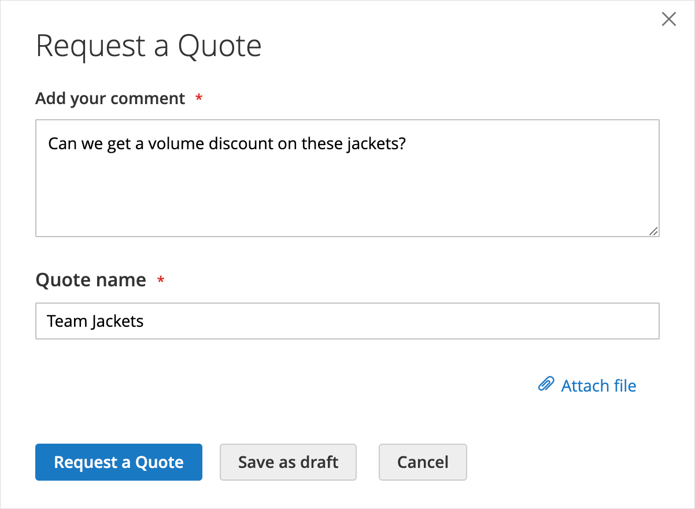

# 询价

如果在[Sales功能配置](configure-quotes.md)中启用了报价，则公司的授权购买者可以通过从购物车中请求报价来启动价格洽谈流程。 如果买方未准备好提交报价以进行洽谈，则可以将它另存为草稿。

>[!NOTE]
>
>询价不能包含折扣码或礼品卡。

## 客户报价请求体验

1. 客户以具有[权限](account-company-roles-permissions.md)的购买者身份登录其用户帐户，以请求报价。

1. 将要包含在报价中的产品添加到购物车。

   >[!TIP]
   > 
   >客户可以使用[快速订购](quick-order.md)更快速地向购物车添加产品SKU列表。

1. 选择&#x200B;**[!UICONTROL Request a Quote]**。

   {width="700" zoomable="yes"}

1. 在&#x200B;**[!UICONTROL Add your comment]**&#x200B;框中，客户输入简短的注释以描述请求。

1. 输入&#x200B;**[!UICONTROL Quote Name]**。

   {width="400" zoomable="yes"}

1. 如果需要，将支持文档或图像附加到引号中：

   - 选择&#x200B;**[!UICONTROL Attach file]**。
   - 从系统选择文件。

   默认情况下，[附加文件](configure-quotes.md)最大为2 MB，采用以下任何文件格式：DOC、DOCX、XLS、XLSX、PDF、TXT、JPG或JPEG、PNG。

1. 创建并处理报价：

   - 通过选择&#x200B;**[!UICONTROL Request a Quote]**&#x200B;将报价发送给销售方。
   - [!BADGE 1.5.0-beta功能]{type=Informative url="/help/b2b/release-notes.md" tooltip="仅适用于Beta计划参与者"}**[!UICONTROL Save as Draft]**。

     如果买方将报价另存为草稿，则报价在[!UICONTROL My Quotes]中处于`Draft`状态。 在买方发送草稿报价以供复查之前，卖方看不到草稿报价。
