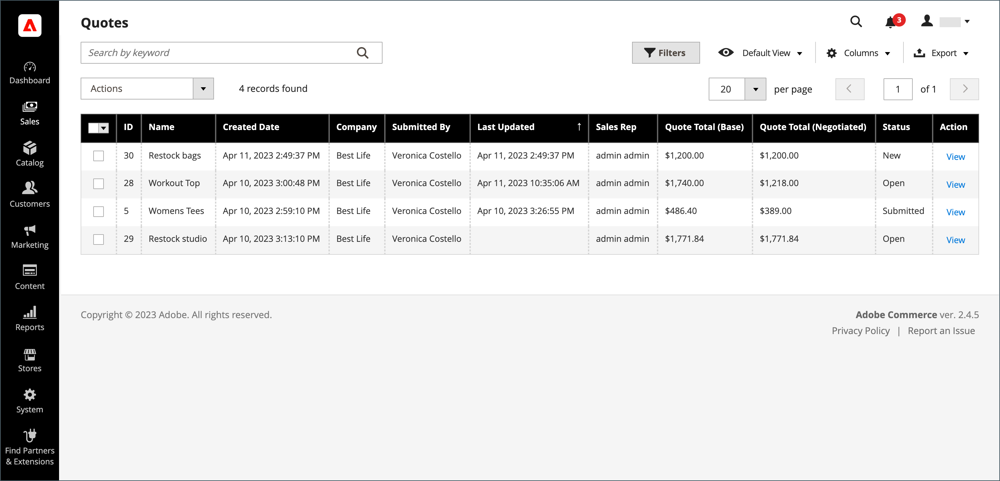
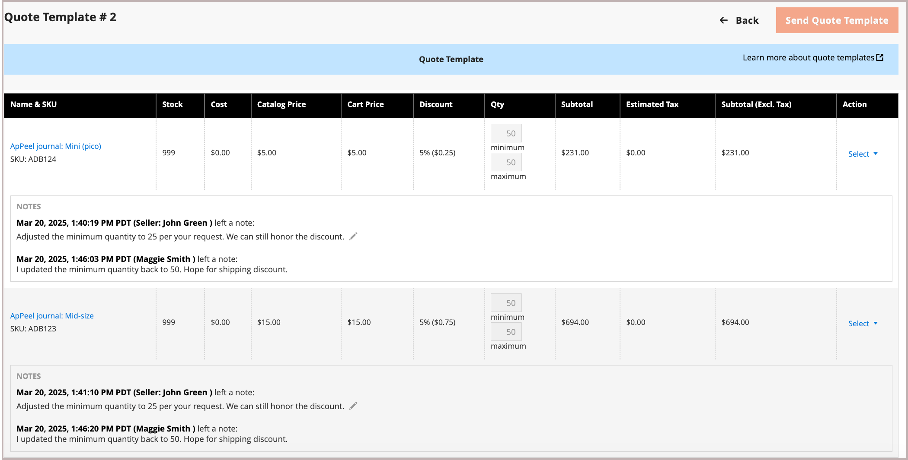

# 可转让报价

买方和卖方使用报价单来管理订单添加项目、更新数量、请求和应用折扣等的洽谈流程，直到他们达成一致为止。 报价洽谈流程可以由授权的公司采购员启动，也可以由公司销售代表启动。

报价可以由授权的公司买方或销售代表起始。 创建报价之后，当买方或卖方提交报价以供复查时，洽谈流程将开始。 此 _引号_ 此网格列出了所收到的每个报价，并维护了买卖双方之间的通信历史。 使用标准 [工作区控件](../getting-started/admin-workspace.md) 要筛选列表，请更改列布局、保存视图和导出数据。

- 在店面，购买者提交报价为 [请求协商](quote-price-negotiation.md) 购物车的价格。 在创建报价请求时，买方可以将报价另存为草稿，或直接将其提交给卖方。

- 在管理员中，销售代表可以代表公司买方创建报价。 在创建报价单时，卖方可以将报价单保存为草稿，或直接将其提交给买方以启动洽谈流程。

在洽谈过程中，报价只能由负责审查和建议进一步洽谈条款的人员更新。

## 先决条件

可转让引号仅在Adobe Commerce具有以下配置设置时才可用：

- [已安装B2B for Adobe Commerce扩展](install.md)
- [配置的B2B功能](enable-basic-features.md)
   - 启用公司帐户
   - 启用B2B报价

## 报价工作流

报价可由买方或卖方发起。

**步骤1：创建报价**

- **买方请求报价**  — 买方 [请求报价](quote-request.md) 从购物车中。 该请求将显示在 _我的报价_ ，然后向分配给公司帐户的销售代表发送电子邮件通知。 在Admin中，请求显示在 _引号_ 网格，状态为 `New`. 在卖方打开报价之前，买方可以修改报价请求。

  {width="700" zoomable="yes"}

- **销售代表**  — 销售代表可以 [创建报价](sales-rep-initiates-quote.md) 管理员代表特定公司买方提供。 销售代表必须更新报价单以将产品和其他信息（如折扣和备注）添加到采购员。 销售代表可以将报价另存为 `draft` 或发送给买方以开始洽谈。 在草稿状态下，报价仅对卖方可见。 发送报价后，状态为 `Submitted`. 在买方将其发回之前，卖方不能对其进行修改。

  {width="700" zoomable="yes"}

**步骤2：报价审核和洽谈**

**卖方查看请求并发送回应**  — 在Admin中，卖方查看报价请求。 报价的状态将更改为 `Pending`，则购买者无法进行任何更改。 此 [卖方回复](quote-price-negotiation.md) 通过为报价中的产品提供折扣定价，输入备注，然后将报价发回给购买者。 通过电子邮件通知买方和销售代表，卖方已作出回应。

**买方查看来自卖方的报价并发送回应**  — 采购员单击电子邮件通知中的链接以打开报价，或从以下位置打开报价 _我的报价_ 帐户仪表板页面。 采购员可以在行项目或报价级别向卖方留下附注，并删除项目。

买方和卖方可以继续协商过程，直到达成协议或卖方拒绝报价。 如果采购员更改报价 — 添加或删除产品或更改产品数量 — 则必须将报价返回给卖方进行复查。

**步骤4：买方接受报价**  — 买方接受提议的价格并继续结帐。 无法将附加折扣添加到协商的报价中。

## 商店报价的B2B角色资源

报价的配置选项可通过以下方式控制 [角色资源](../systems/permissions-user-roles.md#role-resources). 必须为分配给商店管理员的管理员用户角色设置这些角色资源。

要授予对Admin中报价功能的访问权限，请转到 **[!UICONTROL System]** > _[!UICONTROL Permissions]_>**[!UICONTROL User Roles]**，选择角色，然后导航到 [!UICONTROL Sales] > [!UICONTROL Operations] > [!UICONTROL Quotes] 在_&#x200B;角色资源&#x200B;_树。

## 应用操作

在“管理员”中，B2B管理员和销售人员可以使用 [!UICONTROL Actions] 菜单。

{width="700" zoomable="yes"}

1. 在 _管理员_ 侧栏，转到 **[!UICONTROL Sales]** > **[!UICONTROL Quotes]**.

1. 在网格的第一列中，选中要应用操作的每个记录的复选框。

1. 在 **[!UICONTROL Actions]** 选择要应用的操作。

### 查看报价

1. 在 **[!UICONTROL Actions]** 列中，单击 **[!UICONTROL View]**.

1. 要响应客户请求，请按照说明并开始 [议价](quote-price-negotiation.md) 进程。

### 查看报价活动

从查看洽谈时间线、通信和其他报价活动 [!UICONTROL Comments] 和 [!UICONTROL History Log] — 信息包括状态更改、对客户和发货信息的更新、商品和价格更新以及其他重要信息。

1. 打开报价。

1. 通过滚动至，查看报价议价备注和历史记录 **[!UICONTROL Negotiation]**，并选择 **[!UICONTROL Comments]** 和 **[!UICONTROL History Log]**.

   {width="400"}

1. 还会在行项目层跟踪历史记录。

   {width="400"}

### 拒绝询价

仅报价请求具有 `Open` 可以拒绝状态。

1. 选择要拒绝的每个打开报价请求。

1. 设置 _[!UICONTROL Actions]_控制对象 `Declined`.

1. 出现提示时，输入拒绝报价的原因，然后单击 **[!UICONTROL Confirm]**.

   {width="400"}

## 列描述

| 列 | 描述 |
|---------------------------------------|------------------------------------------------------------------------------------------------------------------------------------------------------------------------------------------------------------------------------------------------------------------------------------------------------------------------------------------------------------------------------------------------------------------------------------------------------------------------------------------------------------------------------------------------------------------------------------------------------------------------------------------------------------------------------------------------------------------------------------------------------------------------------------------------------------------------------------------------------------------------------------------------------------------------------------------------------------------------------------------------------------------------------------------------------------------------------------------------------------------------------------------------------------------------------------------------------------------------------------------------------------------------------------------------------------------------------------------------------------------------------------------------------------------------------------------------------------------------------------------------------------------------------------------------------------------------------------------------------------------------------------------------------------------------------------------------------------------------------------|
| [!UICONTROL Select] | 要选择要执行的操作的引号，请选中该复选框或使用列标题中的选择控件。 选项：全选/取消全选 |
| [!UICONTROL ID] | 在从买方购物车提交报价请求时分配的唯一数字标识符。 查看报价详细信息时，ID将显示在页面顶部，而不是报价名称。 |
| [!UICONTROL Name] | 买方分配给报价请求的名称。 |
| [!UICONTROL Created Date] | 买方首次提交报价申请的日期和时间。 |
| [!UICONTROL Company] | 买方提交报价请求的公司的名称。 |
| [!UICONTROL Submitted By] | 提交报价请求的公司买方的名字和姓氏。 |
| [!UICONTROL Last Updated] | 买方和卖方之间关于报价的上次通信的日期和时间。 |
| [!UICONTROL Sales Rep] | 管理买方帐户的销售代表的名字和姓氏。 |
| [!UICONTROL Quote Total (Base)] | 要基于原始报价购买的产品总价。 总金额以网站的基本货币和店面的货币显示。 |
| [!UICONTROL Quote Total (Negotiated)] | 根据议定报价购买的产品总价。 此合计由系统自动计算，包括销售方应用的任何行项目或报价级别折扣。 总金额以网站的基本货币和店面的货币显示。 |
| [!UICONTROL Status] | 表示报价请求的当前状态。 报价单的状态只能通过买方或卖方一方采取行动来更改。 另请参阅 [买方帐户](account-dashboard-my-quotes.md).<ul><li>**[!UICONTROL New]**  — 买方提交了询价，但卖方未查看询价。 买方可以更新该请求，直到卖方打开该请求为止。</li><li>**[!UICONTROL Draft]**  — 卖方为买方创建草稿报价。 在卖方添加优惠详细信息（项目、数量、折扣等）并将报价提交给买方之前，买方看不到报价。</li> <li>**[!UICONTROL Open]**  — 卖方开启了请求，正在审查请求并准备答复。 </li><li>**[!UICONTROL Submitted]**  — 卖方向买方发送了答复。 在洽谈过程中无法编辑报价记录。</li><li>**[!UICONTROL Client Reviewed]**  — 买方查看了卖方的答复，正在准备答复。</li><li>**[!UICONTROL Updated]**  — 买方提交了一份答复，但卖方并未查看该答复。</li><li>**[!UICONTROL Ordered]**  — 买方根据议定报价提交了订单。</li><li>**[!UICONTROL Closed]**  — 采购员已取消报价请求。</li><li>**[!UICONTROL Declined]**  — 卖方拒绝了询价的请求。 所有自定义定价都将从报价中删除，并且记录将被锁定，无法进一步编辑。</li><li>**[!UICONTROL Expired]**  — 买方在指定的期限内未对卖方的答复作出答复，报价不再有效。</li></ul> |
| [!UICONTROL Actions] | **[!UICONTROL View]**  — 打开报价请求，并保留买卖双方之间的洽谈记录。 |

{style="table-layout:auto"}

## 按钮栏

| 按钮 | 描述 |
|----------------------------|----------------------------------------------------------------------------------------------------------------------------------------------------------------------------------------------------------------------------------------------------------------------------------------------------------------------------------------------------------------------------------------------------|
| [!UICONTROL Send] | 发送更新后的报价作为对买方查询的回复。 如果卖方正在等待买方的回复，则此按钮被禁用。 |
| [!UICONTROL Back] | 返回到 _引号_ 页面，而不保存更改。 |
| [!UICONTROL Create Copy] | [!BADGE 1.5.0 Beta版功能]{type=Informative url="/help/b2b/release-notes.md" tooltip="仅供测试版计划参与者使用"}`<original quote name> (copy)`. 通过编辑中的值来更改名称 [!UICONTROL Name] 字段并将报价另存为草稿。 |
| [!UICONTROL Print] | 将报价发送至打印机或将其保存为PDF文件。 |
| [!UICONTROL Create a copy] | 创建报价的副本，名为 `<original quote name> (copy)` 并打开它。 根据需要重命名并更新新报价，然后将其另存为草稿或发送给买方。 |
| [!UICONTROL Save as Draft] | 保存对报价所做的任何更改，但不将其发送回购买者。 |
| [!UICONTROL Decline] | 拒绝就价格进行谈判的要求，无论是在初步调查中还是在正在进行的谈判中。 当报价被拒绝时，卖方应添加评论来解释这一决定。 当报价被拒绝时，所有议价价格都将重置为原始值。 当卖方等待买方的回复时，此按钮被禁用。 |

{style="table-layout:auto"}

## 示例引用

下图显示了Admin中报价详细信息视图的示例，其中配置了一些设置。

{width="700" zoomable="yes"}

>[!NOTE]
>
>[!BADGE 1.5.0 Beta版功能]{type=Informative url="/help/b2b/release-notes.md" tooltip="仅供测试版计划参与者使用"}
