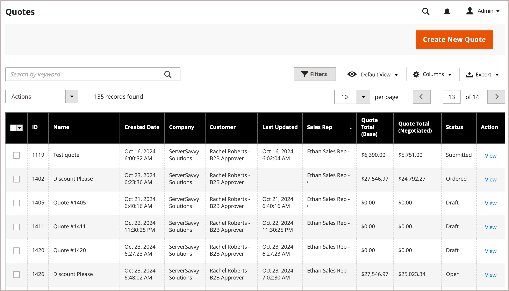

# 可转让报价

买方和卖方使用报价单来管理订单添加项目、更新数量、请求和应用折扣等的洽谈流程，直到他们达成一致为止。 报价洽谈流程可以由授权的公司采购员启动，也可以由公司销售代表启动。

在Admin{width="700" zoomable="yes"}中引用列表视图

创建报价之后，当买方或卖方提交报价以供复查时，洽谈流程将开始。 _报价_&#x200B;网格列出了收到的每个报价，并维护了买方与卖方之间的通信历史记录。 使用标准[工作区控件](../getting-started/admin-workspace.md)筛选列表、更改列布局、保存视图和导出数据。

- 在店面，购买者提交报价作为[请求，以洽谈](quote-price-negotiation.md)购物车中的价格。 在创建报价请求时，买方可以将报价另存为草稿，或直接将其提交给卖方。

- 在管理员中，销售代表可以代表公司买方创建报价。 在创建报价单时，卖方可以将报价单保存为草稿，或直接将其提交给买方以启动洽谈流程。

在洽谈过程中，报价只能由负责审查和建议进一步洽谈条款的人员更新。

## 先决条件

可转让引号仅在Adobe Commerce具有以下配置设置时才可用：

- [已安装Adobe Commerce B2B扩展](install.md)
- [配置的B2B功能](enable-basic-features.md)
   - 启用公司帐户
   - 启用B2B报价

## 报价工作流

报价可由买方或卖方发起。

此图表显示启动报价时各个步骤中买方和卖方（管理员）的报价状态。

{width="700" zoomable="yes"}

**步骤1：报价单创建（新）**

- **买方请求报价** — 买方[从购物车中请求报价](quote-request.md)。 该请求显示在买方帐户仪表板的&#x200B;_我的报价_&#x200B;列表中，并会向分配给公司帐户的销售代表发送电子邮件通知。 在Admin中，请求显示在&#x200B;_引号_&#x200B;网格中，状态为`New`。 在卖方打开报价之前，买方可以修改报价请求。

  {width="700" zoomable="yes"}

- **销售代表** — 销售代表可以代表特定公司购买者从管理员[创建报价](sales-rep-initiates-quote.md)。 销售代表必须更新报价单以将产品和其他信息（如折扣和备注）添加到采购员。 销售代表可以将报价另存为`draft`或发送给采购员以开始洽谈。 在草稿状态下，报价仅对卖方可见。 发送报价后，状态为`Submitted`。 在买方将其发回之前，卖方不能对其进行修改。

  {width="700" zoomable="yes"}

**步骤2：报价审核和协商（审核）**

复查或洽谈报价可能包括更改数量、删除项目、添加行项目备注、应用行项目或报价折扣（卖方）以及添加发运地址（买方）。

- **卖方查看请求并发送回复** — 在管理员中，卖方查看报价请求。 在店面，报价的状态更改为`Pending`，买方无法进行任何更改。 [卖方通过提供价格折扣并根据需要调整数量和项目来回复](quote-price-negotiation.md)，输入注释并将报价返回给买方。 通过电子邮件通知买方和销售代表，卖方已作出回应。

- **买方查看卖方的报价并发送回应** — 买方单击电子邮件通知中的链接打开报价，或从帐户仪表板的&#x200B;_我的报价_&#x200B;页打开报价。 采购员可以在行项目或报价层向卖方留下附注、更改数量以及移除项目。

买方和卖方可以继续协商过程，直到达成协议或卖方拒绝报价。 如果采购员更改报价 — 添加或删除产品或更改产品数量 — 则必须将报价返回给卖方进行复查。

- **买方添加送货地址** — 买方可以向报价添加送货地址。 在买方添加地址之后，卖方可以提供运输和交货选项。 显示的配送方式取决于Storefront配置。

如果买方添加了一个发运地址，则必须复查洽谈协议，并且卖方可以继续洽谈过程，直到达成协议或卖方拒绝报价。

**步骤3：购买者接受报价（结帐）**

买方接受建议价格并继续结账。 无法将附加折扣添加到协商的报价中。

结帐时锁定送货选项。

## 报价状态

报价状态提供有关报价工作流中报价的当前状态的信息。 只有当买方或卖方对报价采取行动时，报价的状态才会改变。 例如，如果采购员在有效报价单上选择[!UICONTROL Proceed to Checkout]，则状态将更改为订单。

- *[!UICONTROL New]** — 买方提交了询价，但卖方未查看该询价。 买方可以更新该请求，直到卖方打开该请求为止。

- **[!UICONTROL Draft]** — 卖方为买方创建草稿报价。 在卖方添加优惠详细信息（项目、数量、折扣等）并将报价提交给买方之前，买方看不到报价。

- **[!UICONTROL Open]** — 卖方已打开请求，正在审查请求并准备回应

- **[!UICONTROL Submitted]** — 卖方向买方发送了回复。 在洽谈过程中无法编辑报价记录。

- **[!UICONTROL Client Reviewed]** — 买方查看了卖方的回复，正在准备回复。

- **[!UICONTROL Updated]** — 买方提交了回复，但卖方未查看回复。

- **[!UICONTROL Ordered]** — 买方基于协商报价提交了订单。

- **[!UICONTROL Closed]** — 买方取消了报价请求。

- **[!UICONTROL Declined]** — 卖方拒绝了询价。 所有自定义定价都将从报价中删除，并且记录将被锁定，无法进一步编辑。

- **[!UICONTROL Expired]** — 买方在指定的时间段内未回复卖方的回复，报价不再有效。

## 商店报价的B2B角色资源

使用[角色资源](../systems/permissions-user-roles.md#role-resources)控制报价的配置选项。 必须为分配给商店管理员的管理员用户角色设置这些角色资源。

要授予对管理员中报价函数的访问权限，请转到&#x200B;**[!UICONTROL System]** > _[!UICONTROL Permissions]_>**[!UICONTROL User Roles]**，选择角色，然后导航到_&#x200B;角色资源&#x200B;_树中的[!UICONTROL Sales] > [!UICONTROL Operations] > [!UICONTROL Quotes]。

{width="700" zoomable="yes"}

## 应用操作

在“管理员”中，B2B管理员和销售人员可以使用[!UICONTROL Actions]菜单管理报价网格中的报价。

{width="700" zoomable="yes"}

1. 在&#x200B;_管理员_&#x200B;侧边栏上，转到&#x200B;**[!UICONTROL Sales]** > **[!UICONTROL Quotes]**。

1. 在网格的第一列中，选中要应用操作的每个记录的复选框。

1. 在&#x200B;**[!UICONTROL Actions]**&#x200B;中，选择要应用的操作。

### 查看报价

1. 在记录的&#x200B;**[!UICONTROL Actions]**&#x200B;列中，单击&#x200B;**[!UICONTROL View]**。

1. 要响应客户请求，请按照说明开始[价格洽谈](quote-price-negotiation.md)流程。

### 查看报价活动

从[!UICONTROL Comments]和[!UICONTROL History Log]中查看洽谈时间线、通信和其他报价活动 — 信息包括状态更改、客户和发运信息的更新、物料和价格更新以及其他重要信息。

1. 打开报价。

1. 通过滚动到&#x200B;**[!UICONTROL Negotiation]**&#x200B;并选择&#x200B;**[!UICONTROL Comments]**&#x200B;和&#x200B;**[!UICONTROL History Log]**&#x200B;来查看报价议价备注和历史记录。

   {width="400"}

1. 还会在行项目层跟踪历史记录。

   {width="400"}

### 拒绝询价

只能拒绝具有`Open`状态的报价请求。

1. 选择要拒绝的每个打开报价请求。

1. 将&#x200B;_[!UICONTROL Actions]_&#x200B;控件设置为`Declined`。

1. 出现提示时，输入报价被拒绝的原因，然后单击&#x200B;**[!UICONTROL Confirm]**。

   {width="400"}
