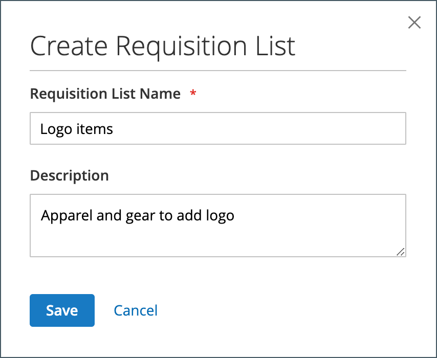
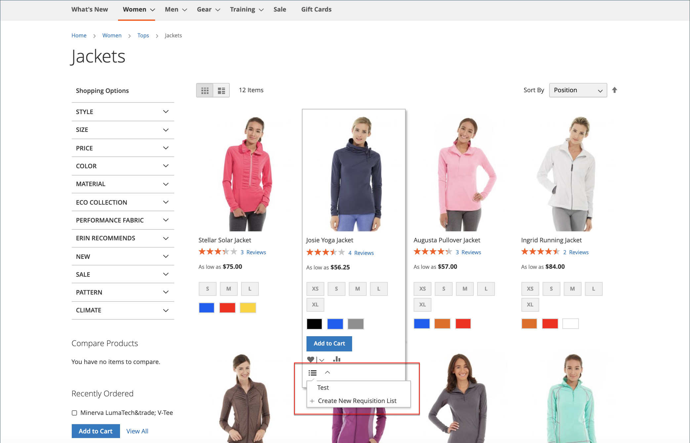

# 申请列表

在购买经常订购的产品时，使用申购单列表可节省时间，因为产品会直接从列表中添加到购物车中。 客户可以维护多个列表，这些列表侧重于来自不同供应商、购买者、团队、营销策划或其他任何可简化其工作流程的产品。 它同时适用于已登录的用户和来宾。

>[!NOTE]
>
>要为您的商店启用申请列表，请参阅 [启用B2B功能](enable-basic-features.md). 它可以允许为每个客户帐户维护多达999个申请列表，具体取决于 [配置](configure-requisition-lists.md).

申请列表功能与愿望列表功能类似，但存在以下差异：

- 将物料发送到购物车后未清除申请列表。 它可多次使用。
- 申请列表的用户界面使用精简视图显示许多物料。

{width="600" zoomable="yes"}

## 从帐户仪表板创建申请列表

与公司帐户关联的已登录客户可以从其帐户信息板创建申请列表。

1. 在他们账户的侧边栏中，选择 **[!UICONTROL My Requisition Lists]**.

1. 在 _[!UICONTROL Requisition Lists]_页面，点击量&#x200B;**[!UICONTROL Create New Requisition List]**.

1. 进入 **[!UICONTROL Requisition List Name]** 和 **[!UICONTROL Description]**.

   {width="300"}

1. 完成后，单击 **[!UICONTROL Save]**.

## 从产品页创建申请列表

与公司帐户关联的登录客户可以从产品页面创建申请列表。 此方法提供了创建列表和添加产品的简单快捷方式。

1. 在产品详细信息页面中，客户单击 **[!UICONTROL Add to Requisition List]**.

1. 点击次数 **[!UICONTROL Create New Requisition List]**.

1. 进入 **[!UICONTROL Requisition List Name]** 和 **[!UICONTROL Description]**.

1. 完成后，单击 **[!UICONTROL Save]**.

## 将产品添加到申请列表

客户可以从以下位置将产品添加到申请列表：

- 产品页面
- 目录页面
- 购物车
- 现有订单

### 从产品详细信息页面

1. 从店面，客户转到要添加到申请列表中的产品的详细信息页面。

1. 点击次数 **[!UICONTROL Add to Requisition List]** 并执行以下操作之一：

   - 选择现有申请列表。
   - 创建申请列表。

   {width="700" zoomable="yes"}

### 从目录页面

1. 从店面，客户进入包含要添加到申购清单中的产品的目录页面。

1. 将鼠标悬停在产品上。

1. 点击次数 **[!UICONTROL Add to Requisition List]** 并执行以下操作之一：

   - 选择现有申请列表。
   - 创建申请列表。

   {width="700" zoomable="yes"}

### 从现有订单

1. 在其帐户仪表板的侧边栏中，客户选择 **[!UICONTROL My Orders]**.

1. 在订单顶部，单击 **[!UICONTROL Add to Requisition List]** 并执行以下操作之一：

   - 选择现有申请列表。
   - 创建申请列表。

   {width="700" zoomable="yes"}

### 从购物车

1. 在项目下，客户单击 **[!UICONTROL Add to Requisition List]** 并执行以下操作之一：

   - 选择现有申请列表。
   - 创建申请列表。

   {width="700" zoomable="yes"}

## 查看已更新的申请列表

客户登录其帐户后，可以使用以下任一方法查看其任何申请列表。

{width="700" zoomable="yes"}

### 从帐户信息板

1. 在其帐户仪表板的侧边栏中，选择 **[!UICONTROL My Requisition Lists]**.

1. 在申请列表列表中，单击 **[!UICONTROL View]** 在 _操作_ 列。

### 从任何店面页面

1. 在页面顶部的快速链接栏中，单击其用户名。

1. 在菜单上，选择 **[!UICONTROL My Requisition Lists]**.
