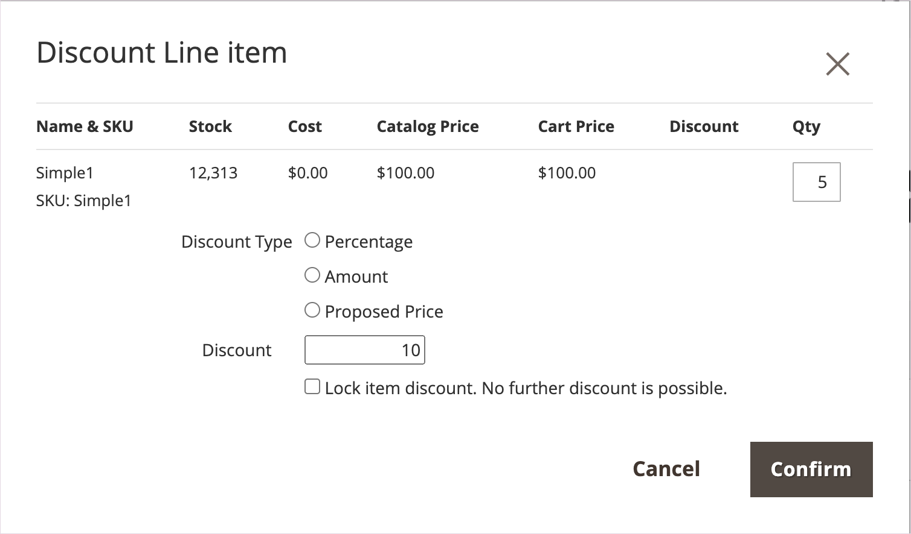
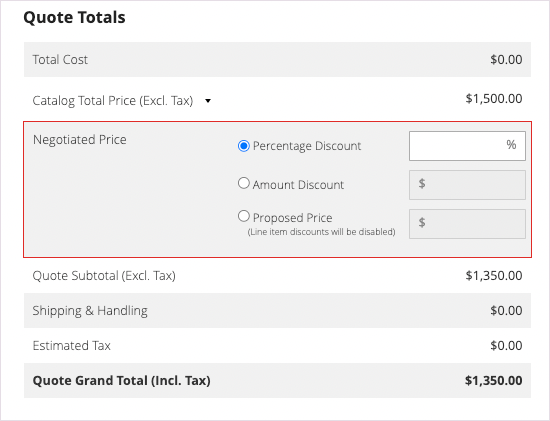
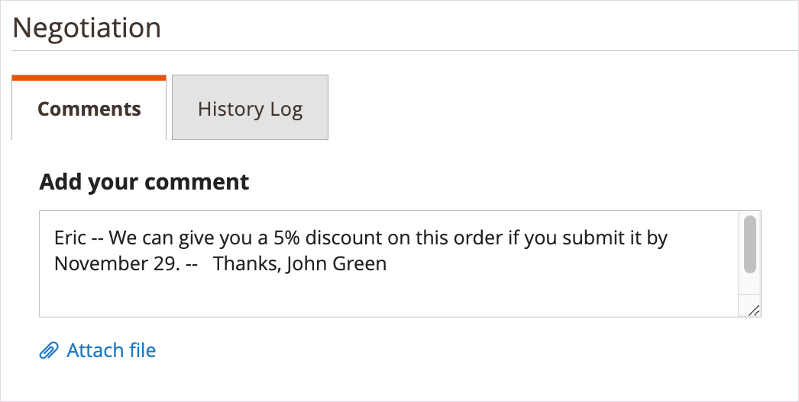
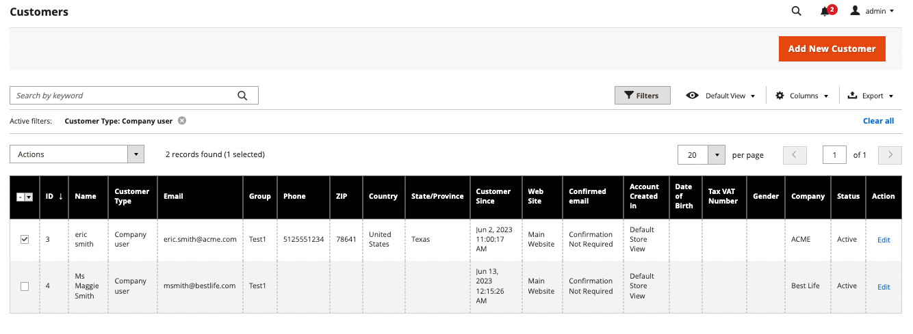
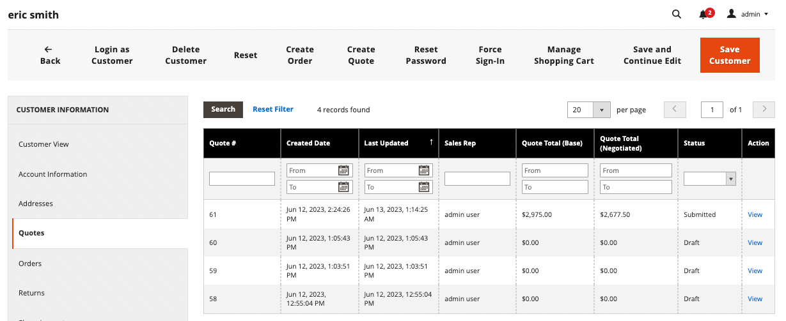

# 为采购员启动报价

如果在[销售功能配置](configure-quotes.md)中启用了报价，则销售代表可以通过从管理员创建报价来启动与公司采购员的洽谈流程。

- 草稿报价仅对卖方可见。
- 只有在销售代表添加物料、相关折扣和附注来为买方创建初始优惠后，才能提交草稿报价。
- 卖方可以从报价或客户网格创建报价。

销售代表将报价发送给采购员以起动洽谈流程。 查看[协商报价](quote-price-negotiation.md)。

## 销售代表报价单创建经验

销售代表可以从“报价”或“客户网格”创建报价。

>[!NOTE]
>
>有关为买方创建报价的卖方视频演示，请参阅[销售代表在&#x200B;_Commerce视频和Tutorials_&#x200B;中启动报价](https://experienceleague.adobe.com/docs/commerce-learn/tutorials/b2b/b2b-quote/sales-rep-initiates-quote.html)。

### 从报价网格创建报价

1. 销售代表以具有[销售操作权限](../systems/permissions.md)的管理员身份登录到管理员以管理报价。

1. 在“管理员”中，选择&#x200B;**[!UICONTROL Sales]**&#x200B;以转到[!UICONTROL Quotes]网格，然后选择&#x200B;**[!UICONTROL Quotes]**。

1. 为采购员创建报价。

   - 从引号网格中，选择&#x200B;**[!UICONTROL Create New Quote]**。

     {width="700" zoomable="yes"}

   - 在[!UICONTROL Create New Quote]页面上，选择客户（公司采购员）以创建报价。

     {width="700" zoomable="yes"}

     新报价以`Draft`状态显示。

     {width="700" zoomable="yes"}

   - 更新报价单名称并根据需要修改到期日期。

   - 将报价另存为草稿。

## 为买方准备报价

创建草稿报价之后，添加产品项目，应用折扣，并通过在报价中添加注释和任何相关文件与买方沟通。 然后，将报价发送给买方进行复查，或将其另存为草稿。

1. 通过选择&#x200B;**[!UICONTROL Add Product By SKU]**&#x200B;将项目添加到报价。 输入SKU编号和数量，然后选择&#x200B;**[!UICONTROL Add Product]**。

   {width="675" zoomable="yes"}

1. 根据需要将行项目折扣应用于产品。

   - 从[!UICONTROL Select]操作菜单中选择&#x200B;**[!UICONTROL Discount Item]**。

   - 在[!UICONTROL Discount Line item]窗体上，选择&#x200B;**[!UICONTROL Discount Type]**。

     {width="675" zoomable="yes"}

   - 在[!UICONTROL Discount]字段中，输入折扣类型的值。 例如，如果您选择了百分比折扣，请输入10以将10%的折扣应用于行项目。

   - [!BADGE 1.5.0-beta功能]{type=Informative url="/help/b2b/release-notes.md" tooltip="仅适用于Beta计划参与者"}

     确认更改后，产品网格中的行项目属性将更新以显示应用的折扣金额。 如果折扣已锁定，则会显示锁图标。

1. 根据需要应用报价级别折扣：

   - 在[!UICONTROL Quote Totals - Negotiated Price]部分中，选择折扣类型，然后输入要应用的值。

     {width="700" zoomable="yes"}

   产品网格将更新以显示折扣。

1. 为采购员添加附加信息。

   在&#x200B;**[!UICONTROL Negotiation - Comments]**&#x200B;选项卡上，添加注释并附加购买者所需的任何支持文件。

   {width="700" zoomable="yes"}的信息

   默认情况下，[附加文件](configure-quotes.md)最大为2 MB，采用以下任何文件格式：DOC、DOCX、XLS、XLSX、PDF、TXT、JPG或JPEG、PNG。

1. 处理报价。

   将报价另存为草稿，或发送给买方。

   - 如果将报价另存为草稿，则状态将更新为`Draft`并显示一条确认消息。

   - 如果将报价发送给买方，则状态将更改为`Submitted`。 采购员收到电子邮件通知，要求复查报价。 报价单将被锁定，直到买方将其退回以进行进一步洽谈。 卖方可以从报价网格或客户网格查看报价。

## 从客户网格查看和创建报价

1. 在“管理员”中，选择&#x200B;**[!UICONTROL Customers]**&#x200B;以转到[!UICONTROL Customer]网格，然后选择&#x200B;**[!UICONTROL All Customers]**。

1. 为公司采购员选择客户ID。

   {width="700" zoomable="yes"}

1. 选择&#x200B;**[!UICONTROL Edit]**&#x200B;以查看客户信息。

1. 通过选择&#x200B;**[!UICONTROL Create Quote]**&#x200B;并遵循流程为客户创建报价以更新草稿报价并将其发送给客户。

1. 通过选择&#x200B;**[!UICONTROL Quotes]**&#x200B;查看客户现有报价。

   {width="700" zoomable="yes"}

1. 通过选择&#x200B;**[!UICONTROL View]**&#x200B;打开报价。

有关管理报价协商过程的详细信息，请参阅[协商报价](quote-price-negotiation.md)
