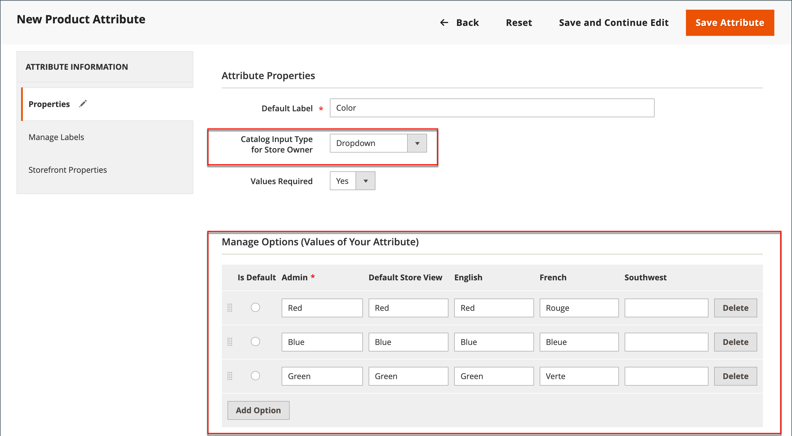
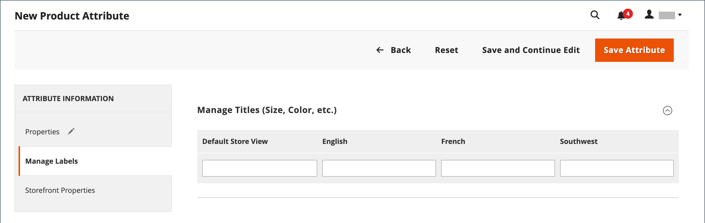

# 创建和删除产品属性

您可以在处理产品时或从&#x200B;_[!UICONTROL Product Attributes]_&#x200B;页面创建属性。 以下步骤显示如何从&#x200B;_[!UICONTROL Stores]_&#x200B;菜单创建属性。

## 步骤1：描述基本属性属性

1. 在&#x200B;_管理员_&#x200B;侧边栏上，转到&#x200B;**[!UICONTROL Stores]** > _[!UICONTROL Attributes]_>**[!UICONTROL Product]**。

1. 单击&#x200B;**[!UICONTROL Add New Attribute]**。

   {width="600" zoomable="yes"}

1. 对于&#x200B;**[!UICONTROL Default Label]**，请输入标识该属性的标签。

1. 将&#x200B;**[!UICONTROL Catalog Input Type for Store Owner]**&#x200B;设置为要用于数据输入的[输入控件](attributes-input-types.md)的类型。

   如果属性用于[可配置产品](product-create-configurable.md)，请选择`Dropdown`。 然后，将&#x200B;**[!UICONTROL Required]**&#x200B;设置为`Yes`。

1. 如果要在客户购买产品之前需要选择选项，请将&#x200B;**[!UICONTROL Values Required]**&#x200B;设置为`Yes`。

1. 对于[!UICONTROL Dropdown]和[!UICONTROL Multiple Select]输入类型，请执行以下操作：

   - 在&#x200B;_[!UICONTROL Manage Options]_&#x200B;下，单击&#x200B;**[!UICONTROL Add Option]**。

   - 输入要显示在列表中的第一个值。

     您可以为管理员输入一个值，并为每个商店视图输入值的转换。 如果您只有一个商店视图，则只能输入管理员值，并且该值也用于店面。

   - 单击&#x200B;**[!UICONTROL Add Option]**&#x200B;并对要包含在列表中的每个选项重复上一步。

   - 选择&#x200B;**[!UICONTROL Is Default]**&#x200B;以使用该选项作为默认值。

   {width="600" zoomable="yes"}

## 步骤2：描述高级属性（如果需要）

1. 以小写字符输入唯一&#x200B;**[!UICONTROL Attribute Code]**，且不含空格。

   >[!NOTE]
   >
   >不建议在[!UICONTROL Attribute Code]字段中使用`type`值。 这可能会导致错误，因为`type`值已保留供系统使用。

   {width="600" zoomable="yes"}

   可用的选项取决于&#x200B;_[!UICONTROL Catalog Input Type for Store Owner]_&#x200B;设置。

1. 若要指示[存储层次结构](../getting-started/websites-stores-views.md)中可以使用属性的位置，请设置&#x200B;**[!UICONTROL Scope]**。

1. 如果要防止任何重复值条目，请将&#x200B;**[!UICONTROL Unique Value]**&#x200B;设置为`Yes`。

1. 对于输入值的输入类型，通过将&#x200B;**[!UICONTROL Input Validation for Store Owner]**&#x200B;设置为字段应包含的数据类型，对输入到文本字段中的任何数据运行有效性测试。

   此字段不可用于具有选定值的输入类型。 该测试可以验证以下任一项：

   - `Decimal Number`
   - `Integer Number`
   - `Email`
   - `URL`
   - `Letters`
   - `Letters (a-z, A-Z) or Numbers (0-9)`

   {width="400"}

1. 若要将此属性添加到[产品列表](products-list.md)，请将以下选项设置为`Yes`。

   - **添加到列选项** — 在&#x200B;_[!UICONTROL Products]_&#x200B;列表中包括属性作为列。
   - **在筛选器选项中使用** — 向&#x200B;_[!UICONTROL Products]_&#x200B;列表中的列标题添加筛选器控件。

## 步骤3：输入字段标签

1. 在左侧导航中，选择&#x200B;**[!UICONTROL Manage Labels]**。

1. 输入要用作字段标签的&#x200B;**[!UICONTROL Title]**。

   如果您的商店以不同的语言提供，则可以为每个视图输入已翻译的标题。

   {width="600" zoomable="yes"}

   >[!NOTE]
   >
   > 如果您计划在Live Search中将此属性用作Facet，则必须指定特定于商店的标签。 如果没有该属性，属性名称可能无法在Facet配置页面上正确显示。 要更新配置，请使用&#x200B;_Live Search指南_&#x200B;的Live Search分面列表[&#128279;](https://experienceleague.adobe.com/en/docs/commerce/live-search/live-search-admin/facets/facets-add#step-2-edit-facet-properties-optional)中的编辑选项手动编辑标签。

## 步骤4：描述店面属性

1. 在左侧导航中，选择&#x200B;**[!UICONTROL Storefront Properties]**。

   {width="600" zoomable="yes"}

   可用的选项取决于&#x200B;_[!UICONTROL Catalog Input Type for Store Owner]_&#x200B;设置。

1. 如果属性可供搜索，请将&#x200B;**[!UICONTROL Use in Search]**&#x200B;设置为`Yes`。

   - 若要控制项在搜索结果中的显示位置，请将&#x200B;**[!UICONTROL Search Weight]**&#x200B;值设置为： 1（最低权重）到10（最高权重）。

   - 根据需要设置&#x200B;**[!UICONTROL Visible in Advanced Search]**。 在[高级搜索](search.md#advanced-search)中了解详情。

1. 若要在产品比较中包含该属性，请将&#x200B;**[!UICONTROL Comparable on Storefront]**&#x200B;设置为`Yes`。

1. 对于下拉列表、多选和价格字段，请执行以下操作：

   - 若要在分层导航中将属性用作过滤器，请将&#x200B;**[!UICONTROL Use in Layered Navigation]**&#x200B;设置为`Yes`。

   - 要在搜索结果页面的分层导航中使用属性，请将&#x200B;**[!UICONTROL Use in Search Results Layered Navigation]**&#x200B;设置为`Yes`。

   - 对于&#x200B;**[!UICONTROL Position]**，输入一个数字以指示属性在分层导航块中的相对位置。

1. 要在价格规则中使用属性，请将&#x200B;**[!UICONTROL Use for Promo Rule Conditions]**&#x200B;设置为`Yes`。

1. 若要允许使用HTML格式化文本，请将&#x200B;**[!UICONTROL Allow HTML Tags on Frontend]**&#x200B;设置为`Yes`。

   此设置使WYSIWYG编辑器可用于字段。

1. 若要在产品页面上包含该属性，请将&#x200B;**[!UICONTROL Visible on Catalog Pages on Storefront]**&#x200B;设置为`Yes`。

1. 如果您的主题支持，请完成以下设置：

   - 若要在产品列表中包含该属性，请将&#x200B;**[!UICONTROL Used in Product Listing]**&#x200B;设置为`Yes`。

   - 若要将该属性用作产品清单的排序参数，请将&#x200B;**[!UICONTROL Used for Sorting in Product Listing]**&#x200B;设置为`Yes`。

1. 完成后，单击&#x200B;**[!UICONTROL Save Attribute]**。

## 步骤5：将创建的属性分配给属性集

要在产品创建页面上显示的属性，请将其添加到特定属性集。

1. 完成之前的步骤后，转到&#x200B;**[!UICONTROL Stores]** > _[!UICONTROL Attributes]_>**[!UICONTROL Attribute Set]**。

1. 在列表中选择所需的属性集，然后在编辑模式下将其打开。

1. 将创建的属性从&#x200B;**[!UICONTROL Unassigned Attributes]**&#x200B;列表拖到&#x200B;**组**&#x200B;列中的相应文件夹。

1. 完成后，单击&#x200B;**[!UICONTROL Save]**。

## 可配置产品的属性

任何用作[可配置产品](product-create-configurable.md)的选项下拉列表的属性都必须具有以下属性：

| 属性 | 值 |
|----------|------ |
| 商店所有者的目录输入类型 | 下拉列表 |
| 范围 | 全局 |

{style="table-layout:auto"}

## 删除属性

删除属性后，该属性会从任何相关的产品和属性集中删除。 系统属性是存储的核心功能的一部分，无法删除。

在删除属性之前，请确保目录中的产品当前未使用它。 确定属性是否正在使用的一个简单方法是使用[导出](../systems/data-export.md)工具检查产品实体属性的列表。 如果列表不包含属性，则目录中的任何产品都不会使用它。

**_要删除属性:_**

1. 在&#x200B;_管理员_&#x200B;侧边栏上，转到&#x200B;**[!UICONTROL Stores]** > _[!UICONTROL Attributes]_>**[!UICONTROL Product]**。

1. 在列表中查找属性，并在编辑模式下打开。

1. 单击&#x200B;**[!UICONTROL Delete Attribute]**。

   {width="600" zoomable="yes"}

1. 提示确认时，单击&#x200B;**[!UICONTROL OK]**。

