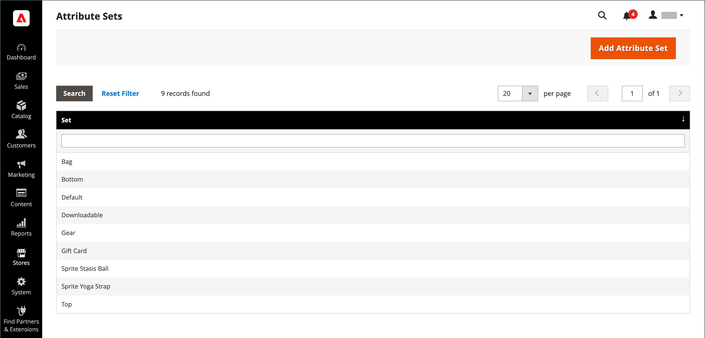

# 属性集

创建产品时的首要步骤之一是选择用作产品记录模板的属性集。 该属性集确定在数据输入期间可用的字段，以及向客户显示的值。

这些属性被组织到不同的组中，以确定它们在产品记录中的显示位置。 您的存储附带了一个初始属性集（称为&#x200B;_default_），其中包含一组常用的属性。 如果只想添加几个属性，则可以将其添加到此默认属性集。 如果您销售的产品需要特定类型的信息，则最好创建一个专用属性集，其中包含该产品所需的特定属性。

{width="700" zoomable="yes"}

## 创建属性集

1. 在&#x200B;_管理员_&#x200B;侧边栏上，转到&#x200B;**[!UICONTROL Stores]** > _[!UICONTROL Attributes]_>**[!UICONTROL Attribute Set]**。

1. 单击&#x200B;**[!UICONTROL Add New Set]**。

   {width="600" zoomable="yes"}

1. 输入属性集的&#x200B;**[!UICONTROL Name]**。

1. 将&#x200B;**[!UICONTROL Based On]**&#x200B;设置为要用作模板的现有属性集。

1. 单击&#x200B;**[!UICONTROL Save]**。

   下一页显示以下内容：

   - 左列显示属性集的名称。 该名称用于内部引用，可根据需要进行更改。
   - 页面中心列出了当前选择的属性组。
   - 右列列出了当前未分配给属性集的属性选择。

1. 若要向集中添加属性，请将该属性从&#x200B;**[!UICONTROL Unassigned Attributes]**&#x200B;列表拖到&#x200B;**[!UICONTROL Groups]**&#x200B;列中的相应文件夹中。 要从集中删除属性，请将其拖动到&#x200B;**[!UICONTROL Unassigned Attributes]**&#x200B;列表。

   >[!NOTE]
   >
   >系统属性标有点，无法从&#x200B;_[!UICONTROL Groups]_&#x200B;列表中删除。 但是，可以将它们拖到属性集中的另一个组中。

1. 完成后，单击&#x200B;**[!UICONTROL Save]**。

{width="600" zoomable="yes"}

## 创建属性组

1. 在属性集的&#x200B;_[!UICONTROL Groups]_&#x200B;列中，单击&#x200B;**[!UICONTROL Add New]**。

1. 为新组输入&#x200B;**[!UICONTROL Name]**，然后单击&#x200B;**[!UICONTROL OK]**。

1. 执行以下任一操作：

   - 将&#x200B;**[!UICONTROL Unassigned Attributes]**&#x200B;拖到新组中。
   - 将属性从任何其他组拖到新组中。
   - 将不必要的属性拖动到&#x200B;**[!UICONTROL Unassigned Attributes]**。

   新组将成为任何基于属性集的产品中的属性部分。

## 删除属性集

1. 在&#x200B;_管理员_&#x200B;侧边栏上，转到&#x200B;**[!UICONTROL Stores]** > _[!UICONTROL Attributes]_>**[!UICONTROL Attribute Set]**。

1. 在列表中选择属性集，并以编辑模式打开。

1. 单击&#x200B;**[!UICONTROL Delete]**。

1. 提示确认时，单击&#x200B;**[!UICONTROL OK]**。
