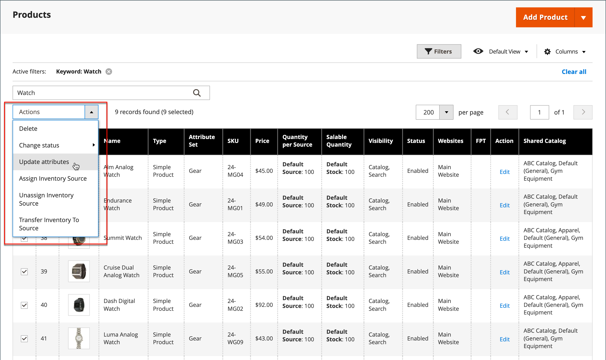

# 批量更新产品属性

使用&#x200B;_[!UICONTROL Update Attributes]_工具更改产品中的一个或多个属性。 此工具允许您对大量产品应用重大更改。

1. 在&#x200B;_管理员_&#x200B;侧边栏上，转到&#x200B;**[!UICONTROL Catalog]** > **[!UICONTROL Products]**。

1. 选择要修改其源的产品。

   浏览或搜索以查找产品并选中这些复选框。

1. 单击顶部的&#x200B;**[!UICONTROL Actions]**&#x200B;菜单，然后选择&#x200B;**[!UICONTROL Update Attributes]**。

   {width="600" zoomable="yes"}

1. 根据需要更新所选产品的属性、高级清单或网站数据。

   {width="600" zoomable="yes"}

1. 完成后，单击&#x200B;**[!UICONTROL Save]**。
