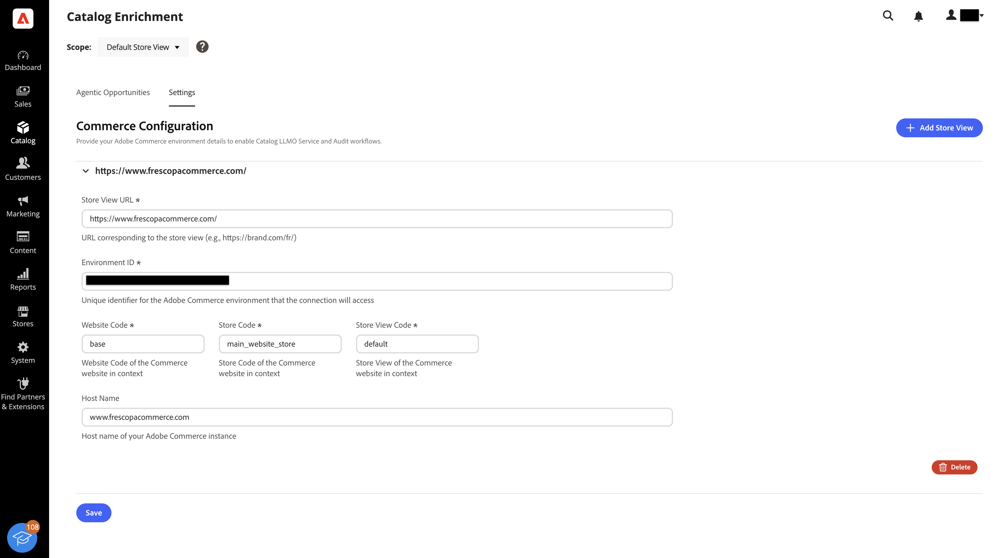
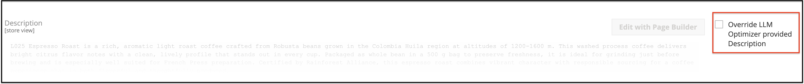

# 目录扩充

目录扩充是一项原生[!DNL Adobe Commerce]功能，可帮助您改进产品名称和长描述，以便在购物者使用LLM和AI助手进行产品研究和发现时，更准确地表示您的目录。

>[!NOTE]
>
>目录扩充由[!DNL Commerce Catalog Agent]和[!DNL Adobe LLM Optimizer]在幕后提供支持。 您可以将扩充用作Commerce目录工作流的一部分。 您无需管理单独的LLM Optimizer集成即可应用批准的名称和描述更新。 有关在Commerce之外进行更广泛的LLM监控和优化，请参阅[LLM Optimizer产品文档](https://experienceleague.adobe.com/en/docs/llm-optimizer/using/home)。

## 工作原理 {#how-it-works}

您的[!DNL Adobe Commerce]产品目录是产品数据的记录系统：名称、描述、属性、定价和库存。[!DNL Adobe Commerce] Storefront MCP（模型上下文协议）将实时目录数据连接到Adobe AI体验。 从那里，目录代理可以识别产品名称和详细描述中的空白，提出改进建议，并将批准的更改写回Commerce，以便您可以在Commerce管理员中查看这些更改。

通过目录扩充，您可以：

- 确定产品名称中的差距和不一致之处以及影响LLM解释产品的详细描述。
- 审查在支持情境方面建议的改进，包括理由和前后比较。
- 将批准的更新直接应用于Commerce目录，以使管理员、店面和其他读取这些字段的渠道保持一致。

由于产品名称和长描述存在于Commerce中，因此改进一次复制可以使使用该产品数据的每个渠道受益。 其优势取决于系统更新的方式和时间。

| 方向 | 用途 |
| --- | --- |
| Commerce目录 — >分析 | 目录和URL信号提供扩充建议。 |
| 扩充 — > Commerce目录 | 批准更新后，对产品名称和描述所做的更改将保存到Commerce目录中，以便管理员和店面反映优化后的值。 |

## 这是给谁的 {#who-this-is-for}

- 希望产品数据在LLM驱动的答案中准确且一致的数字营销人员和营销人员。
- 需要以可控方式大规模改进目录复制的数字营销人员和营销人员。
- 拥有目录完整性、管理流程和用于提供产品属性的集成(API、CSV、PIM)的Commerce管理员。

## 先决条件 {#prerequisites}

当您有权访问目录扩充时，以下先决条件适用。

- 您的店面可以由面向LLM和代理的机器人抓取，这些机器人需要抓取范围才能获得目录感知建议。
- 所需的Commerce服务和目录连接已启用且运行正常。 请参阅[启用目录扩充](#enable-catalog-enrichment)以了解详情。
- 已配置[IMS](https://experienceleague.adobe.com/en/docs/core-services/interface/administration/organizations)。
- 您有权访问[Adobe Admin Console](https://helpx.adobe.com/business/enterprise/plan-your-deployment/basic-concepts/admin-console.html)。

> 如果您没有IMS组织，请联系您的Adobe客户团队进行配置。

## 启用目录扩充 {#enable-catalog-enrichment}

在查看或应用建议之前，请与Commerce管理员或实施合作伙伴合作以确保满足以下条件：

### 安装目录扩充和目录服务扩展

1. 通过运行以下命令，在Commerce实例中安装目录扩充扩展：

   ```bash
   composer require magento/module-catalog-enrichment --no-update
   composer update magento/module-catalog-enrichment
   ```

1. 如果您尚未安装目录服务，请[执行此操作](https://experienceleague.adobe.com/en/docs/commerce/catalog-service/installation#install-the-catalog-service-extension)。

   **[!UICONTROL Catalog enrichment]**&#x200B;现在可在您的Commerce实例中使用。

### 访问目录扩充

安装目录扩充和目录服务扩充后，管理员可在&#x200B;**[!UICONTROL Catalog]** > **[!UICONTROL Catalog Enrichment]**&#x200B;下使用目录扩充功能。


### 配置目录扩充

在&#x200B;**[!UICONTROL Settings]**&#x200B;选项卡上配置目录扩充，以便[!DNL Commerce Catalog Agent]能够连接到[!DNL Adobe Commerce]环境，并在Commerce管理员中显示建议。

1. 在“管理员”中，转到&#x200B;**[!UICONTROL Catalog]** > **[!UICONTROL Catalog Enrichment]**。
1. 在页面顶部的&#x200B;**[!UICONTROL Scope]**&#x200B;列表中，选择要配置的商店视图，或保留&#x200B;**[!UICONTROL All Store Views]**&#x200B;以跨商店视图管理设置。
1. 打开&#x200B;**[!UICONTROL Settings]**&#x200B;选项卡。
1. 在&#x200B;**[!UICONTROL Commerce Configuration]**&#x200B;中，展开标记为其URL的存储区视图面板。

   提供您的[!DNL Adobe Commerce]环境详细信息以启用目录LLM Optimizer服务和审核工作流。

   “目录扩充设置”选项卡上的

1. 输入商店视图所需的连接详细信息。

   - **[!UICONTROL Store View URL]**：对应于商店视图的URL（例如，`https://brand.example.com/fr/`）。
   - **[!UICONTROL Environment ID]**：连接访问的[!DNL Adobe Commerce]环境的唯一标识符。
   - **[!UICONTROL Website Code]**、**[!UICONTROL Store Code]**&#x200B;和&#x200B;**[!UICONTROL Store View Code]**： Commerce网站的网站、商店和商店视图代码。 这些值必须与您的Commerce管理员中的代码匹配。

1. 可选：如果您的环境需要&#x200B;**[!UICONTROL Host Name]**&#x200B;和&#x200B;**[!UICONTROL API Key]**，请输入。

   - **[!UICONTROL Host Name]**： [!DNL Adobe Commerce]实例的主机名。
   - **[!UICONTROL API Key]**：用于安全访问[!DNL Adobe Commerce] API的身份验证密钥。 如果需要将密钥复制到其他位置，请单击字段旁边的&#x200B;**[!UICONTROL Copy]**。

1. 单击&#x200B;**[!UICONTROL Save]**。

保存后，请等待任何初始同步或验证作业完成，然后再依赖该存储视图的目录或审核结果。 产品建议可能需要24小时才能显示在&#x200B;**[!UICONTROL Catalog Enrichment]**&#x200B;页面上。

要删除商店视图配置，请展开该条目并单击&#x200B;**[!UICONTROL Delete]**。

#### 字段描述 {#commerce-connection-fields}

在&#x200B;**[!UICONTROL Commerce Configuration]**&#x200B;表单中，必填字段标有星号(*)。

| 字段 | 必填 | 描述 |
| --- | --- | --- |
| 商店视图URL | 是 | 与商店视图对应的URL（例如，`https://brand.example.com/fr/`）。 |
| 环境ID | 是 | 连接访问的[!DNL Adobe Commerce]环境的唯一标识符。 |
| 网站代码 | 是 | Commerce网站的网站代码。 |
| 商店代码 | 是 | Commerce网站商店代码。 |
| 存储视图代码 | 是 | Commerce网站的商店视图。 |
| 主机名 | 否 | [!DNL Adobe Commerce]实例的主机名。 |
| API密钥 | 否 | 用于安全访问[!DNL Adobe Commerce] API的身份验证密钥。 像对待任何生产凭证一样对待它。 |

### 查看并应用目录扩充 {#review-and-apply}

启用和配置目录扩充后，**[!UICONTROL Agentic Opportunities]**&#x200B;选项卡上将显示产品建议。 在此处，您可以查看建议并将批准的更新应用于Commerce目录中的产品名称和详细说明。

目录扩充使用以下工作流视图：

- **[!UICONTROL Current Suggestions]**：要审阅的新项目或活动项目。
- **[!UICONTROL Fixed Suggestions]**：已应用或解析的项。
- **[!UICONTROL Ignored Suggestions]**：您特意从操作中排除的项目。


### 部署已批准的建议 {#review-deploy-catalog}

要部署已批准的建议，请执行以下操作：

1. 选择&#x200B;**[!UICONTROL Current Suggestions]**。
1. 单击URL或SKU行的展开控件以显示建议的产品名称和产品说明更新。
1. 查看建议，并确认其符合您的促销和SEO策略。

您可以在部署建议之前对其进行编辑，如果建议与您的策略不符，则将其移至&#x200B;**[!UICONTROL Ignored Suggestions]**。

1. 选择要更新的URL或SKU的行。
1. 单击&#x200B;**[!UICONTROL Deploy optimizations]**&#x200B;并确认。

批准的名称和描述更改会像其他产品更新一样保存到您的[!DNL Adobe Commerce]目录。

>[!IMPORTANT]
>
>将每个应用的更新视为生产目录更改。 使用常规的更改控制、暂存和QA实践。 仅在推销和SEO利益相关者就最终副本达成一致后应用更新。

应用更新后，建议将移动到状态为&#x200B;**标记为“已修复”**&#x200B;的&#x200B;**[!UICONTROL Fixed Suggestions]**。

## 在管理员中验证扩充 {#verify-in-admin}

**要验证应用的目录扩充：**

1. 在Commerce管理员中转到&#x200B;**[!UICONTROL Catalog]** > **[!UICONTROL Products]**。
1. 根据需要使用筛选器和&#x200B;**[!UICONTROL Store View]**&#x200B;选择器（例如，**[!UICONTROL Default Store View]**）。
1. 搜索SKU。
1. 在编辑模式下打开产品。

   产品表单显示扩充的产品名称和/或描述。

   

1. 可选：如果要保留手动输入的名称，请选择&#x200B;**[!UICONTROL Override Catalog Agent provided Product Name]**。

   手动覆盖会影响建议如何与目录保持同步。 有关详细信息，请参阅管理员中的[手动覆盖](#manual-override-in-the-admin)。

1. 展开&#x200B;**[!UICONTROL Content]**&#x200B;部分并找到描述字段。

   在您应用说明更改后，即会显示扩充说明。

   

1. 可选：如果要保留手动输入的描述，请选择&#x200B;**[!UICONTROL Override Catalog Agent provided Description]**。

手动覆盖会影响建议如何与目录保持同步。 有关详细信息，请参阅管理员中的[手动覆盖](#manual-override-in-the-admin)。

## 验证店面上的扩充 {#verify-storefront}

**验证店面的扩充：**

1. 在您的店面中搜索SKU。
1. 打开产品页面。
1. 确认产品名称和描述与您批准的内容相匹配。

   你的店面可能需要一些时间才会出现丰富内容。

1. 确认显示详细描述的区域与您批准的内容相匹配。
1. 可选：确认使用与转出相关的相同目录属性的下游渠道。

## 覆盖、引入和过时的建议 {#overrides-ingestion}

在目录扩充更新产品的名称或描述后，其他摄取系统可能会更改相同的字段。 示例包括REST API调用、CSV导入和PIM馈送。

### 已重新摄取原始值 {#original-value-reingested}

如果外部进程写入原始名称或描述（在应用扩充之前存在的值），则Commerce会继续根据目录扩充规则遵循该字段的扩充值。 仅根据摄取，建议可能不会自动恢复。

### 已重新摄取新值 {#new-value-reingested}

如果外部流程发送的新值不是预扩充文本的重复，则Commerce将遵循新目录值。 例如，将“Red Shoes”重命名为“Iconic Red Shoes”会替换扩充值。 相关扩充建议通常标记为&#x200B;*已过时*，因为实时目录不再与建议上下文匹配。

### 管理员中的手动覆盖 {#manual-override-in-the-admin}

如果您在[!DNL Adobe Commerce]管理员中手动编辑产品名称或描述：

- Admin值作为该手动更改的记录系统而获胜。
- 扩充建议标记为&#x200B;*已过时*。
- 建议工作流会移回该项的原始状态，以便您可以重新基线或在分析再次运行时接受新的建议。

这些规则可帮助您了解当多个渠道接触同一SKU时，目录扩充、摄取馈送或管理员编辑是否具有权威性。

## 限制和注意事项 {#limits}

- 扩充仅适用于产品名称和详细说明。 它不会更改PDP布局、小组件或其他页面级店面内容。
- 大型目录和高的URL计数可能会影响分析完成的速度以及同时显示的建议数量。
- 有意义的建议假定与LLM相关的机器人可以访问您关注的产品URL。 机器人规则、身份验证、地理阻挡和高度个性化可能会减少覆盖范围。

## 最佳实践 {#best-practices}

- 产品名称和描述的文档系统所有权，以便PIM或信息源作业不会无意中与目录扩充冲突。
- 在批量应用标题或描述之前，请与SEO和品牌团队协调。
- 主要目录导入后重新同步或重新分析，以便建议反映当前目录状态。

<!--## Examples This section will provide examples of what enrichment before/after looks like:-->
