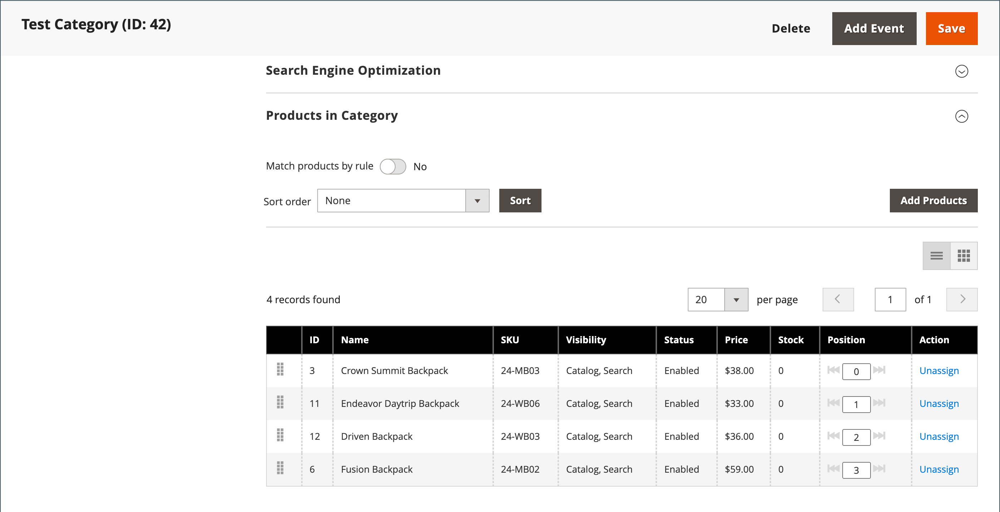

# 平面目录

>[!IMPORTANT]
>
>不再建议将使用平面目录作为最佳实践。 据悉，继续使用此功能会导致性能下降和其他索引问题。 [帮助中心](https://experienceleague.adobe.com/docs/commerce-knowledge-base/kb/troubleshooting/miscellaneous/slow-performance-slow-and-long-running-crons.html)提供了详细的说明和解决方案。  受影响的版本包括： - Adobe Commerce on cloud infrastructure、2.3.x及更高版本 - Adobe Commerce （内部部署）、2.3.x及更高版本 - Magento Open Source、2.3.x及更高版本  在任何发行版本上，某些扩展只适用于平面表，因此如果您禁用平面表，将会产生风险。 如果您知道某些扩展使用平面目录索引器，则在将这些值设置为`No`时必须注意此风险。

Commerce通常根据实体属性值(EAV)模型将目录数据存储在多个表中。 由于产品属性存储在许多表中，因此SQL查询有时很长，也很复杂。

相反，平面目录会动态创建表格，其中每一行都包含有关产品或类别的所有必要数据。 平面目录会自动更新 — 每分钟更新一次，或者根据您的cron作业进行更新。 平面目录索引还可以加快目录和购物车价格规则的处理。 具有多达500,000个SKU的目录可以快速作为平面目录编制索引。

>[!NOTE]
>
>在为实时存储启用平面目录之前，请确保在开发环境中测试配置。

## 步骤1：启用平面目录

1. 在&#x200B;_管理员_&#x200B;侧边栏上，转到&#x200B;**[!UICONTROL Stores]** > _[!UICONTROL Settings]_>**[!UICONTROL Configuration]**。

1. 在左侧面板中，展开&#x200B;**[!UICONTROL Catalog]**&#x200B;并在下面选择&#x200B;**[!UICONTROL Catalog]**。

1. 展开&#x200B;_店面_&#x200B;部分并执行以下操作：

   - 将&#x200B;**[!UICONTROL Use Flat Catalog Category]**&#x200B;设置为`Yes`。 （如有必要，请取消选中&#x200B;**[!UICONTROL Use system value]**&#x200B;复选框。）

   - 将&#x200B;**[!UICONTROL Use Flat Catalog Product]**&#x200B;设置为`Yes`。

   {width="700" zoomable="yes"}

1. 完成后，单击&#x200B;**[!UICONTROL Save Config]**。

1. 提示更新缓存时，单击系统消息中的&#x200B;**[!UICONTROL Cache Management]**，然后按照说明刷新缓存。

## 第2步：验证结果

可以使用两种方法验证结果。

### 方法1：验证单个产品的结果

1. 在&#x200B;_管理员_&#x200B;侧边栏上，转到&#x200B;**[!UICONTROL Catalog]** > **[!UICONTROL Products]**。

1. 在编辑模式下打开产品。

1. 对于&#x200B;**[!UICONTROL Name]**，将文本`_TEST`添加到产品名称的末尾。

1. 单击&#x200B;**[!UICONTROL Save]**。

1. 在新的浏览器选项卡上，导航到商店的主页并执行以下操作：

   - 搜索您编辑的产品。

   - 使用导航浏览到为其分配的类别下的产品。

     如有必要，请刷新页面以查看结果。 此更改将在分钟内显示或根据您的[Cron](../systems/cron.md)计划显示。

   {width="700" zoomable="yes"}

### 方法2：验证类别的结果

1. 在&#x200B;_管理员_&#x200B;侧边栏上，转到&#x200B;**[!UICONTROL Catalog]** > **[!UICONTROL Categories]**。

1. 在左上角，验证&#x200B;**[!UICONTROL Store View]**&#x200B;是否设置为`All Store Views`。

   如果出现提示，请单击&#x200B;**[!UICONTROL OK]**&#x200B;确认。

1. 在类别树中，选择现有类别，单击&#x200B;**[!UICONTROL Add Subcategory]**，然后执行以下操作：

   - 对于&#x200B;**[!UICONTROL Category Name]**，输入`Test Category`。

   - 完成后，单击&#x200B;**[!UICONTROL Save]**。

     {width="600" zoomable="yes"}

   - 展开 **[!UICONTROL Products in Category]**&#x200B;部分并单击&#x200B;**[!UICONTROL Reset Filter]**&#x200B;以显示所有产品。

   - 选中要添加到新类别的多个产品的复选框。

   - 单击&#x200B;**[!UICONTROL Save]**。

   {width="600" zoomable="yes"}

1. 在新浏览器选项卡上，导航到商店的主页，并使用商店导航浏览到您创建的类别。

   如有必要，请刷新页面以查看结果。 更改将在分钟内显示或根据您的cron时间表显示。

## 步骤3：删除测试数据

执行以下操作可删除测试数据并恢复原始产品名称和目录配置。

### 删除测试类别

1. 在&#x200B;_管理员_&#x200B;侧边栏上，转到&#x200B;**[!UICONTROL Catalog]** > **[!UICONTROL Categories]**。

1. 在类别树中，选择您创建的测试子类别。

1. 单击右上角的&#x200B;**[!UICONTROL Delete]**。

1. 提示确认时，单击&#x200B;**[!UICONTROL OK]**。

   此类别删除不会删除分配给此类别的产品。

### 恢复原始产品名称

1. 在&#x200B;_管理员_&#x200B;侧边栏上，转到&#x200B;**[!UICONTROL Catalog]** > **[!UICONTROL Categories]**。

1. 在编辑模式下打开测试产品。

1. 删除您添加到&#x200B;**[!UICONTROL Product Name]**&#x200B;的`_TEST`文本。

1. 单击右上角的&#x200B;**[!UICONTROL Save]**。

### 恢复原始目录配置

1. 在&#x200B;_管理员_&#x200B;侧边栏上，转到&#x200B;**[!UICONTROL Stores]** > _[!UICONTROL Settings]_>**[!UICONTROL Configuration]**。

1. 在左侧面板中，展开&#x200B;**[!UICONTROL Catalog]**&#x200B;并在下面选择&#x200B;**[!UICONTROL Catalog]**。

1. 展开&#x200B;_店面_&#x200B;部分并执行以下操作：

   - 将&#x200B;**[!UICONTROL Use Flat Catalog Category]**&#x200B;设置为`No`。

   - 将&#x200B;**[!UICONTROL Use Flat Catalog Product]**&#x200B;设置为`No`。

1. 完成后，单击&#x200B;**[!UICONTROL Save Config]**。

1. 出现提示时，刷新缓存。
