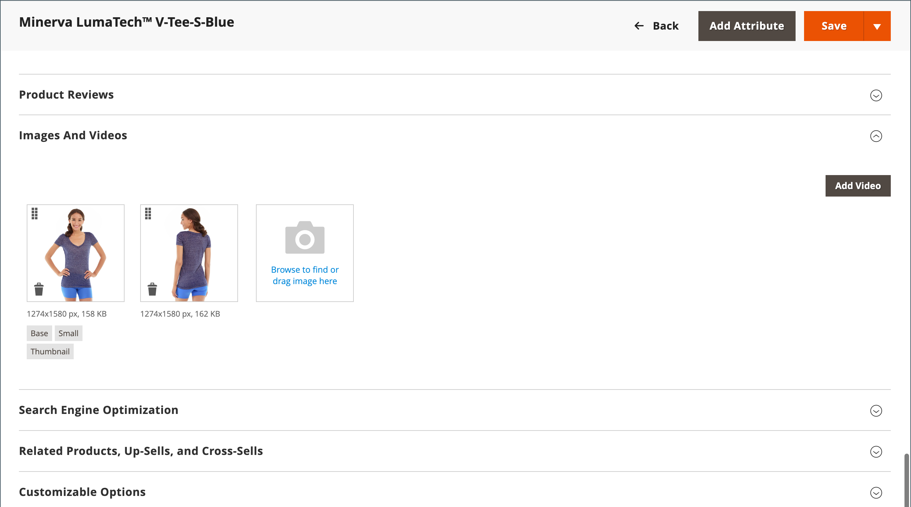
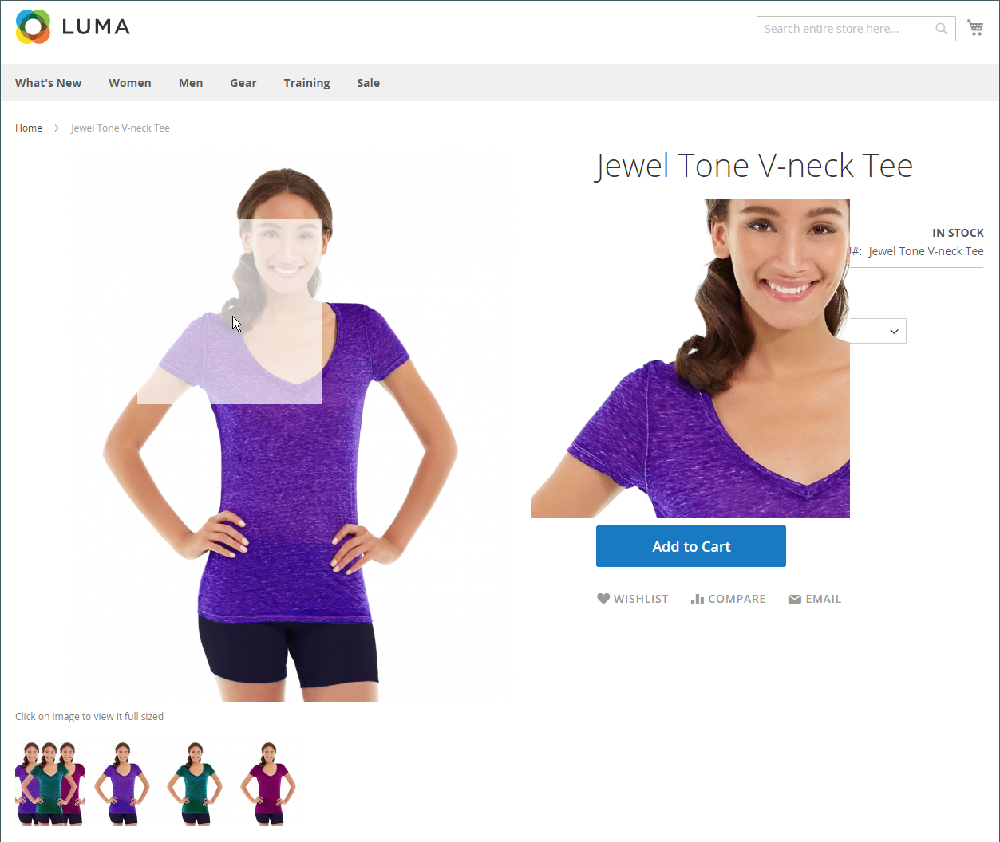

# 目录图像和视频

使用比例一致的高质量图像为您的目录提供具有商业吸引力的专业外观。 如果您有一个大目录，每个产品都有多个图像，那么您可以轻松管理数百个（甚至数千个）产品图像。 在开始之前，请为图像文件建立命名惯例并组织它们，以便在需要时查找原件。

{width="600" zoomable="yes"}

单个产品图像在整个目录中呈现为不同大小。 页面上图像容器的显示大小在主题的样式表中定义。 但是，图像在存储中出现的位置取决于分配给图像的角色。 主产品图像，或 _基础_ 图像，必须足够大才能生成缩放所需的缩放比例。 除了主图像之外，同一图像的较小版本也可能显示在产品清单中，或显示在购物车中，以缩略图的形式显示。 您可以上传所需最大大小的图像，也可以使用 [Adobe Stock](../content-design/adobe-stock.md) 图像，并让Commerce呈现每次使用所需的大小。 所有角色都可以使用同一图像，或者可以为每个角色分配不同的图像。 默认情况下，上传的第一个图像将分配给所有三个角色。

## 店面媒体浏览器

产品页面上的媒体浏览器会显示与产品相关的多个图像、视频或色板。 每个缩略图可以显示产品的不同视图或变体。 购物者可以单击缩略图浏览媒体资产。 尽管媒体浏览器的位置因主题而异，但默认位置仍位于产品页面上主图像的正下方。 有关辅助功能控件，请参阅 [导航辅助功能](../getting-started/navigation-accessibility.md).

{width="700" zoomable="yes"}

### 图像缩放

如果 [基本图像](product-image.md) 大到足以创建缩放效果，因此客户可以在鼠标悬停时查看图像的放大部分。 激活缩放后，客户可以单击主图像并在周围移动光标以放大图像的不同部分。 放大的选区将显示在图像的右侧。

{width="700" zoomable="yes"}

### 灯箱和滑块

有许多第三方灯箱和滑块可用于增强产品图像的呈现。 在中查找扩展 [Commerce Marketplace](../getting-started/commerce-marketplace.md).

## 资源疑难解答

要获得有关图像和视频问题疑难解答的帮助，请参阅以下Commerce支持知识库文章：

- [安装后，不加载图像和样式表；只显示文本，不加载图形](https://experienceleague.adobe.com/docs/commerce-knowledge-base/kb/troubleshooting/storefront/after-installing-images-and-stylesheets-do-not-load-only-text-displays-no-graphics.html)
- [通过REST API管理产品图像时出现问题](https://experienceleague.adobe.com/docs/commerce-knowledge-base/kb/support-tools/patches/v1-0-5/mdva-28763-magento-patch-issues-with-managing-product-images-via-rest-api.html)
- [导入重复的产品.csv图像](https://experienceleague.adobe.com/docs/commerce-knowledge-base/kb/support-tools/patches/v1-0-14/mdva-31969-magento-patch-import-products-.csv-images-duplicated.html)
- [尽管具有“产品编辑”图像角色，仍不显示产品图像](https://experienceleague.adobe.com/docs/commerce-knowledge-base/kb/troubleshooting/storefront/product-images-do-not-display-despite-product-edit-image-roles.html)
- [部署后不显示存储映像](https://experienceleague.adobe.com/docs/commerce-knowledge-base/kb/troubleshooting/storefront/store-images-not-displayed-after-deployment.html)
