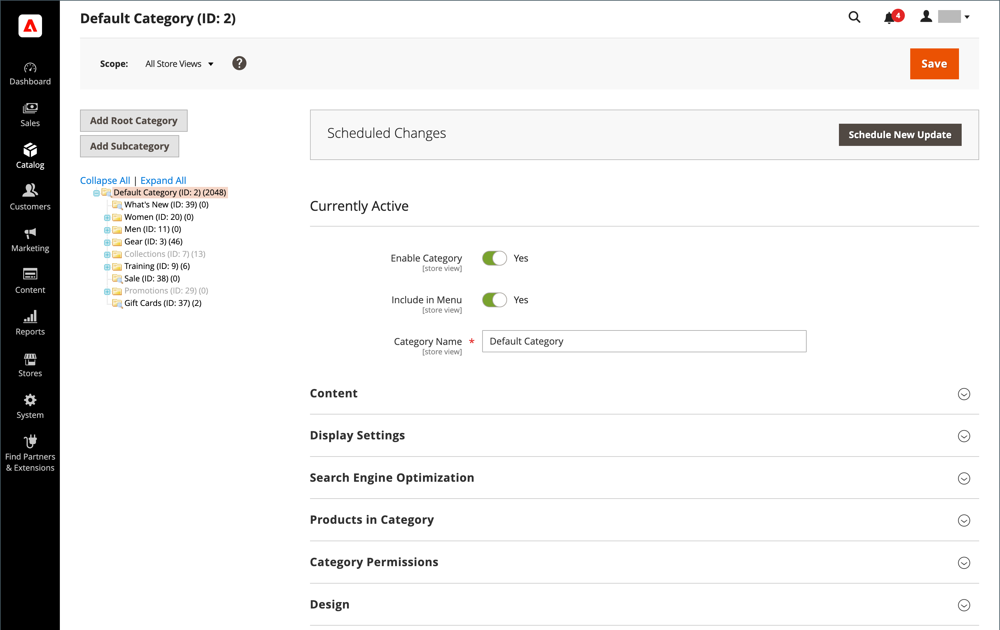

# [!UICONTROL Catalog] 菜单

此 [!UICONTROL Catalog] 菜单可让您轻松访问中的产品创建、类别和库存管理工具，以及自定义定价的共享目录 [B2B存储](https://experienceleague.adobe.com/docs/commerce-admin/b2b/introduction.html).

{width="300" zoomable="yes"}

在 _管理员_ 侧栏，单击 **[!UICONTROL Catalog]**.

## [!UICONTROL Products]

创建 [产品](products-list.md) 并管理您的库存。

{width="700" zoomable="yes"}

## [!UICONTROL Categories]

创建 [类别](categories.md) 结构是商店导航的基础。

{width="700" zoomable="yes"}

## [!UICONTROL Shared Catalogs]

对于已安装并启用Adobe Commerce B2B的商店， [共享目录](https://experienceleague.adobe.com/docs/commerce-admin/b2b/shared-catalogs/catalog-shared.html) 让您能够将自定义定价提供给不同的公司。

{width="700" zoomable="yes"}
