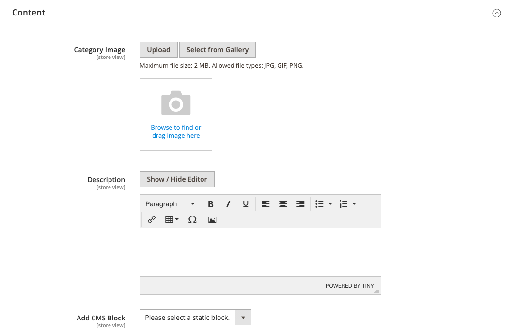

# 类别 — 内容设置

此 _[!UICONTROL Content]_设置可决定类别页面上是否显示其他内容。 除了类别产品列表之外，该页面还可以包括图像、描述和CMS块。 您可以使用 [[!DNL Page Builder]](../page-builder/introduction.md) 用于定义类别描述的内容工具。

## 在中添加类别描述 [!DNL Page Builder]

1. 在编辑模式下打开类别。

1. 向下滚动并展开  该 **[!UICONTROL Content]** 部分。

   {width="600" zoomable="yes"}

1. 在右上角 **[!UICONTROL Description]** 区域，单击 **[!UICONTROL Edit with Page Builder]**.

1. 使用 [[!DNL Page Builder]](../page-builder/introduction.md) 内容工具 [编辑任何现有文本](../page-builder/text.md) 并添加其他内容（如果需要）。

## [!DNL Page Builder] 预览

当您展开 _内容_ 现有类别的部分，其中包含创建内容 [!DNL Page Builder]，它显示 **[!UICONTROL Description]** 显示在类别页面中的内容。 单击内容区域将打开 [!DNL Page Builder] 工作区，您可以在其中进行任何所需的更新。

{width="500" zoomable="yes"}

默认情况下，产品和类别表单将启用此内容预览。 如果性能因加载预览而受到影响，您可以在中禁用预览 [内容管理配置](../configuration-reference/general/content-management.md#advanced-content-tools) 设置。

## 在编辑器中添加类别说明

在文本框中只输入纯ASCII字符。 如果从文字处理器粘贴文本，请首先将其保存为纯.TXT文件，以删除任何不可见的控制字符。

有关更多信息，请参阅 [所见即所得编辑器](../content-design/editor.md).

1. 在编辑模式下打开类别。

1. 向下滚动并展开  该 **[!UICONTROL Content]** 部分。

   {width="500" zoomable="yes"}

1. 输入类别 **[!UICONTROL Description]** 并使用 [编辑器工具栏](../content-design/editor.md) 以根据需要进行格式化。

   您可以拖动右下角来更改文本框的高度。

## 将CMS块添加到类别页面

1. 在 _管理员_ 侧栏，转到 **[!UICONTROL Catalog]** > **[!UICONTROL Categories]**.

1. 在类别树中，选择要编辑的类别。

1. 展开  该 **[!UICONTROL Content]** 部分。

1. 对象 **[!UICONTROL Add the CMS block]**&#x200B;中，选择要添加的块。

1. 展开  该 **[!UICONTROL Display Settings]** 部分。

1. 设置 **[!UICONTROL Display Mode]** 更改为以下任一项：

   - `Static block only`
   - `Static block and products`

1. 完成后，单击 **[!UICONTROL Save]** 和查看店面上的块显示（需要缓存刷新）。

## 内容设置参考

| 设置 | [范围](../getting-started/websites-stores-views.md#scope-settings) | 描述 |
|--- |--- |--- |
| [!UICONTROL Category Image] | 商店视图 | 指定类别页面顶部的图像。 方法：   **[!UICONTROL Upload]**— 将图像文件从本地计算机上载到图片库，并将其用作类别图像。  **[!UICONTROL Select from Gallery]**  — 提示您从图库中选择现有图像。     — 将图像文件拖到相机图块中，或者浏览到图像并从本地文件系统中进行选择。 |
| [!UICONTROL Description] | 商店视图 | 指定类别页上显示的说明。   **[!UICONTROL Edit with Page Builder]**— 打开 [[!DNL Page Builder] 工作区](../page-builder/workspace.md)，您可以在其中编辑描述。  **[!UICONTROL Show / Hide Editor]**  — 在WYSIWYG编辑器和HTML模式之间切换显示。 |
| [!UICONTROL Add CMS Block] | 商店视图 | 添加现有 [CMS块](../content-design/blocks.md) 到类别页面。 |

{style="table-layout:auto"}
