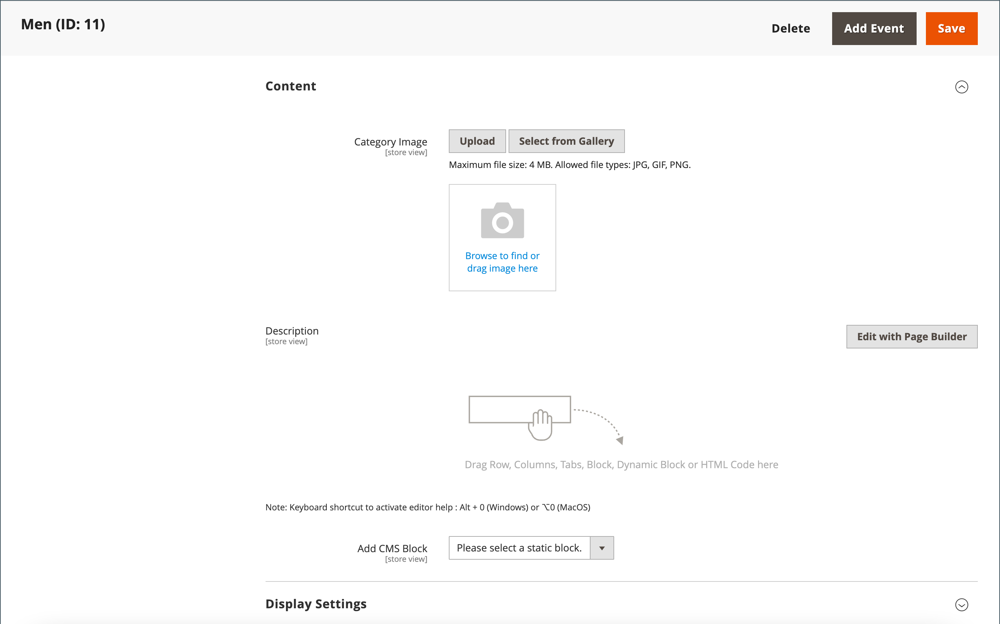
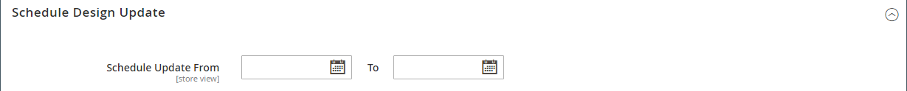

# 创建类别

目录的类别结构就像一个上下颠倒的树，其根位于顶部。 树的每一部分都可以展开和折叠。 任何禁用或隐藏的类别都会呈灰显状态。 第一级的类别(在 [根](category-root.md))通常作为选项显示在 [主菜单](navigation-top.md). 您可以根据配置中设置的最大菜单深度，根据需要创建任意数量的其他子类别。 可以将类别拖放到树中的其他位置。 类别ID编号显示在页面顶部的类别名称后面的括号中。

对于具有多个的Web站点 [存储](../stores-purchase/stores.md#add-stores)中，您可以为每个存储创建不同的根类别，以定义用于 [顶部导航](navigation-top.md).

{width="700" zoomable="yes"}

## 最佳实践

在规划和创建类别时，请使用这些最佳实践。

### 类别结构

主菜单中的类别结构可能会影响客户体验和性能。 作为最佳实践，您应该确定一个首要的顶级类别，并避免其他类别具有相同名称。 例如，不要在不同部门下组织多个类别的“儿童”，例如 `Clothing/Kids`， `Shoes/Kids`， `Accessories/Kids`. 设置顶级父类别可能更有效 `Kids`，然后根据需要创建以下子类别。 与类别结构保持一致，对目录中的所有产品类型使用相同的方法。

### 业务规则和自动化

在使用业务逻辑在目录页面上显示相似项目，或设置个性化促销、自动化流程或搜索标准时，请考虑类别结构和可用属性值。 例如，如果指定“polo”作为父类别，则结果可能包括性别和年龄不适当的混合产品。 但是，如果您与特定子类别的polo衫匹配，则结果会更窄，并且可能会吸引特定客户。 如果与针对特定客户的其他属性值相结合，结果可能会更加具体。 考虑在引用特定类别路径时必须过滤和检索的产品数量。 结果上的差别可能非常大。 考虑以下类别路径返回的不同结果：

- `[Category:  All Products/Shirts/Father's Day/Polos/Sale]`
- `[Category Path: Men/Shirts/Polos]`
- `[Child Category: Polos]`

必须明确定义分类关系，例如：

- 父类别
- 子类别
- 类别路径

还可定义任何关联的关键字和属性，例如：

- 可用性
- 售价
- 品牌
- 大小
- 颜色

## 步骤1：创建类别

1. 在 _管理员_ 侧栏，转到 **[!UICONTROL Catalog]** > **[!UICONTROL Categories]**.

1. 设置 **[!UICONTROL Store View]** 以确定新类别在何处可用。

1. 在类别树中，选择新类别的父类别。

   父级比新类别高一级。

   如果您从头开始，没有任何数据，则列表中可能只存在两个类别： _默认类别_，根目录，以及 _示例类别_

1. 单击 **[!UICONTROL Add Subcategory]**.

## 第2步：完成基本信息

1. 如果希望类别立即在存储中可用，请设置 **[!UICONTROL Enable Category]** 到 `Yes`.

1. 要将类别包含在 [顶部导航](navigation-top.md)，设置 **[!UICONTROL Include in Menu]** 到 `Yes`.

1. 输入 **[!UICONTROL Category Name]**.

   {width="500" zoomable="yes"}

1. 单击 **[!UICONTROL Save]** 并继续。

## 第3步：完成类别内容

1. 展开  该 **[!UICONTROL Content]** 部分。

   {width="600" zoomable="yes"}

1. 要显示 **[!UICONTROL Category Image]** 在页面顶部，您可以上传自己的图像，也可以使用中存在的图像 [媒体存储](../content-design/media-storage.md).

   - 要上传您自己的图像，请单击 **[!UICONTROL Upload]** 并选择要表示该类别的图像。

   - 要使用介质存储中的图像，请单击 **[!UICONTROL Select from Gallery]** 并选择要表示该类别的图像。

   >[!NOTE]
   >
   >在媒体集内，您还可以使用 [Adobe Stock集成](../content-design/adobe-stock.md) 要通过单击查找合适的图像，请执行以下操作 **[!UICONTROL Search Adobe Stock]**.

1. 对象 **[!UICONTROL Description]**，输入要显示在类别登录页面上的文本或其他内容。

   有关更多信息，请参阅 [类别内容](categories-content-settings.md).

1. 要在类别登陆页面上包含内容块，请选择 **[!UICONTROL CMS Block]** 您希望显示的对象。

1. 单击 **[!UICONTROL Save]** 并继续。

## 第4步：完成显示设置

1. 展开  该 **[!UICONTROL Display Setting]** 部分。

   {width="600" zoomable="yes"}

   有关这些选项的详细信息，请参阅有关这些选项的详细信息，请参阅  [显示设置](categories-display-settings.md).

1. 设置 **[!UICONTROL Display Mode]** 更改为以下任一项：

   - `Products Only`
   - `Static Block Only`
   - `Static Block and Products`

1. 如果您希望类别页面包含 _`Filter by Attribute`_分层导航部分，设置&#x200B;**[!UICONTROL Anchor]**到 `Yes`.

1. 对于 **[!UICONTROL Available Product Listing Sort By]** 选项中，选择一个或多个可供客户对列表进行排序的可用值。 此设置不适用于 [!DNL Live Search] [产品列表页面小组件](https://experienceleague.adobe.com/en/docs/commerce-merchant-services/live-search/live-search-storefront/plp-styling).

   默认情况下，将包含所有可用值。 取消选择 **[!UICONTROL Use All]** 复选框以更改选择。 例如，值可能包括：

   - `Position`
   - `Product Name`
   - `Price`

1. 要设置类别的默认排序顺序，请选择 **[!UICONTROL Default Product Listing Sort By]** 值。 此设置不适用于 [!DNL Live Search] [产品列表页面小组件](https://experienceleague.adobe.com/en/docs/commerce-merchant-services/live-search/live-search-storefront/plp-styling).

1. 更改默认的分层导航 [价格步骤](navigation-layered.md#configure-price-navigation) 设置，请执行以下操作：

   - 取消选择 **[!UICONTROL Use Config Settings]** 复选框。

   - 输入要用作分层导航的增量价格步骤的值。

1. 单击 **[!UICONTROL Save]** 并继续。

## 步骤5：完成搜索引擎优化设置

1. 展开  该 **[!UICONTROL Search Engine Optimization Settings]** 部分。

   {width="600" zoomable="yes"}

   有关这些选项的详细信息，请参阅 [搜索引擎优化](categories-search-engine-optimization.md).

1. 完成以下操作 [元数据](../merchandising-promotions/meta-data.md) 对于类别：

   - [!UICONTROL Meta Title]
   - [!UICONTROL Meta Keywords]
   - [!UICONTROL Meta Description]

1. 单击 **[!UICONTROL Save]** 并继续。

## 步骤6：选择类别中的产品

1. 展开  该 **[!UICONTROL Products in Category]** 部分。

   {width="600" zoomable="yes"}

   有关这些选项的详细信息，请参阅 [类别中的产品](categories-product-assignments.md).

1. 如果需要，请使用 [过滤器](../getting-started/admin-grid-controls.md) 以查找产品。

   要显示尚未包含在类别中的所有记录，请将第一列中的记录选择器设置为 `No` 并单击 **[!UICONTROL Search]**.

1. 在第一列中，选中要包含在类别中的每个产品的复选框。

1. 单击 **[!UICONTROL Save]** 并继续。

## 步骤7：设置类别权限

{{ee-feature}}

1. 展开  该 **[!UICONTROL Category Permissions]** 部分。

1. 对于多站点安装，请选择 **[!UICONTROL Website]** 类别权限适用的位置。

1. 选择 **[!UICONTROL Customer Group]** 类别权限适用的位置。

    ([适用于Adobe Commerce的B2B](../b2b/introduction.md) （仅限）如果需要，您可以选择 **[!UICONTROL Shared Catalog]** 而是。

1. 根据需要设置以下权限：

   - [!UICONTROL Browsing Category]
   - [!UICONTROL Display Product Prices]
   - [!UICONTROL Add to Cart]

1. 要添加其他权限规则，请单击 **[!UICONTROL New Permission]** 然后重复这个过程。

   {width="600" zoomable="yes"}

## 步骤8：完成设计设置

1. 展开  该 **[!UICONTROL Design]** 部分。

1. 根据需要设置设计设置：

   - ([适用于Adobe Commerce的B2B](../b2b/introduction.md) （仅限）要将父类别设计设置应用于此类别，请设置 **[!UICONTROL Use Parent Category Settings]** 到 `Yes`.

   - 要更改类别页面的设计，请选择 **[!UICONTROL Theme]** 您想要申请的。

   - 要更改类别页面的列布局，请选择 **[!UICONTROL Layout]** 您想要申请的。

   - 要输入自定义代码，请在 **[!UICONTROL Layout Update XML]** 盒子。

   - 要对产品页面使用相同的设计，请设置 **[!UICONTROL Apply Design to Products]** 到 `Yes`.

   {width="600" zoomable="yes"}

1.  (仅限Magento Open Source)要计划在特定时间段进行设计更新，请执行以下操作：

   - 展开 _[!UICONTROL Schedule Design Update]_部分。

   - 使用日历()，以选择计划更新 **[!UICONTROL from]** 和 **[!UICONTROL to]** 日期。

   {width="600" zoomable="yes"}

1. 完成后，单击 **[!UICONTROL Save]**.
