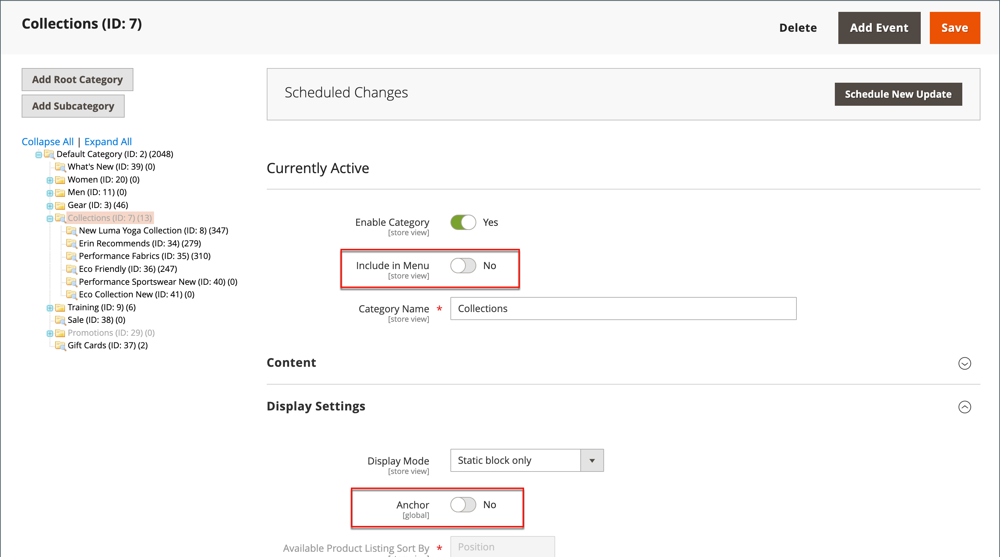

# 隐藏的类别

隐藏类别有许多种使用方式。 您可能希望为自己的内部目的创建其他类别级别，但只向客户显示更高级别的类别。 或者，您可能希望链接到未包含在导航菜单中的类别。

## 创建隐藏类别

1. 在&#x200B;_管理员_&#x200B;侧边栏上，转到&#x200B;**[!UICONTROL Catalog]** > **[!UICONTROL Categories]**。

1. 在类别树中，选择要隐藏的类别，然后执行以下操作：

   - 将&#x200B;**[!UICONTROL Is Active]**&#x200B;设置为`Yes`。
   - 将&#x200B;**[!UICONTROL Include in Menu]**&#x200B;设置为`No`。

1. 在&#x200B;**[!UICONTROL Display Settings]**&#x200B;部分中，将&#x200B;**[!UICONTROL Anchor]**&#x200B;设置为`No`。

   {width="600" zoomable="yes"}

   隐藏类别处于活动状态，但不显示在顶部菜单或分层导航中。

1. 为每个隐藏的子类别完成以下设置以创建子类别：

   >[!NOTE]
   >
   >尽管类别是隐藏的，但您可以在其下面创建子类别并使它们处于活动状态。

   - 将&#x200B;**[!UICONTROL Enable Category]**&#x200B;设置为`Yes`。
   - 在&#x200B;**[!UICONTROL Display Settings]**&#x200B;部分中，将&#x200B;**[!UICONTROL Anchor]**&#x200B;设置为`Yes`。

   作为活动类别，您现在可以从商店中的其他位置链接到它们，但它们不会显示在菜单中。

1. 完成后，单击&#x200B;**[!UICONTROL Save]**。
