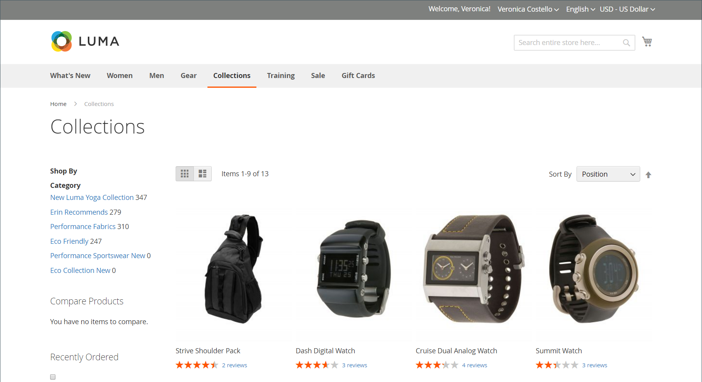

# 类别权限

{{ee-feature}}

类别访问可以限制为特定客户组，也可以完全限制。 您可以控制产品价格的显示，确定哪些客户组可以将产品添加到购物车，并指定登陆页面。

>[!NOTE]
>
>类别权限具有全局范围，启用时，会根据每个类别的个别权限限制每个类别的访问。 默认情况下，“类别权限”处于未启用状态。

例如，如果您只向批发客户销售，则可以允许任何人浏览目录，但可以显示价格并只允许以下位置的购物者购买： _批发_ 客户组。 在以下示例中，仅登录用户有权访问“收藏集”类别。 对于来宾，“收藏集”选项不会出现在主菜单中。

{width="600" zoomable="yes"}

启用后，新的 _[!UICONTROL Category Permissions]_部分将显示在“类别”页面上，通过该页面可以为每个类别应用所需的访问权限。 您可以为不同的网站和客户组向每个类别添加多个权限规则。

## 步骤1：配置类别权限

>[!IMPORTANT]
>
>所有现有 [组权限设置](../configuration-reference/catalog/catalog.md#category-permissions) 被忽略 **_所有_** 目录中的类别，当 **_[!UICONTROL Shared Catalog]_** 功能已启用。 [!UICONTROL Shared Catalog] 完全控制启用目录后目录中的所有类别权限。

1. 在 _管理员_ 侧栏，转到 **[!UICONTROL Stores]** > _[!UICONTROL Settings]_>**[!UICONTROL Configuration]**.

1. 在左侧面板中，展开 **[!UICONTROL Catalog]** 并选择 **[!UICONTROL Catalog]** 下方。

1. 展开  该 **[!UICONTROL Category Permissions]** 部分。

   {width="600" zoomable="yes"}

   有关这些选项的详细列表，请参阅 [类别权限](../configuration-reference/catalog/catalog.md#category-permissions) 在 _配置引用_.

1. 设置 **[!UICONTROL Enable]** 到 `Yes`.

1. 根据您希望对存储允许或限制的内容完成其他选项（请参阅以下部分）。

1. 完成后，单击 **[!UICONTROL Save Config]**.

1. 提示更新缓存时，单击 **[!UICONTROL Cache Management]** 链接系统消息，并按照说明刷新缓存。

### [!UICONTROL Allow Browsing Category]

此选项适用于 [网站](../getting-started/websites-stores-views.md).

要允许成员 **_特定客户组_** 要浏览类别产品，请执行以下操作：

1. 设置 **[!UICONTROL Allow Browsing Category]** 到 `Specified Customer Groups`.

1. 在 **[!UICONTROL Customer Groups]** 框中，选择允许浏览类别中产品的每个组。

   要选择多个组，请在单击每个组时按住Ctrl键(PC)或Command键(Mac)。

   {width="600" zoomable="yes"}

至 **_限制访问并重定向到登陆页面_**，请执行以下操作：

1. 设置 **[!UICONTROL Allow Browsing Category]** 到 `No, Redirect to Landing Page`.

1. 选择 **[!UICONTROL Landing Page]** 重定向访客的位置。

   {width="600" zoomable="yes"}

   >[!NOTE]
   >
   >尽管 _[!UICONTROL Allow Browsing Category]_设置适用于网站中的所有类别，您可以为每个商店视图配置不同的登陆页面。

### [!UICONTROL Display Product Prices]

此选项适用于 [网站](../getting-started/websites-stores-views.md).

仅允许成员 **_特定客户组_** 要查看类别中产品的价格，请执行以下操作：

1. 设置 **[!UICONTROL Display Product Prices]** 到 `Yes, for Specified Customer Groups`.

1. 在 **[!UICONTROL Customer Groups]** 框中，选择每个允许查看该类别中产品价格的组。

   要选择多个组，请在单击每个组时按住Ctrl键(PC)或Command键(Mac)。)

   {width="600" zoomable="yes"}

### [!UICONTROL Allow Adding to Cart]

此选项适用于 [网站](../getting-started/websites-stores-views.md).

仅允许成员 **_特定客户组_** 要将类别产品放入购物车，请执行以下操作：

1. 设置 **[!UICONTROL Allow Adding to Cart]** 到 `Yes, for Specified Customer Groups`.

1. 在 **[!UICONTROL Customer Groups]** 框中，选择每个允许将产品从类别添加到购物车的组。

   要选择多个组，请在单击每个组时按住Ctrl键(PC)或Command键(Mac)。

   {width="600" zoomable="yes"}

### [!UICONTROL Disallow Catalog Search]

设置此选项可阻止特定客户组的成员使用目录搜索。 它适用于 [网站](../getting-started/websites-stores-views.md).

- 允许 **_仅已登录的客户_** 要使用“目录搜索”，请选择 `NOT LOGGED IN`.

- 允许 **_仅限特定客户组_** 要使用“目录搜索”，请选择要使用“类别搜索”排除的每个组。

  要选择多个组，请在单击每个组时按住Ctrl键(PC)或Command键(Mac)。

  {width="600" zoomable="yes"}

## 步骤2：应用类别权限

1. 在 _管理员_ 侧栏，转到 **[!UICONTROL Catalog]** > **[!UICONTROL Categories]**.

1. 在类别树中，选择目标类别。

1. 展开  **[!UICONTROL Category Permissions]** ，并执行以下操作：

   - 要创建权限规则，请单击 **[!UICONTROL New Permission]**.

     {width="600" zoomable="yes"}

   - 选择适用的 **[!UICONTROL Website]** 和 **[!UICONTROL Customer Group]**.

   - 根据需要设置各个权限。

   >[!NOTE]
   >
   >时间 `Browsing Category` = `Deny` 为任何父类别设置了权限，该权限不会显示在 [痕迹导航路径](navigation-breadcrumb-trail.md) 在子类别页面上。

1. 完成后，单击 **[!UICONTROL Save]**.

>[!NOTE]
>
>如果有 **_允许_** 已为设置权限 `Root Category`，则这些权限将自动应用于 `Catalog`. 如果有任何产品被分配给多个类别，并且它有任何 **_允许_** 至少有一个类别的权限，它会自动具有相同的 **_允许_** 所有已分配类别的权限。
