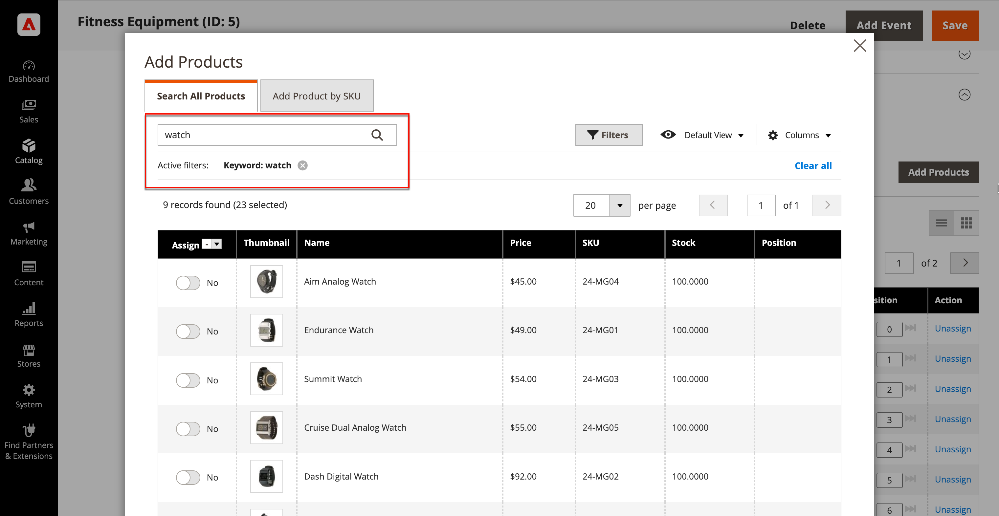

# 添加和删除类别产品

在[类别](categories-product-assignments.md)中的产品部分，商店管理员可以将产品添加到该类别。 此部分列出了分配给该类别的所有产品，并在&#x200B;**[!UICONTROL Match products by rule]**&#x200B;设置为`No`时显示&#x200B;**[!UICONTROL Add Product]**。

{width="600" zoomable="yes"}

## 搜索要添加的产品

1. 在&#x200B;_管理员_&#x200B;侧边栏上，转到&#x200B;**[!UICONTROL Catalog]** > **[!UICONTROL Categories]**。

1. 在左侧的类别树中，选择要添加产品的类别。

1. 展开类别&#x200B;_中的_&#x200B;产品。

1. 单击&#x200B;**[!UICONTROL Add Products]**。

1. 使用&#x200B;_按关键字搜索_&#x200B;或筛选条件查找要添加的产品。

   {width="700" zoomable="yes"}

1. 在&#x200B;_[!UICONTROL Assign]_&#x200B;列中，将您要添加的每个产品的选项切换为`Yes`。

   如果要包含所有显示的产品，可单击列标题中的菜单箭头，然后选择&#x200B;**[!UICONTROL Select All]**。

1. 要应用更改，请单击&#x200B;**[!UICONTROL Save and Close]**。

### 操作

| 操作 | 描述 |
|--- |--- |
| [!UICONTROL Select All] | 选中列表中所有记录的复选框。 |
| [!UICONTROL Unselect All] | 清除列表中所有记录的复选框。 |
| [!UICONTROL Select All on This Page] | 选中当前页面上记录的复选框。 |
| [!UICONTROL Deselect All on This Page] | 清除当前页面上记录的复选框。 |

{style="table-layout:auto"}

## 按SKU添加产品

1. 单击&#x200B;**[!UICONTROL Add Products]**

1. 选择&#x200B;**[!UICONTROL Add Products by SKU]**&#x200B;选项卡。

1. 输入SKU（每行一个）并单击&#x200B;**[!UICONTROL Assign]**。

   若要放弃更改，请单击&#x200B;**[!UICONTROL Remove]**。

   {width="700" zoomable="yes"}

1. 要应用更改，请单击&#x200B;**[!UICONTROL Save and Close]**。

## 从类别中删除产品

1. 在&#x200B;_管理员_&#x200B;侧边栏上，转到&#x200B;**[!UICONTROL Catalog]** > **[!UICONTROL Categories]**。

1. 在左侧的类别树中，选择要编辑的类别。

1. 展开&#x200B;_[!UICONTROL Products in Category]_&#x200B;部分的。

1. 查找要删除的产品。

1. 在&#x200B;_[!UICONTROL Actions]_&#x200B;列中，单击&#x200B;**[!UICONTROL Unassign]**。

1. 要应用更改，请单击&#x200B;**[!UICONTROL Save]**。
