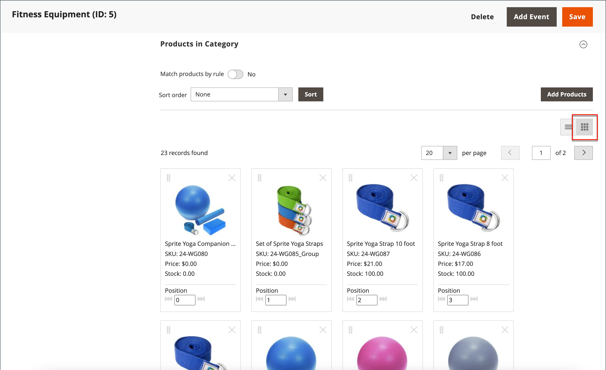

# 对类别产品排序

{{ee-feature}}

通过将产品拖放到某个位置或应用预定义的排序顺序，可以手动指定某个类别中的产品位置。 默认情况下，产品可以按库存级别、年龄、颜色、名称、SKU和价格排序。 自动排序将覆盖当前排序顺序，并重置手动设置的任何拖放位置。 在[Visual Merchandiser](../configuration-reference/catalog/visual-merchandiser.md)配置中设置了颜色的排序顺序以及产品包含在列表中所需的最低库存级别。

>[!NOTE]
>
>在类别页面上，`Out of stock`产品始终显示在具有所有排序类型的产品列表上的&#x200B;**_之后_** `In Stock`。

您可以为每个[商店视图](../stores-purchase/stores.md#add-stores)单独设置类别选项，以确定产品的选择、它们在列表中的相对位置以及类别规则可用的属性。 但是，目录中存在单个&#x200B;**_全局_**&#x200B;排序顺序和产品位置，它们在所有[商店视图](../stores-purchase/store-views.md)、商店和网站之间共享。

## 步骤1：设置配置的范围

1. 在&#x200B;_管理员_&#x200B;侧边栏上，转到&#x200B;**[!UICONTROL Catalog]** > **[!UICONTROL Categories]**。

1. 如有必要，请选择应用设置的&#x200B;**[!UICONTROL Store View]**。

   对于多存储安装，_[!UICONTROL Store View]_&#x200B;设置将排序顺序应用到存储中的所有可用视图。

1. 在左侧的类别树中，选择要编辑的类别。

   {width="700" zoomable="yes"}

## 第2步：对产品进行排序

>[!NOTE]
>
>按产品属性对类别进行排序时，具有相同属性值的产品也会按其&#x200B;_[!UICONTROL Product ID]_&#x200B;的升序排序。

在&#x200B;_[!UICONTROL Products in Category]_&#x200B;部分中，单击磁贴（）图标以显示网格中的产品磁贴。 使用手动或自动方法对产品进行排序。

{width="600" zoomable="yes"}

### 方法1：手动排序

1. 将&#x200B;**[!UICONTROL Sort Order]**&#x200B;设置为您的首选项。

   {width="600" zoomable="yes"}

1. 要应用新的排序顺序，请单击&#x200B;**[!UICONTROL Sort]**。

1. 要保存排序顺序，请单击&#x200B;**[!UICONTROL Save Category]**。

1. 出现提示时，请更新任何无效的索引器。

### 方法2：自动排序

1. 将&#x200B;**[!UICONTROL Match products by rule]** （）设置为`Yes`。

1. 将&#x200B;**[!UICONTROL Automatic Sorting]**&#x200B;设置为您的首选项。

1. 要创建类别规则，请按照下一步中的说明操作。

## 步骤3：创建类别规则

1. 将&#x200B;**[!UICONTROL Match products by rule]** （）设置为`Yes`。

1. 单击&#x200B;**[!UICONTROL Add Condition]**。

1. 选择作为条件基础的&#x200B;**[!UICONTROL Attribute]**。

1. 将&#x200B;**[!UICONTROL Operator]**&#x200B;设置为以下项之一：

   - `Equal`
   - `Not equal`
   - `Greater than`
   - `Greater than or equal to`
   - `Less than`
   - `Less than or equal to`
   - `Contains`

1. 输入相应的&#x200B;**[!UICONTROL Value]**。

   {width="600" zoomable="yes"}

1. 要添加其他条件，请单击&#x200B;**[!UICONTROL Add Condition]**&#x200B;并重复该过程。

## 步骤4：保存、刷新和验证

1. 完成后，单击&#x200B;**[!UICONTROL Save Category]**。

1. 提示刷新缓存时，单击&#x200B;**[!UICONTROL Cache Management]**&#x200B;并刷新每个无效缓存。

1. 在店面中，验证产品选择、排序和类别规则是否正常工作。

   如果必须进行调整，请更改设置并重试。
