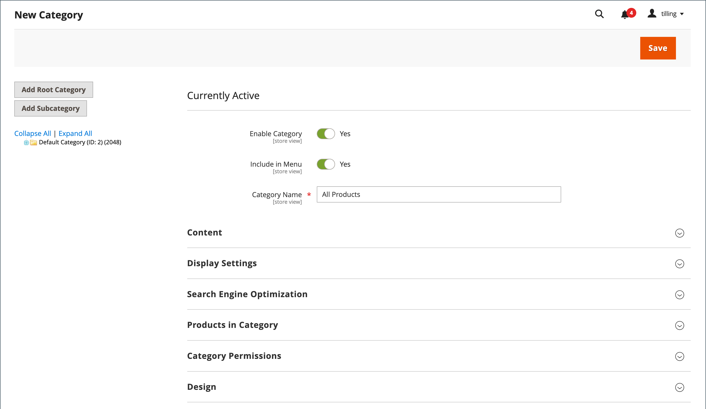

# 根类别和层次结构

主菜单中的产品由分配给[商店](../stores-purchase/stores.md#add-stores)的根类别决定。 根类别基本上是类别树中主菜单的容器。 您可以创建一个具有全新产品集的根类别，或从现有的根类别中复制产品。 根类别可以分配给当前商店或同一网站中的任何其他商店。

{width="550"}

在Admin中，类别结构就像一个上下颠倒的树，根位于顶部。 根具有名称，但没有URL密钥，并且未出现在存储的[顶部导航](navigation-top.md)中。 菜单中的所有其他类别都嵌套在根下。 由于根类别是目录的最高级别，因此存储一次只能有一个处于活动状态的根类别。 但是，您可以为替代目录结构和不同存储创建其他根类别。

以下示例显示了如何创建根类别并将其分配给其他存储。

## 步骤1：创建根类别

1. 在&#x200B;_管理员_&#x200B;侧边栏上，转到&#x200B;**[!UICONTROL Catalog]** > **[!UICONTROL Categories]**。

1. 单击左侧的&#x200B;**[!UICONTROL Add Root Category]**。

   {width="600" zoomable="yes"}

1. 输入&#x200B;**[!UICONTROL Category Name]**。

   您选择的名称最初被指定给所有商店视图。

1. 如果要将产品从当前目录添加到目录，请执行以下操作：

   - 展开类别&#x200B;_中的_&#x200B;产品。

   - 使用[搜索过滤器](../getting-started/admin-grid-controls.md)查找所需的产品，并选中要复制到新目录中的每个产品的复选框。

1. 完成后，单击&#x200B;**[!UICONTROL Save]**。

## 第2步：构建主菜单

1. 在左侧，选择您在上一步中创建的新根类别。

1. 要为主菜单创建[类别结构](category-create.md)，请单击&#x200B;**[!UICONTROL Add Subcategory]**&#x200B;并按照说明操作。

## 步骤3：将根类别分配给存储

1. 在&#x200B;_管理员_&#x200B;侧边栏上，转到&#x200B;**[!UICONTROL Stores]** > _[!UICONTROL Settings]_>**[!UICONTROL All Stores]**。

1. 在网格的&#x200B;_存储_&#x200B;列中，单击要分配新目录的存储。

1. 将&#x200B;**[!UICONTROL Root Category]**&#x200B;设置为您创建的新根类别。

1. 确保已为该存储分配&#x200B;**[!UICONTROL Default Store View]**。

   存储必须至少有一个[存储视图](../stores-purchase/store-views.md)。

1. 完成后，单击&#x200B;**[!UICONTROL Save Store]**。

1. 要验证存储是否具有新目录，请执行以下操作：

   - 在&#x200B;_管理员_&#x200B;侧边栏上，转到&#x200B;**[!UICONTROL Catalog]** > **[!UICONTROL Products]**。

     复制到新目录的任何产品都会显示在网格中。

   - 要验证新目录和主菜单是否正常工作，请访问店面。
