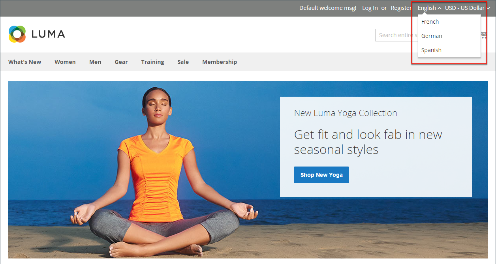

# 目录管理简介

Adobe Commerce和Magento Open Source使用术语 _目录_ 以引用整个产品数据库。

创建和管理商店的最重要领域之一是产品创建和类别。 管理员提供了多种工具，可用于初始设置商店、维护商店和优化业务。

>[!TIP]
>
>适用于Adobe Commerce和Magento Open Source的Inventory management为您提供了用于管理产品库存的工具。 只有一家商店到多个仓库、商店、提货地点、卸货托运人等的商家可以使用这些功能来维护销售数量，并处理发运以完成订单。 有关这些功能以及如何使用这些功能管理多个位置的毛坯的更多信息，请参阅 [Inventory management用户指南](../inventory-management/introduction.md).

## 目录范围

对目录数据的访问取决于多种因素，包括 [范围](../getting-started/websites-stores-views.md#scope-settings) 设置、目录配置和 [根类别](category-root.md) 指定给该存储区的ID。 该目录包括已启用且可供销售的产品，以及当前不提供以供销售的产品。

在销售中，术语 _目录_ 通常指精心挑选的可供销售的产品。 例如，商店可能具有“Spring Catalog”和“Fall Catalog”。

就像打印目录中的目录，商店的主菜单 — 或 _顶部导航_  — 按类别组织产品，使客户能够轻松地找到他们想要的东西。 主菜单基于 _根类别_，这是分配给商店的菜单的容器。 由于特定菜单选项是在商店视图级别定义的，因此每个视图可以具有基于同一根类别的不同主菜单。 在每个菜单中，您都可以提供适合该商店的精选产品。

{width="550"}

## 产品范围

对于具有多个网站、商店和视图的安装， [范围](../getting-started/websites-stores-views.md#scope-settings) 设置确定产品在何处可供销售，以及每个商店视图可用的产品信息。 最初，您创建的所有产品都会发布到默认的网站、商店和商店视图。

{width="550"}

如果您只有一个默认视图的商店，则可以在中运行您的商店 [单存储模式](../getting-started/websites-stores-views.md#single-store-mode) 以隐藏范围设置。 但是，如果您的存储有多个视图，则每个字段的名称下方会显示一个范围指示器。

- 要编辑特定视图的产品信息，请使用 _商店视图_ 按住ctrl键以选择视图。 其他控件将可用于可在存储视图级别编辑的任何字段。

- 要定义多站点安装中产品的范围，请参见 [网站中的产品](settings-basic-websites.md) 产品信息部分。

为商店视图编辑产品的过程与添加特定于视图的产品信息层类似。

您只能编辑或分配您具有权限的站点的产品，而不能编辑或分配所有已分配产品的站点的产品。

尽管 _西班牙语_ 在以下示例中，选择了“商店视图”，产品信息仍以默认商店视图的原始语言显示。 要翻译产品信息，您必须切换到 _西班牙语_ 存储视图和翻译文本字段 — 如产品标题、描述和元数据。 有关更多信息，请参阅 [将产品本地化](../stores-purchase/store-localize.md#localize-products).

## 编辑其他视图的产品

>[!NOTE]
>
>此 _所有商店视图_ 如果产品也发布在允许的范围之外，则对于被限制在特定范围内的管理员用户，范围将被禁用。 默认情况下会选择第一个可用于编辑的范围，因为受限制的用户无法执行 _全局_ 影响他们无权访问的范围的操作或操作。

1. 在左上角，设置 **[!UICONTROL Store View]** 到要编辑的特定视图。

1. 要确认范围更改，请单击 **[!UICONTROL OK]**.

1. 使用商店视图的新值更新字段。

   可在商店视图中编辑的任何字段下方都会出现一个复选框。 要覆盖默认值，请取消选择 **使用默认值** 复选框。

   {width="600" zoomable="yes"}

1. 完成后，单击 **[!UICONTROL Save]**.

1. 在左上角，设置 **[!UICONTROL Store View]** 选择器返回到默认值。

1. 要在您的商店中验证更改，请执行以下操作：

   - 在右上角，单击 _管理员_ 菜单箭头并选择 **[!UICONTROL Customer View]**.

     {width="600" zoomable="yes"}

   - 在商店的右上角，设置 **[!UICONTROL Language Chooser]** 到您编辑的产品的商店视图，并查找您为该视图编辑的产品。

     {width="700" zoomable="yes"}
