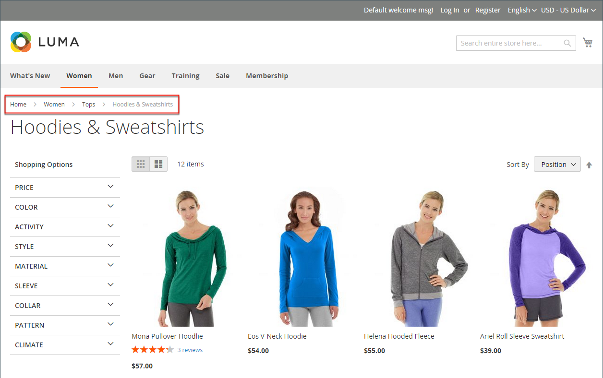

# 痕迹导航跟踪

_痕迹导航路径_&#x200B;是一组链接，用于显示客户相对于商店中其他页面的位置。 他们可以单击痕迹导航跟踪中的任意链接以返回上一页。

可以将痕迹导航跟踪配置为显示在内容页面和目录页面上。 痕迹导航轨迹的格式和位置因主题而异，但通常位于标题的正下方。 默认情况下，痕迹导航跟踪会显示在CMS页面上。

店面中显示了{width="700" zoomable="yes"}

## 普通类型的面包屑

痕迹导航主要分为三种类型，这三种类型的用途各不相同。 下文介绍了实施各种面包屑的实质和主要原则。

### 基于层次结构的痕迹导航

此类痕迹导航基于网站上设置的类别层次结构。 显示的链告知用户它们在结构中的位置。 在这种情况下，每个文本链接都面向比上一个链接高一个级别的页面。

示例： `Men > Tops > Hoodies & Sweatshirts`

这种类型的优点是，用户可以轻松地查看他们处于哪个类别级别，并轻松地访问目录页面之间的导航。

### 基于历史的痕迹导航

基于历史记录（或基于路径）的导航类似于浏览器中的“返回”按钮。 这种类型的导航允许用户快速返回他们访问的上一页面，而无需进行更改。

此类型的好处是，当客户在一个类别页面上选择多个过滤器后希望返回上一页时，此类型最有用。

示例： `Home > What's New > Gear > Bags`

### 基于属性的痕迹导航

此类型的痕迹导航显示类别页面上选择的属性。 与其他类型的主要区别在于，基于属性的痕迹导航表示客户在导航层为某些产品（如价格、质量和颜色）选择的过滤器和选项。

示例： `Home > Suits > All Suits > Refined by > Slim Fit`

## 在CMS页面中添加/删除痕迹导航

1. 在&#x200B;_管理员_&#x200B;侧边栏上，转到&#x200B;**[!UICONTROL Stores]** > _[!UICONTROL Settings]_>**[!UICONTROL Configuration]**。

1. 在左侧面板中的&#x200B;_[!UICONTROL General]_下，选择&#x200B;**[!UICONTROL Web]**。

   {width="600" zoomable="yes"}

1. 展开&#x200B;_[!UICONTROL Default Pages]_部分。

1. 取消选中&#x200B;**[!UICONTROL Use system value]**&#x200B;复选框。

1. 将&#x200B;**[!UICONTROL Show Breadcrumbs for CMS Pages]**&#x200B;设置为`No`或`Yes`。

1. 完成后，单击&#x200B;**[!UICONTROL Save Config]**。

>[!NOTE]
>
>当父类别具有`Browsing Category`= `Deny` [类别权限](category-permissions.md)设置时，父类别不会显示在子类别页面的痕迹导航线索中。
