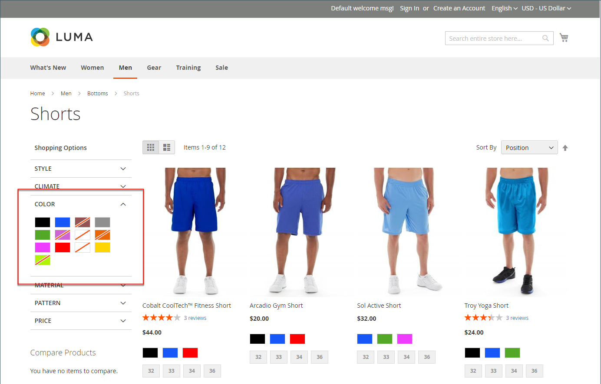

# 分层导航

>[!NOTE]
>
>本节中介绍的标准分层导航与具有[方面的Live Search筛选导航](https://experienceleague.adobe.com/en/docs/commerce/live-search/live-search-admin/facets/facets)不同。

通过分层导航，可以轻松地根据类别、价格范围或任何其他可用属性查找产品。 分层导航通常显示在搜索结果和类别页面的左列，有时显示在主页上。 标准导航包含&#x200B;_Shop By_&#x200B;类别和价格范围列表。 您可以配置分层导航的显示，包括产品数量和价格范围。

{width="700" zoomable="yes"}

## 可过滤属性

>[!NOTE]
>
>本主题中介绍的可筛选属性要求与[实时搜索](https://experienceleague.adobe.com/en/docs/commerce/live-search/overview)不同。 若要了解详细信息，请参阅[Facet](https://experienceleague.adobe.com/en/docs/commerce/live-search/live-search-admin/facets/facets)。

分层导航可用于按类别或属性搜索产品。 例如，当购物者从顶部导航中选择“Mens/Shorts”类别时，初始结果将包括该类别中的所有产品。 可以通过选择特定的样式、气候、颜色、材质、图案或价格（或值的组合）进一步过滤列表。 可过滤属性显示在展开部分中，其中列出了每个属性值。 作为一个选项，可以将具有匹配结果的产品列表配置为包含具有或不具有匹配项的产品。

属性属性与产品输入类型相结合，可确定哪些属性可用于分层导航。 分层导航仅适用于&#x200B;[_锚点_](categories-display-settings.md)&#x200B;类别，但也可以添加到搜索结果页面。 每个属性的&#x200B;**存储所有者**&#x200B;的目录输入类型必须设置为`Yes/No`、`Dropdown`、`Multiple Select`或`Price`。 要使属性可过滤，必须将每个属性的&#x200B;**在分层导航中使用**&#x200B;属性设置为`Filterable (with results)`或`Filterable (no results)`。

_示例：结果为_&#x200B;的可筛选属性

{width="700" zoomable="yes"}

_示例：显示可筛选样本值，但没有结果_

{width="700" zoomable="yes"}

以下说明说明了如何使用可过滤属性设置基本的分层导航。 有关带价格步骤的高级分层导航，请参阅[价格导航](navigation-layered.md#configure-price-navigation)。

## 步骤1：设置属性属性

1. 在&#x200B;_管理员_&#x200B;侧边栏上，转到&#x200B;**[!UICONTROL Stores]** > _[!UICONTROL Attributes]_>**[!UICONTROL Product]**。

1. 浏览或使用过滤搜索查找列表中的属性，并在编辑模式下打开该属性。

   {width="700" zoomable="yes"}

1. 在左侧面板中，选择&#x200B;**[!UICONTROL Storefront Properties]**&#x200B;并将&#x200B;**[!UICONTROL Use In Layered Navigation]**&#x200B;设置为以下项之一：

   - `Filterable (with results)` — 分层导航仅包含那些可以找到匹配产品的筛选器。 任何已应用于列表中显示的所有产品的属性值仍应显示为可用过滤器。 可用过滤器列表中省略计数为零(0)产品匹配的属性值。 过滤列表仅包含与过滤器匹配的产品。 仅当选定的过滤器更改了显示的内容时，才会更新产品列表。

   - `Filterable (no results)` — 分层导航显示所有可用属性值的筛选器及其产品计数，即使存在匹配零(0)的产品。 如果属性值是色板，则显示过滤器，但会将其划出。 此选项不支持价格分层过滤，也不影响价格过滤器。

1. 将&#x200B;**[!UICONTROL Use In Search Results Layered Navigation]**&#x200B;设置为`Yes`。

   {width="600" zoomable="yes"}

1. 对要包括在分层导航中的每个属性重复这些步骤。

>[!NOTE]
>
>- 如果&#x200B;_[!UICONTROL Use in Search]_设置设置为`No`，则不显示_[!UICONTROL Use in Search Results Layered Navigation]_&#x200B;设置。在这种情况下，无论[!UICONTROL Use in Layered Navigation]设置如何，都不会在搜索中使用产品属性。
>
>- 默认情况下，[!UICONTROL Position]字段呈灰显状态。 在修改此设置之前，必须保存属性。

## 第2步：将类别设置为锚点

1. 在&#x200B;_管理员_&#x200B;侧边栏上，转到&#x200B;**[!UICONTROL Catalog]** > **[!UICONTROL Categories]**。

1. 在类别树中，选择要使用分层导航的类别。

1. 展开扩展选择器&#x200B;**[!UICONTROL Display Settings]**&#x200B;并将&#x200B;**[!UICONTROL Anchor]**&#x200B;设置为`Yes`。

   {width="600" zoomable="yes"}

1. 单击&#x200B;**[!UICONTROL Save]**。

## 第3步：测试结果

要测试设置，请访问您的商店，然后从主菜单导航到类别。 可过滤属性的选择将显示在类别页的分层导航中。

搜索、筛选和查看显示的产品。

## 从分层导航中删除可过滤属性值

分层导航包括所有可用属性值及其产品计数的过滤器，包括零(0)产品匹配的产品（如下图所示）。

显示{width="700" zoomable="yes"}

这种结果可能会使客户难以选择首选产品，并且无需在前端显示&#x200B;&#x200B;0个产品的属性值。

您可以使用以下步骤从分层导航中删除0 Products的可过滤属性值：

1. 在&#x200B;_管理员_&#x200B;侧边栏上，转到&#x200B;**[!UICONTROL Stores]** > _[!UICONTROL Attributes]_>**[!UICONTROL Product]**。

1. 浏览或使用过滤搜索查找列表中的属性，并在编辑模式下打开该属性。

1. 在&#x200B;_[!UICONTROL Attribute Information]_下，单击&#x200B;**[!UICONTROL Storefront Properties]**。

1. 对于&#x200B;**[!UICONTROL Layered Navigation]**，请选择`Filterable (with results)`。

   {width="600" zoomable="yes"}

1. 单击&#x200B;**[!UICONTROL Save Attribute]**。

## 价格导航

>[!NOTE]
>
>本节中介绍的价格导航配置与具有[方面的Live Search筛选导航不同](https://experienceleague.adobe.com/en/docs/commerce/live-search/live-search-admin/facets/facets)。

分层导航中价格导航可用于按价格范围分配产品。 您还可以按间隔拆分每个范围。 有几种方法可计算价格导向：

- 自动（均衡价格范围）
- 自动（均衡产品计数）
- 手动

>[!BEGINSHADEBOX]

在分层导航中按价格过滤时，Adobe Commerce使用可配置产品子项的最低价格。 因此，可配置产品只出现在子产品的最低价格范围内，即使某些子产品的价格更高。

>[!ENDSHADEBOX]

使用前两种方法可以自动计算导航步骤。 通过手动方法，您可以为价格间隔指定除法限制。 以下示例显示了10个和100个价格导航步骤之间的差异。

迭代拆分提供不同价格范围内产品的最佳分配。 通过迭代拆分，在选择$0.00 -$99的价格范围后，客户可以向下钻取多个价格子范围。 当产品数达到“间隔除法限制”设置的阈值时，价格范围拆分将停止。

## 示例：价格定位步骤

| 价格步进10 | 价格步进100 |
|----------|--------|
| 20.00美元 — 29.99美元(1) | 0.00美元 — 99.99美元(4) |
| 30.00美元 — 39.99美元(2) | 100美元 — 199.99美元(5) |
| 70.00美元 — 79.99美元(1) | 400.00美元 — 499.99美元(2) |
| 100.00美元 — 109.99美元(1) | 700.00美元及以上(1) |
| 120.00美元 — 129.99美元(2) |   |
| 150.00美元 — 159.99美元(1) |   |
| 180.00美元 — 189.99美元(1) |   |
| 420.00美元 — 429.99美元(1) |   |
| 440.00美元 — 449.99美元(1) |   |
| 710.00美元及以上(1) |   |

{style="table-layout:auto"}

## 配置价格导航

>[!IMPORTANT]
>
>要在分层导航中根据&#x200B;_价格筛选器_&#x200B;正确显示产品及其价格，请确保[增值税配置](../configuration-reference/sales/tax.md)中显示的价格设置具有相同的值（`Excluding Tax` **或** `Including Tax`）。 对于&#x200B;_[!UICONTROL Calculation Settings]_，检查&#x200B;**[!UICONTROL Catalog Prices]**值。 对于_[!UICONTROL Price Display Settings]_，请检查&#x200B;**[!UICONTROL Display Product Prices in Catalog]**&#x200B;值。 如果它们的值不同，则分层导航中的价格过滤器可能无法正确过滤和排序产品。

1. 在&#x200B;_管理员_&#x200B;侧边栏上，转到&#x200B;**[!UICONTROL Stores]** > _[!UICONTROL Settings]_>**[!UICONTROL Configuration]**。

1. 在左侧面板中，展开&#x200B;**[!UICONTROL Catalog]**&#x200B;并在下面选择&#x200B;**[!UICONTROL Catalog]**。

1. 展开部分的&#x200B;_扩展选择器_。

   默认情况下，**[!UICONTROL Display Product Count]**&#x200B;设置为`Yes`。 如有必要，请取消选中&#x200B;**[!UICONTROL Use system value]**&#x200B;复选框以更改此设置。

   {width="600" zoomable="yes"}

   有关这些配置选项的详细列表，请参阅[配置引用](../configuration-reference/catalog/catalog.md#layered-navigation)中的&#x200B;_分层导航_。

1. 为以下部分中的方法之一设置&#x200B;**[!UICONTROL Price Navigation Steps Calculation]**。

1. 完成后，单击&#x200B;**[!UICONTROL Save Config]**。

### 方法1：自动（均衡价格范围）

将&#x200B;**[!UICONTROL Price Navigation Steps Calculation]**&#x200B;保留设置为`Automatic (Equalize Price Ranges)`（默认）。 此设置使用标准算法进行价格导航。

### 方法2：自动（均衡产品计数）

>[!TIP]
>
>如有必要，请先取消选中&#x200B;**[!UICONTROL Use system value]**&#x200B;复选框以更改这些设置。

1. 将&#x200B;**[!UICONTROL Price Navigation Steps Calculation]**&#x200B;设置为`Automatic (equalize product counts)`。

1. 要在多个产品具有相同价格时显示单一价格，请将&#x200B;**[!UICONTROL Display Price Interval as One Price]**&#x200B;设置为`Yes`。

1. 对于&#x200B;**[!UICONTROL Interval Division Limit]**，输入价格范围内产品数量的阈值。

   范围无法进一步拆分，超出此限制。 默认值为`9`。

   {width="600" zoomable="yes"}

### 方法3：手动

>[!NOTE]
>
>如有必要，请先取消选中&#x200B;**[!UICONTROL Use system value]**&#x200B;复选框以更改这些设置。

1. 将&#x200B;**[!UICONTROL Price Navigation Steps Calculation]**&#x200B;设置为`Manual`。

1. 输入确定&#x200B;**[!UICONTROL Default Price Navigation Step]**&#x200B;的值。

1. 输入允许的&#x200B;**[!UICONTROL Maximum Number of Price Intervals]**，最多`100`。

   {width="600" zoomable="yes"}

## 配置分层导航

>[!NOTE]
>
>本节中介绍的标准分层导航与具有[方面的Live Search筛选导航](https://experienceleague.adobe.com/en/docs/commerce/live-search/live-search-admin/facets/facets)不同。

分层导航配置确定产品计数是否显示在每个属性后面的括号中，以及价格导航中使用的步骤计算的大小。

1. 在&#x200B;_管理员_&#x200B;侧边栏上，转到&#x200B;**[!UICONTROL Stores]** > _[!UICONTROL Settings]_>**[!UICONTROL Configuration]**。

1. 在左侧面板中，展开&#x200B;_[!UICONTROL Catalog]_部分并在下面选择&#x200B;**[!UICONTROL Catalog]**。

1. 展开&#x200B;_[!UICONTROL Layered Navigation]_部分。

   >[!NOTE]
   >
   >如有必要，请先取消选中&#x200B;**[!UICONTROL Use system value]**&#x200B;复选框以更改这些设置。

1. 要显示为每个属性找到的产品数，请将&#x200B;**[!UICONTROL Display Product Count]**&#x200B;设置为`Yes`。

1. 将&#x200B;**[!UICONTROL Price Navigation Step Calculation]**&#x200B;设置为`Automatic (equalize price ranges)`。

1. 完成后，单击&#x200B;**[!UICONTROL Save Config]**。
